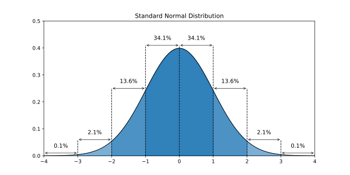
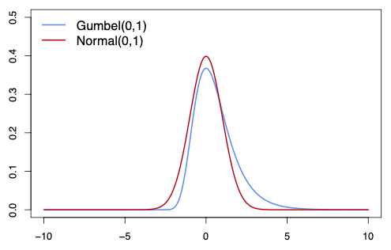
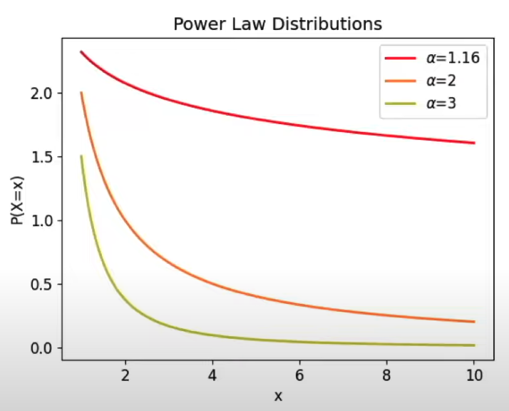

# Continuous Random Variable

takes value on a continuum of scale, ie, can take **any** decimal value

## PDF

$$
\begin{aligned}
f(x) &\ge 0 \\
\int f(x) \ \mathrm{d} x &= 1
\end{aligned}
$$

## CDF

$$
\begin{aligned}
F(x) &= P(X \le x) \\
&= \int\limits_{- \infty}^x f(x) \ \mathrm{d} x \\
P(a \le X \le b) &= P(a < x < b) \\
&= \int\limits_a^b f(x) \ \mathrm{d} x
\end{aligned}
$$

## Terms

|          |            Formula            |
| :------: | :---------------------------: |
|  $E(x)$  |  $\int x \cdot f(x) \ \mathrm{d} x$  |
| $E(x^2)$ | $\int x^2 \cdot f(x) \ \mathrm{d} x$ |

(others are the same as discrete)

## Distributions

| Distribution                                     | Comment                                                      |                            $f(x)$                            |                                                              |                            $\mu$                             |          $\sigma^2(x)$           | Skewness | Kurtosis | Modality | Symmetry | Diagram                                                      |                                                              |
| ------------------------------------------------ | ------------------------------------------------------------ | :----------------------------------------------------------: | ------------------------------------------------------------ | :----------------------------------------------------------: | :------------------------------: | :------: | :------: | :------: | :------: | ------------------------------------------------------------ | ------------------------------------------------------------ |
| Uniform                                          |                                                              | $\begin{cases} \frac 1 {B-A} & A \le x \le B \\ 0 & \text{elsewhere} \end{cases}$ |                                                              |                       $\dfrac {B+A} 2$                       |     $\dfrac 1 {12} (B-A)^2$      |          |          |          |    ✅     |                                                              |                                                              |
| Normal/ Gaussian/ Bell-Curve/ $z$ |                                                              | $\dfrac {1}{\sigma \sqrt{2\pi}} \exp \left\{ \dfrac {-1}{2} \left(\dfrac{x-\mu}{\sigma} \right)^2 \right\}$ | $\begin{aligned} P(x<k) &= P \left(z<\frac{k-\mu}{\text{SD}} \right) \\ P(x>k) &= P(x < -k) \end{aligned}$ |                              0                               |                1                 |    0     |    3     |    1     |    ✅     |  |                                                              |
| Gumbel/Type 1 Extreme Value                      | Normal distribution with skew and fatter tails               | $\exp \Bigg[ - \exp \left( \dfrac{-(x-\mu)}{\sigma} \right ) \Bigg]$ |                                                              | $\mu + \sigma \gamma_e$ $\gamma_e \approx 0.577$ (Euler’s constant) |   $\dfrac{\pi^2 \sigma^2}{6}$    |          |          |          |          |      |                                                              |
| Log-Normal                                       | Type of gumbel distribution                                  |                                                              |                                                              |                                                              |                                  |          |          |          |          |                                                              |                                                              |
| Student $t$                                 | Tends to normal distribution for large dof                   |                                                              |                                                              |                              0                               |                >1                |          |          |          |    ✅     |                                                              |                                                              |
| Binomial $\to$ Normal Approx                     | $np \ge 10$ or $n(1-p) \ge 10$                               |                     Normal distribution                      | $\begin{aligned} x' &= x \pm 0.5 \\ z &= \frac{x' - \mu}{\text{SD}} \end{aligned}$ |                             $np$                             |            $np(1-p)$             |          |          |          |          |                                                              |                                                              |
| Chi-Square $\chi^2$                         | PDF of $\sum \limits_i N_i(0, 1)^2$, where $N_i$ is independent of $N_j, \ \forall i \ne j$ |                                                              |                                                              |                             DOF                              |             2 * DOF              |          |          |          |          |                                                              |                                                              |
| Gamma                                            | time between $n$ occurrences                                 | $\dfrac{1}{B^\alpha \lceil\alpha} \cdot x^{\alpha-1} \cdot \exp \left(\dfrac{-x}{\beta} \right)$ |                                                              |                        $\alpha \beta$                        |         $\alpha \beta^2$         |          |          |          |          |                                                              |                                                              |
| Exponential                                      | time between successive/consecutive                          |               $\lambda \cdot \exp(-\lambda x)$               |                                                              |                 $\dfrac 1 \lambda  = \beta$                  | $\dfrac 1 {\lambda^2} = \beta^2$ |          |          |          |          |                                                              |                                                              |
| Power Law                                        |                                                              |           $L(x) \cdot x^{-(\alpha-1)}; x > x_\min$           |                                                              |                                                              |                                  |          |          |          |          |  |                                                              |
| Pareto                                           | Power law with $\alpha =1.16$ Average value of those whose value is greater than $y$ is $y$ times the constant $\lambda/(\lambda-1)$ $\lambda$ controls the thickness of tail | $P(X > x) = \begin{cases} (x_m/x)^\lambda, & x \ge x_m \\ 1, & x < x_m \end{cases}$ Top $q$th percentiles share = $(q/100)^{(\lambda-1)/\lambda}$ | $1 - F(x) = \bar F(x) = P(X>x)$                              |                                                              |                                  |          |          |          |          |                                                              | Size distribution Sizes of cities Income Family names Popularity Social network patterns Crime per convict Sizes of large earthquakes Power outages |
| Zipf                                             | Pareto with $\lambda=1$                                      |                                                              |                                                              |                                                              |                                  |          |          |          |          |                                                              | Empirical city size Firm size Equivalent to relationship of slope of -1 between log rank of city (based on city size) and log of population |

- DOF = Degrees of freedom
  - $n$ for sampling
  - $n-k-1$ for regression
  
- $\lambda$ = mean no of occurances per unit time
  $\lambda = \alpha\text{(poisson)}$
- $\beta$ = mean time b/w occurances
  $\beta = \frac 1 \lambda = \frac 1 {\alpha\text{(poisson)}}$
- $\alpha$ = shape parameter
  it is the average number of occurrences of an event

Pareto Distribution

