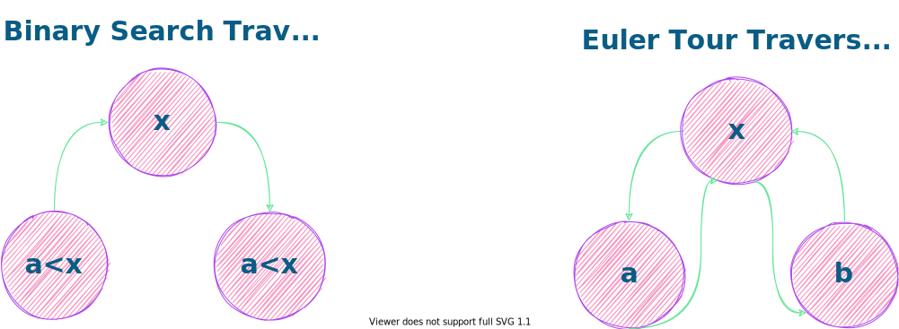

## Binary Tree

```mermaid
flowchart TB

subgraph ct[Complete Tree]
	direction TB
	p --> q & r
	q --> s & t
	r --> u & v
end

subgraph pt[Proper Tree]
	direction TB
	a --> b & c
	b --> d & e
end
```

## Binary Search Tree

Inorder traversal goes through elements in ascending order

Operations Complexity: $O(\log_2 n)$

```mermaid
flowchart TB
6 --> 5 & 7

7 --> 0[" "] & 8
8 --> -1[" "] & 9

5 --> 3 & 4
3 --> 1 & 2
```

## Insertion

If the element already exists in BST, then traverse left once and then right once

```mermaid
flowchart LR

Before -.-> After

subgraph Before
direction TB
z[4] --> x[2] & y[3]
x --> w[1] & l[" "]
end

subgraph After
direction TB
4 --> 2 & 3
2 --> 1 & k[" "]
1 --> -1[" "] & a[2]
end
```

## Deletion

```pseudocode
Algorithm delete(w, v)
	find(w, v)
	
	if isExternal()
		remove w
	if isInternal
		Find smallest descendant d of w
		Replace w with d
		remove d in the leaf node
```

For internal node, you can replace $w$ with the

- smallest element from right subtree
- largest element from left subtree

## Depth

Calculating depth is $O\Big(1 + \text{depth(v)} \Big)$

```pseudocode
Algorith depth(v)
	if isRoot(v)
		return 0
	else
		return 1 + depth( parent(v) )
```

## Height

Height is kinda like the reverse of depth

```pseudocode
Algorith depth(v)
	if isExternal(v)
		return 0
	else
		h = 0
		for each w children(v) do
			h = 
		
```

## Properties

| Notation | Meaning              |
| -------- | -------------------- |
| $n$      | no of nodes          |
| $e$      | no of external nodes |
| $i$      | no of internal nodes |
| $h$      | height               |

$$
\begin{align}
e &= i+1 \\n &= 2e - 1 \\h &\le i \\h &\le (n-1)/2
\end{align}
$$

$$
\begin{align}
h+1 &\le e \le 2^h \\h &\le i \le 2^h - 1 \\2h+1 &\le i \le 2^{h+1} - 1 \\one more
\end{align}
$$

$$
\begin{align}
h &\ge \log_2 e \\h &\ge \log_2(n_1) -1 \\i &\le 2^i
\end{align}
$$

## Expressions

```pseudocode
Algorithm printExpression(v)
	if isInternal(v)
		print("(")
		printExpression(leftChild(v))
	print(v.element())
	if isExternal(v)
		printExpression(rightChild(v))
		print(")")
		
Algorithm evaluateExpression()
	something
```

## Euler Tour Traversal

| Node Type | Traversed |
| --------- | --------- |
| Internal  | Thrice    |
| External  | Once      |

{ loading=lazy }

### Application

Computing number of descendants of a node

```pseudocode
Algo countDescendants(t, v)
	count = t.counter
	somethign
```

