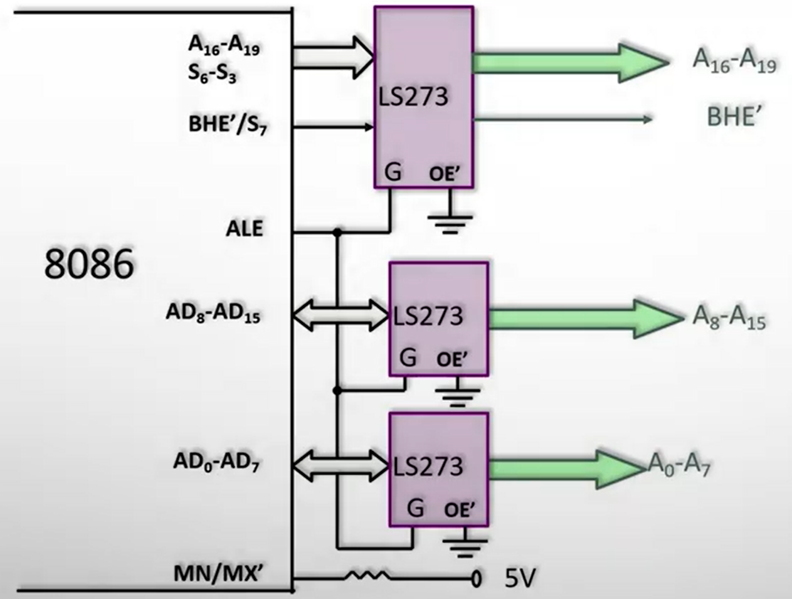

This topic goes over how 8086 creates addresses and how data transfers occurs

## Intro

8086 can be divided mainly into

1. Bus Interface Unit
2. Execution Unit

## Externals

ROM - Read-Only Memory

contains the BIOS (Basic Input/Output System)

RAM - Random Access Memory
is faster and hence, applications get loaded here during runtime

Permanent Memory is non-volatile

IO- Input/Output Devices

## Buses

|           | Address | Data | Control |
| --------- | ------- | ---- | ------- |
| Direction | 1       | 2    | 1       |

All signals depend on the clock. So faster the frequency of the clock, faster the operations.

## Address Buses

{ loading=lazy }

They are multiplexed with data lines and with selection lines. To reduce area required.

Multiplexing happens with inputs that won’t be used simultaneously.

## Pin Diagram

40 pins

Dual Inline Package IC

### VCC

$5v \pm 10 \%$

### GND

2 grounds

### Clk

One cycle of this clock is called as T state.

The time between 2 rising/falling edges is called as a time period.

### Reset

Used to initialize the processor. The processor will repeat all given instructions. Any data inside registers will be lost, and flags will be reset.

CS FFFFh

IP 0000h

This signal has to high for atleast 4 clk signals.

### $MN/ \overline{MX}$

Minimum/Maximum

These 2 are different [modes](#Modes) of operations.

### ALE

Address Latch Enable

Whenever there is address, this is set as high. Else, it is data.

This is sent to [Gate](#G) signal.

### $\overline{BHE}/S7$

Bus High Enable

Enables the most significant data lines (D8 - D15), only when required

S7 is always high

## Modes

|                  | Minimum                  | Maximum                                                      |
| ---------------- | ------------------------ | ------------------------------------------------------------ |
| Logic            | 1                        | 0                                                            |
| No of processors | 1 Only 8086 or 8088 | Multiple requires 8087 as its co processor for floating point operation |
| Size             | Smaller                  | Larger                                                       |
| Cost             | Cheaper                  | Costlier                                                     |

## Octal Latch

8 bit latch

used for **de**multiplexing address and data

it is used to ensure that address does not get affected, while operations don’t get affected.

we are using ==LS273==

### G

Gate Signal controls whether or not input to the latch get reflected to the output.

As soon as the address gets passed through, the signal is turned low.

get its value from the [ALE](#ALE)

When $G$ is high, address is sent out. Else, data is sent out.

### $\overline{OE}$

Output Enabled Active Low

Grounded by default

### Don’t know

| Signal               | Address Signal   | Status Signal   |
| -------------------- | ---------------- | --------------- |
| $A_{16}/S_3$         | $A_{16}$         | Segment Address |
| $A_{17}/S_4$         | $A_{17}$         | Segment Address |
| $A_{18}/S_5$         | $A_{18}$         | Int Flag Status |
| $A_{19}/S_6$         | $A_{19}$         | 0               |
| $\overline{BHE}/S_7$ | $\overline{BHE}$ | 1               |

| S4   | S3   | Function           |
| ---- | ---- | ------------------ |
| 0    | 0    | Extra Segment      |
| 0    | 1    | Stack Segment      |
| 1    | 0    | Code or no Segment |
| 1    | 1    | Data Segment       |
