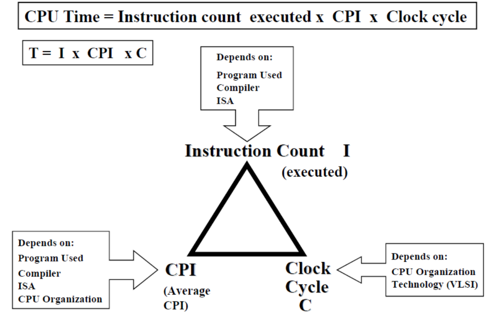

## Performance Measures

| Measure              | Definition                                  |     Goal     | Concerns            |
| -------------------- | ------------------------------------------- | :----------: | ------------------- |
| Execution Time       | Time between start and completion of a task | $\downarrow$ | individual users    |
| Throughput/Bandwidth | Total work done per unit time               |  $\uparrow$  | Datacenter managers |

### Performance and Execution Time

$$
\text{Performance} = \frac{1}{\text{Execution Time}}
$$

$$
\begin{align}
P_x &\textcolor{orange}{>} P_y \\
\implies T_x & \textcolor{orange} < T_y \quad \left( \frac{1}{T_x} > \frac{1}{T_y} \right)
\end{align}
$$

$$
\begin{align}
& X \text{ is } n \text{ times as fast as } Y \\
\implies & n 
= \frac{P_{\textcolor{orange}{x}}}{P_{\textcolor{hotpink}{y}}}
= \frac{T_{\textcolor{hotpink}{y}}}{T_{\textcolor{orange}{x}}}
\end{align}
$$

## Execution Time

### Components

#### Response/Elapsed Time

Time to complete a task

- Processing
- I/O activity
- Memory access
- OS overhead

#### CPU Time

- Time spent by processor to execute a job
  Discounts I/O time, other jobs’ shares
- User CPU time/CPU performance
  CPU time spent in user program
- System CPU Time
  CPU time spent in operating system performing tasks on behalf of the program

### Formula

$$
\text{Clock Cycle Time} = \frac{1}{\text{Clock Frequency Rate}}
$$

$$
\begin{align}
& \text{No of clock cycles} \\
&= \text{No of instructions} \times \text{CPI} \\
& \qquad \qquad \text{CPI}\to \text{(Cycles per Instruction)} \\
&= \sum_{i=1} \text{(No of instructions)}_i \times \text{(CPI)}_i \\
& \qquad\qquad (\exists \text{ different classes of instructions)}
\end{align}
$$

$$
\begin{align}
&\text{CPU Execution time for a program} \\
=& \text{No of clock cycles} \times \text{Clock cycle time}
\end{align}
$$

Be careful when calculating avg CPI for a code sequence (simple, but avoid careless mistake)

We can improve performance by

- Reducing number of clock cycles
- Increasing clock rate
  However, this is not ideal, as this will increase
    - Power consumption
    - Heat produced

## CPU Clocking

Constant-rate clock that governs operation of digital hardware

## Performance Factors

| Factor                | Determines                                                   | Affects Instruction Count | Affects CPI~avg~ | Affects T~C~ |
| --------------------- | ------------------------------------------------------------ | :----------------------------: | :--------------: | :----------: |
| Algorithm             | No of source-level statements I/O operations executed   |               ✅                |        ✅         |      ❌       |
| Programming Language  | No of machine instructions executed per source-level statement |               ✅                |        ✅         |      ❌       |
| Compiler              | No of machine instructions executed per source-level statement |               ✅                |        ✅         |      ❌       |
| ISA                   | No of machine instructions executed per source-level statement |               ✅                |        ✅         |      ✅       |
| Processor Memory | Speed of instruction execution                               |                                |                  |              |
| I/O System OS    | Speed of I/O operations execution                            |                                |                  |              |

## Speedup

$$
\begin{align}
S
&= \frac{P_\text{new}}{P_\text{old}} \\
&= \frac{T_\text{old}}{T_\text{new}}
\end{align}
$$

## Amdahl's Law

> … gives the theoretical speedup in latency of the execution of a task at fixed workload that can be expected of a system whose resources are improved.

If

- $s$ is the fraction that is sequential
- $p$ is the fraction that can be parallelized
- $n$ is the new parallel processing ability
  
$$
\begin{align}
n &= \text{factor of increase in number of processors} \\
& \qquad \times \text{factor of increase in processor performance}
\end{align}
$$
  
$(s = 1-p; \quad p = 1-s)$

Then, the maximum speed up $S$ is

$$
\begin{align}
S &= 
\frac{\text{Speed with parallelization}}{\text{Speed without parallelization}} \\
&= \frac{1}{
s + \frac{p}{n}
}
\end{align}
$$

## Design Principles

- Simplicity is favored over regularity
- Smaller is faster
- Something
- Something

## ISA

Instruction Set Architecture

The sheet will be given

**Note**

- All core instructions have 3 operands
- All pseudo-instructions have 2 operands

## Branching

Doing the branching opposite of the pseudocode helps eliminate a jump instruction.

It may seem small, but if you use a loop, the savings will add up to a lot of cycles.

## IDK

| P       | Multiplicand | Mr   | Step                                              |
| ------- | ------------ | ---- | ------------------------------------------------- |
| 0000000 | 00001100     | 1100 |                                                   |
|         | 00000110     | 110  | Right-Shift multiplier Left-Shift multiplier |
|         |              |      | Right-Shift multiplier Left-Shift multiplier |
