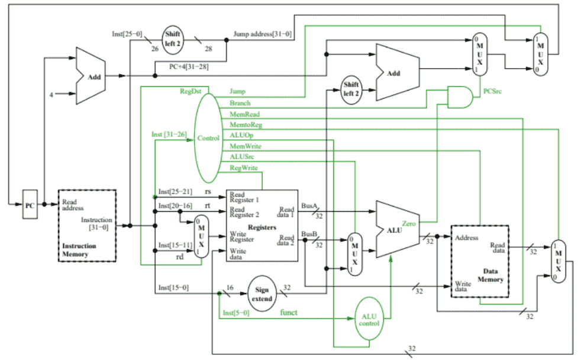
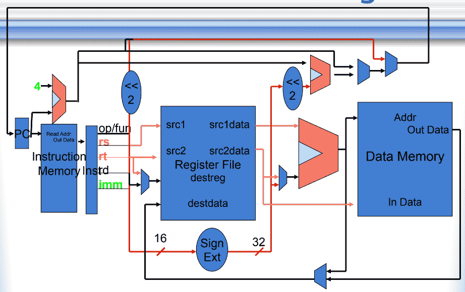
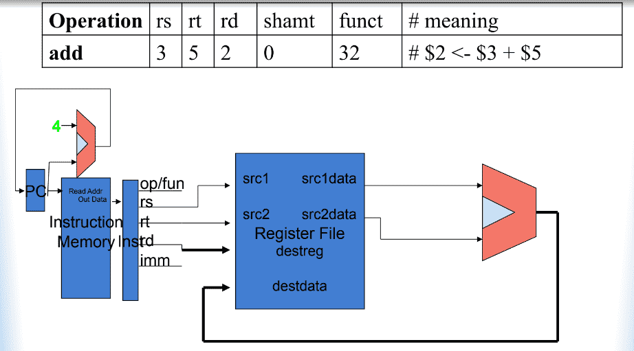
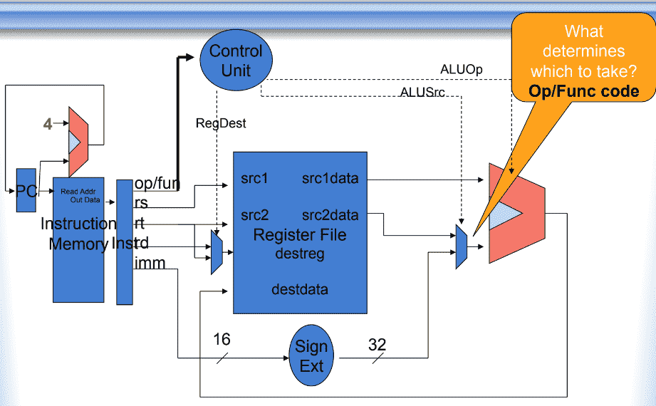
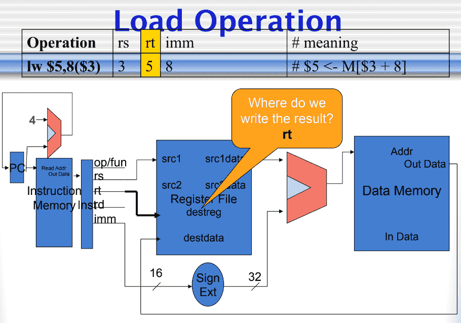
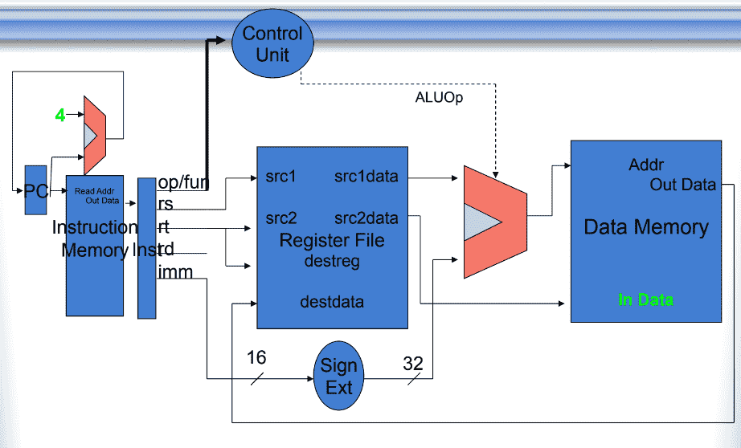
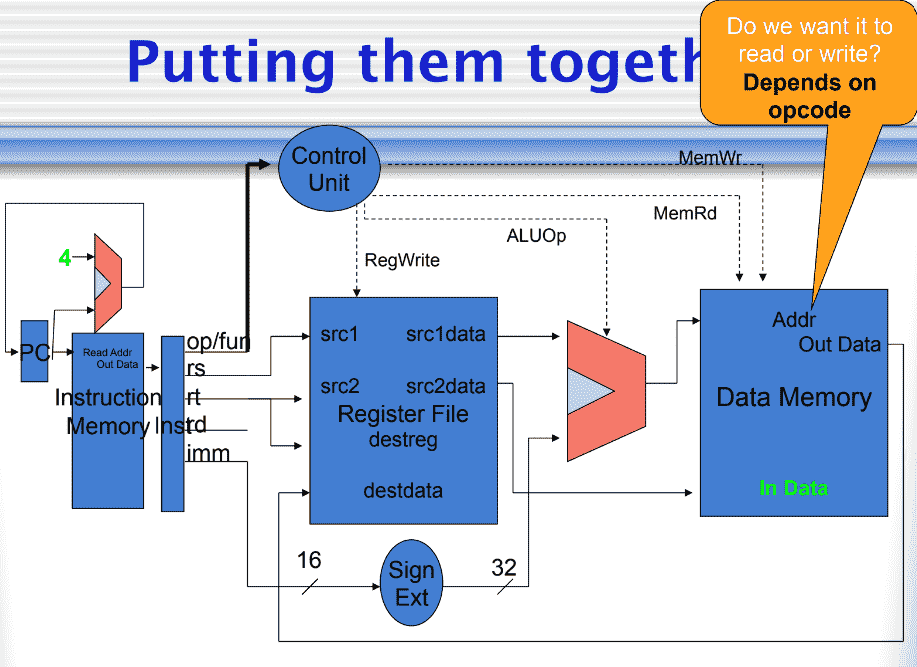
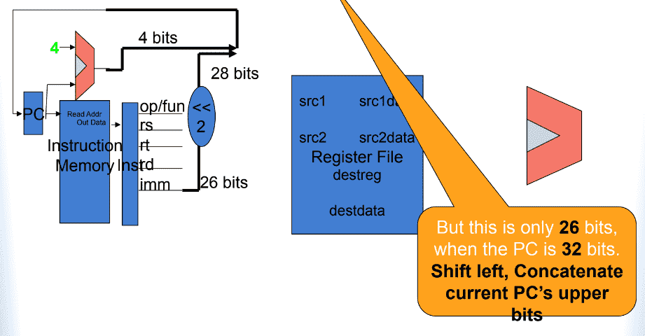

## MIPS Datapath

{ loading=lazy }

## Goal of Datapath

Build an architecture to support the following instructions

- Arithmetic: `add`, `sub`, `addi`, `slt`
- Memory references: `lw`, `sw`
- Branches: `j`, `beq`

## Process

1. Design basic framework that is needed by all instructions
2. Build a computer for each operation individually
3. Add MUXs to choose between different operations
4. Add control signals to control the MUXs

## MIPS Steps

```mermaid
flowchart LR
if["Instruction Fetch<br/>(using Program Counter)"] -->
|PC += 4| r["Instruction Decode<br />&<br />Register Read"] -->
alu["Execute<br />(ALU)"] -->
m["Memory<br />(Read/Write)"] -->
R["WriteBack<br />(Register Write)"]
```

Register Read may be

- One register: `addi`, `lw`
- Two registers: `add`, `sub`, `slt`, `sw`, `beq`

Quick operations may loop twice through machine, getting incorrect result, as clock is dependent on longest path (`lw`). 

## Sign Extension

Important for immediate data operations

Take the top bit and copy it to all the other bits

**example**

$$
\begin{align}
7 &\to 0111 \to 0000 \ 0000 \ 0000 \ 0111 \\-2 &\to 1110 \to 1111 \ 1111 \ 1111 \ 1110
\end{align}
$$

## MIPS Instruction Available Datapath

{ loading=lazy }

## `add` instruction

{ loading=lazy }

## `addi` Instruction

{ loading=lazy }

## `load` Instruction

{ loading=lazy }

## Store Instruction

{ loading=lazy }

{ loading=lazy }

## `beq` Instruction

Choose between

- $\text{PC = (PC + 4)}$
- $\text{PC = (PC + 4) + \ \ Imm<<2}$

{ loading=lazy }

## `j` Instruction

`imm` is 26 bits, but PC is 32 bits

- `imm <<` (shift left)
- Concatenate PC’s upper bits

{ loading=lazy }

## Control Unit

Set of control line values that cause appropriate actions to be taken at each step

Finite state machine determines what needs to be done at each step

- Fetch
- Decode
- Action depends on opcode
    - Execute
    - Memory
    - Writeback

## Single Cycle implementation

An implementation in which an instruction is executed in one clock
cycle

Also called single clock cycle implementation

### Advantage

Easy to understand

### Disadvantage

Too slow

The clock cycle must have the same length for every instruction. Hence, the longest possible path in the processor determines the clock cycle

- usually it is the `load` instruction, which uses five functional units in series
    - instruction memory
    - register file
    - ALU
    - data memory
    - register file

Single long clock cycle makes `add` take as long as `load`

### Solution

- Break single instruction execution into small execution steps
- Improve performance by **pipelining**