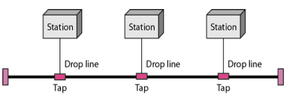
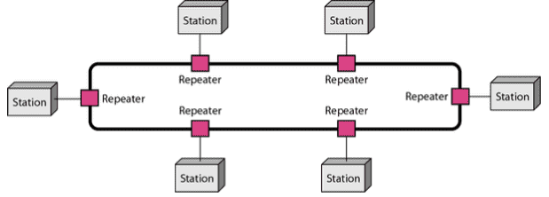
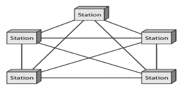
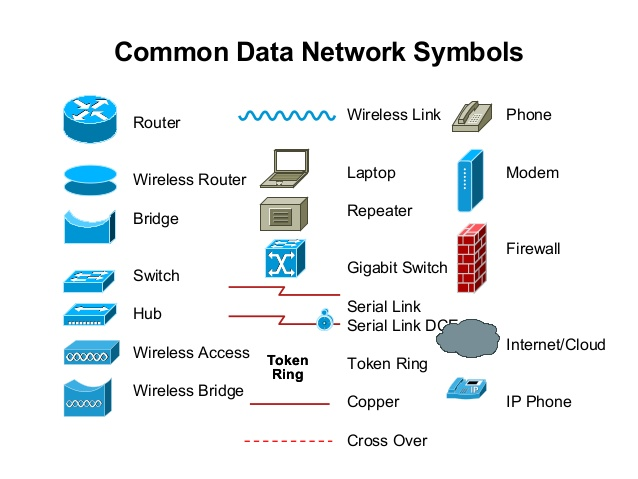
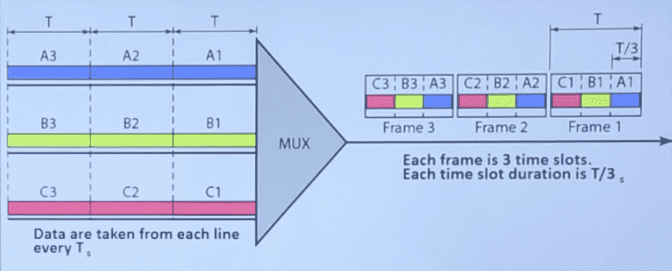

# Introduction

## Data Communication

Exchange of data b/w devices via transmission medium, where data is information presented in form agreed by involved parties. Termed from ‘telecommunication’ - communication at a distance

### Components of Data Communication

- Message
- Sender
- Sending protocol
- Medium
- Receiver
- Receiving protocol

### Node

Device capable of sending/receiving data to/from other notes on network

## Network

Set of devices connected by communication links

### Purpose

Share resourcces

- File sharing
- Hardware sharing
- Application sharing: Client/server apps
- Network graming
- User Commuication
  - Voice over IP (VoIP): allows calls over traditional IP rather than by traditional PTSN

### Distance-Based Classification

|      | Range                        | Example      |
| ---- | ---------------------------- | ------------ |
| LAN  | Short                        | Wifi         |
| MAN  | Specific area (city, campus) | Cable TV     |
| WAN  | Long                         | The Internet |

### Parts of Network

| Part              | Role                                                         |
| ----------------- | ------------------------------------------------------------ |
| ‘The Internet’    |                                                              |
| Router            | Connect internet to ‘The Internet’ has intelligence (represented using $\otimes$) |
| Firewall          | Rules to adhere on which messages to be allowed              |
| Switch            | Helps form a LAN (Local Area Network) No of ports will always be $2^n$ |
| File Server       |                                                              |
| Database Server   |                                                              |
| File Server       |                                                              |
| WiFi Access Point | kinda like a wireless switch connected to wired swetch  |

Links between one/more routers should be a ‘dedicated link’

## Transmission Modes & Media

| Type                            | Medium              | Range     | Requires                                   | Example                   |
| ------------------------------- | ------------------- | --------- | ------------------------------------------ | ------------------------- |
| Wired                           | Twisted Pair Cables | Short     |                                            | Landline, Ethernet cable  |
|                                 | Coaxial Cables      | Long      |                                            |                           |
|                                 | Fibreoptic Cables   | Very Long |                                            |                           |
| Wireless (Frequency bands) | Radio Waves         | Long      | Omni-directional antenna                   | Car radio                 |
|                                 | Micro Waves         | Long      | Uni-directional Microwave antenna Lon | Etisalat connection tower |
|                                 | Infrared Waves      | Short     |                                            | Bluetooth                 |

Wireless can
- Infrastructure-Based: Mobile Network
- Infrastructure-less: Bluetooth

## IDK

### Transmission Modes

|             | Direction | Order                                                | Example       |
| ----------- | :-------: | ---------------------------------------------------- | ------------- |
| Simplex     |    Uni    |                                                      | Car Radio     |
| Half-Duplex |    Bi     | Sequential (one direction after the other)      | Walkie-Talkie |
| Full-Duplex |    Bi     | Simultaneous (both directions at the same time) | Telephone     |

### Line Configurations

|                | Example                                            |
| -------------- | -------------------------------------------------- |
| Point-to-Point | Connection from ISP to home router                 |
| Multi-Point    | Multiple devices connected to a single home router |

### Topology

Arrangement of nodes in a network

|              | Bus                                               | Ring                                                                                    | Star                                                            | Mesh                                                                 | Hybrid|
|---           | ---                                               | ---                                                                                     | ---                                                             | ---                                                                  | ---|
|Arrangement   | Sequential                                        | Each node connected to 2 adjacent nodes                             | Nodes directly connected to a central ‘controller’ | Every device connected to every other device in point-point manner | Combination of star and bus|
|Working | Devices collectively help transfer data b/w points Terminators stop signals after reaching end of wire, to prevent signal bounce | Token-Passing (Token: Message which gives priority to a station to use ring) - Data hops from one device to another until it reaches its destination - Each device communicates its routing info to every other connected device - Each device then determines either passes/keep received data |  |  | |
|Device Used   | Tap Drop line                                | [Repeater](#Repeater)                                                                   | Hub/Switch/Router |                                                                      | |
|Advantage     | Simple Cheap Easy installation Node failure does not affect others | Easier to manage Easier to locate defective node/cable problem Great for transmitting signals over long distances on a LAN Handles high-volume network traffic Enables reliable communication | - Good for modern networks - Low startup costs - Easy to manage - Easy to expand - Great availability of equipment - Scalable - High security | Highest redundancy Low failure chance Low traffic Easy fault identification Robust | |
|Disadvantage  | Not fault-tolerant Prone to congestion No security | Expensive Single point of failure Requires more cable & network equipment at start Fewer equipment options Fewer options for high-speed upgrades Only one station can send message Requires tokens Requires multiple repeaters No security | Single point of failure - If hub fails, everything fails Possible congestion at hub Requires more cables than bus | Expensive (Many cables, I/O port, connections) | Same as star |
|Method | Half-Duplex | Simplex | Duplex? |  | |
|Example       | [Ethernet](#Ethernet)                             |                                                                                         |                                                                 | Between ISP routers                                                  | |
|Duplex/Half-Duplex links  | 1 | 0 | $n$ | $\frac{n(n-1)}{2}$                                                  | |
|Simplex links | 0 | 1 | $2n$ | $n(n-1)$                                                          | |
|Diagram |  |  |  |  |  |

## Network Devices

|                  |                                                              |
| ---------------- | ------------------------------------------------------------ |
| End Points       | PCs, Servers, Printers, etc                                  |
| Interconnections | Media, Connectors NIC(Network Interface Card)/LAN Card/Ethernet Card) |
| Bridge           | (not used anymore)                                           |
| Switches         | Connects endpoints to LAN Multi-Port Bridge             |
| Router           | Connect multiple LANs to form internetworks Chooses best path between LAN & WAN |
| Repeater         | Repeats [Token](#Token) in a round-robin fashion Helps overcome signal attenuation |
| Hub              | Device without any intelligence Multi-port repeater Not used much anymore It will just broadcast every packet, as it cannot select devices. |

## Network Rules

### Protocol

Consists rules for the following aspects

| Aspect    | Meaning                           |
| --------- | --------------------------------- |
| Syntax    | Format of data                    |
| Semantics | Meaning of each section of bits   |
| Timing    | Timing and speed of data transfer |

## The Internet

Network of networks, consisting of

- Connected computing devices
- communication links
- Routers
- Protoctols
- Communication infrasture for distributed applications
- Communication services

### Standard

Collection of [protocol](#protocol)s agreed by organizations, such as ITU, IEEE

| De Facto Standards        | De Jure Standards              |
| ------------------------- | ------------------------------ |
| Approved by organizations | Adopted through widespread use |

For eg

- Wired LAN uses standard `IEEE 802.3`
- WiFi (WirelessFidelity) uses standard `802.11`

#### Internet Standards

- Internet draft
- RFC (Request for Comment)

### Models

| Model         |                                        | Example                          |
| ------------- | -------------------------------------- | -------------------------------- |
| Client-Server | 1 Client 1 Server                 | WWW Email                   |
| Peer-to-Peer  | End devices use each other’s resources | Torrenting Teleconferencing |

## Types of Services

|                      | Connection-Oriented                                          | Connection-Less                                              |
| -------------------- | ------------------------------------------------------------ | ------------------------------------------------------------ |
| Stages               | 1. Set up connection 2. Receive acknoledgement 3. Send data 4. Receive acknowlegment 5. Repeat steps 3-4 | Send data                                                    |
| Reliable             | ✅                                                            | ❌                                                            |
| Flow Control         | ✅                                                            | ❌                                                            |
| Congestion Control   | ✅                                                            | ❌                                                            |
| Speed                | Slower                                                       | Faster                                                       |
| Example Protocol     | TCP (Transmission Control Protocol)                     | UDP (User Datagram Protocol)                            |
| Example Applications | HTTP (WWW) FTP (File Transfer Protocol) Telnet (Remote Login SMTP (Simple Mail Transfer Protocol) | Streaming media Teleconferencing Internet telephony |

## Switching/Routing Mechanism

|                                                   | Circuit Switching                                            | Packet Switching                                             |
| ------------------------------------------------- | ------------------------------------------------------------ | ------------------------------------------------------------ |
| Type                                              | Physical                                                     | Logical                                                      |
|                                                   | Dedicated circuit per call: telephone net                    | Data sent in discrete ‘chunks’ Each packet uses full link bandwidth |
| Steps                                             | - Establish physical connection - Network resources divided into pieces - Pieces allocated to calls - Data Transmission - Teardown | - Split data into packets - Transmit packets one hope at a time - Packet reaches receiver |
| Resource reservation                              | ✅                                                            | ❌                                                            |
| Resources allocated                               | Fixed                                                        | On-Demand (Dynamic)                                          |
| Advantages                                        |                                                              | Line efficiency (Single link can be shared by multiple packets) Data rate conversion Packets are accepted even when network is busy (delayed, but still accepted) Priorities can be set |
| Disadvantage                                      | Resource piece idle if not used by owning call (no sharing) Call setup required |                                                              |
| Connection Type                                   | Connection-oriented                                          | Connection-less (Virtual Circuit Approach) Connection-oriented (Datagram Approach) |
| Total resource demand can exceed  available? | ❌                                                            | ✅                                                            |
| Congestion Control?                          | ❌                                                            | ✅                                                            |
| Performance guaranteed?                      | ✅                                                            | ❌                                                            |

## Resource Division

1. Frequency division
2. Time division
3. Code division

### TDM

Time Division Multiplexing

## Subnet Mask

This is the value to perform `and` operation

To get the value, just make the network bits of the IP address as 1s and host bits as 0s

