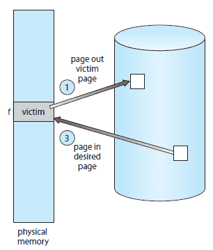

Only the required page of a process is required to be brought to physical memory; when a page is not required for execution, it is not brought in

### Main usecases

Rarely used features/functions and data structures

## Advantages

- Size of process is not limited by the size of physical memory (primary)
- Increased degree of multiprogramming (no of programs that can exist in the primary memory at the same time)
- Increased CPU utilization
- Reduced I/O wrt a process, by eliminating unnecessary ‘swapping-in’

## Page Fault

When a process tries to access a page that exists in memory, execution continues as normal

Otherwise, if the process tries to access a page that is marked invalid, this means that the corresponding page is missing

- software interrupt (trap) is created
- bring in required page from secondary memory
- Store into free frame/[Page Replacement](#Page Replacement)
- Reset page table
- Restart execution

## Page Replacement

If there are no free frames, we need to replace the frame in a manner that would reduce future page faults.

{ loading=lazy }

### Algorithms

| Algo                      | Replace frame that is                 | Avoids [Bélády's Anomaly](#Bélády's Anomaly) |
| ------------------------- | ------------------------------------- | :------------------------------------------: |
| FIFO (First in First out) | oldest                                |                      ❌                       |
| Optimal                   | least likely to be used in the future |                      ✅                       |
| LRU                       | Least Recently-Used                   |                      ✅                       |

> #### Bélády's Anomaly
>
> In computer storage, the phenomenon in which having more page frames can cause more page faults for first-in first-out page replacement algorithm