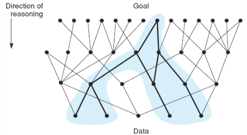
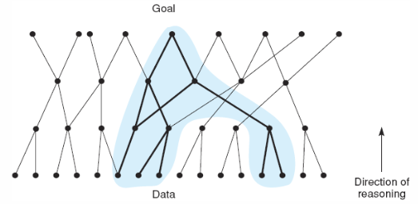

# Search

## Steps

1. Formulate goal
2. Formulate problem
3. Find solution

## Types of Search

| Type                     | Examples                                                     |
| ------------------------ | ------------------------------------------------------------ |
| Single-Agent             | Traveling Salesperson 8-Puzzle (Sudoku) Wiring of VLSI circuits Finding faults in vehicle |
| Two-Agent                | Chess Tic-Tac-Toe Checkers Go Tzaar      |
| Constraint-Satisfication | Scheduling 8-Queens F-Block                        |

## Parts of Search

### Agents

| Type of Agents                                          |                                                              |
| ------------------------------------------------------- | ------------------------------------------------------------ |
| Intelligent/ Problem Solving/ Rational Agents | has goals and tries to perform a series of actions that yield the best outcome/achieve a goal |
| Reflex Agents                                           | Don’t think about consequences of its actions, and selects an action based on current state of the world. |

### Keywords

| Keyword                   | Meaning                                                      |                                                           |
| ------------------------- | ------------------------------------------------------------ | --------------------------------------------------------- |
| State                     | Description of possible state of the world Includes all features relevant to problem |                                                           |
| Initial/ Start State | State from where agent begins the search                     |                                                           |
| Goal State                | State where success is attained, which we want to reach Multiple goal states can exist |                                                           |
| Goal Test                 | Function that observes current state and returns whether goal state is achieved/not |                                                           |
| Action                    | Function that maps transitions from one state to another     |                                                           |
| Problem                   | Definition of general problem as search problem              |                                                           |
| Solution                  | Sequence of actions that help go from initial state to goal state |                                                           |
| Solution cost             | Cost associated to perform solution                          |                                                           |
| Search                    | Process of looking for solution                              |                                                           |
| State Space               | Set of all states that are possible and can be reached in an environment/system. |  |
| State space size          | Total number of states. Counted using fundamental counting principle. |                                                           |
| Search Tree               | Tree representation of search problem.                       |                 |

## Search Type

### IDK

| Type           |                         | Path is relevant? | Direction         |                                                              |
| -------------- | ----------------------- | ----------------- | ----------------- | ------------------------------------------------------------ |
| Planning       | Sequence of actions     | ✅                 | Backward chaining |                     |
| Diagonosis     |                         | ✅                 | Forward chaining  |  |
| Identification | Assignment to variables | ❌                 |                   |                                                              |

### Information

| Information | Other names                            | Comment            |
| ----------- | -------------------------------------- | ------------------ |
| Uninformed  | Blind Brute-Force Undirected |                    |
| Informed    |                                        | Tends to be faster |

## Search Property

| Property     | Meaning                                                      |
| ------------ | ------------------------------------------------------------ |
| Completeness | Algo guaranteed to find soln in a **finite** duration $\iff \exists$ a soln |
| Optimality   | Algo guaranteed to find least cost path to goal state        |

## Heuristic

A heuristic function $h(x)$ is an estimated cost from one node to another

- Heuristics are problem-specific
- Over-estimating heuristic is better than under-estimating
- As heuristics get closer to the true cost, you will expand fewer nodes but usually do more work per node to compute the heuristic itself

Eg: Manhattan distance, Euclidean distance

### Characteristics

Consider

- $h(a, b)$ is heuristic from $a$ to $b$
- $c(a, b)$ is true cost from $a$ to $b$

| Characteristic                | Definition                                                   | Comment                                                      | Implication                                                  |
| ----------------------------- | ------------------------------------------------------------ | ------------------------------------------------------------ | ------------------------------------------------------------ |
| Admissible                    | $h(x, G) \le c(x, G) \quad \forall x$                        | Heuristic never overestimates true cost                      | Admissible slows down bad plans, but never outweigh true costs Inadmissible/pessimistic compromises optimality but with lower (better) search time |
| Consistent                    | $\vert h(x_1, G) - h(x_2, G) \vert \le c(x_1, x_2)$ where $x_2$ is an intermediate node b/w $x_1$ and $G$ | Every consistent heuristic is also admissible                | $f$ value along path never decreases You can skip checking for shortest path when a node is encountered 2nd time. |
| Informedness/ Domination | $h_1(x, G) \ge h_2(x, G) \quad \forall x$ where $h_1, h_2$ are admissible | $h_1$ is more informed than $h_2$ $h_1$ dominates $h_2$ |                                                              |
| Semi-lattice of heuristics    | $\max(h_1, h_2)$ is admissible                               |                                                              |                                                              |
| Trivial heuristic             | Bottom of lattice is zero heuristic $\implies$ top of lattice is exact heuristic |                                                              |                                                              |

## Search Algorithms

| Search Type | Algo                                    |                                                              | Comment                                                      | Complete                                      | Optimal                                   | Time Complexity  | Space Complexity | Disadvantage                                                 | Advantage                                                | Hyperparameter                                               |
| ----------- | --------------------------------------- | ------------------------------------------------------------ | ------------------------------------------------------------ | --------------------------------------------- | ----------------------------------------- | ---------------- | ---------------- | ------------------------------------------------------------ | -------------------------------------------------------- | ------------------------------------------------------------ |
| Uninformed  | DFS                                     | Keep picking left-most node possible                         | Explore deepest node from start node  (Stack - LIFO) | ❌ ✅ (if no cycles)                       | ❌                                         | $O(b^m)$         | $O(bm)$          | May get “lost” deep in graph, missing the shortest path      | Avoids searching “shallow states” for long solution      |                                                              |
|             | BFS                                     | Traverse left to right, level by level                       | Explore shallowest node from start node  (Queue - FIFO) | ✅                                             | ✅                                         | $O(b^{m_s} + 1)$ | $O(b^{m_s}+1)$   | High memory usage if states have high avg no of children     | Always finds shortest path                               |                                                              |
|             | Iterative-Deepening                     | Combination of DFS and BFS)                                  | Perform DFS for every level DFS with depth bound        |                                               | Not necessarily                           | $O(b^d)$         | $O(bd)$          | Repeated work (negligible though: $O(1/b)$)                  | Prevents DFS from getting lost in infinite path          | Depth threshold                                              |
|             | UCS (Uniform Cost)/ Branch & Bound | Orders by path/backward cost $c(i, x)$                       | Explore least cost node from start node                      | ✅ ($\iff$ all costs are non-negative)    | ✅                                         | $O(b^m)$         | $O(b^m)$         | Explores options in “every direction”                        | Keeps cost low                                           |                                                              |
|             | Bi-Directional                          | Performed on search graph                                    | Two simultaneous search - forward search from start vertex toward goal vertex and backward search from goal vertex toward start vertex | ✅                                             | ✅ $\iff$ we use BFS in both searches | $O(b^{d/2})$     | $O(b^{d/2})$     |                                                              | Can prune many options                                   | - Which goal state(s) to use - Handling search overlap - Which search to use in each direction - 2 BFS searches |
| Informed    | Greedy/Best-First                       | Explore the node with lowest heuristic value which takes closer to goal  Orders by goal proximity/forward cost $h(x, G)$ | Similar to UCS, but with a priority queue                    | ❌                                             | ❌                                         | $O(b^m)$         | $O(b^m)$         | Tentative May directly go to wrong end state May behave like a poorly-guided DFS | Helps find solution quickly                              |                                                              |
|             | A*                                      | Explore the node with lowest total cost value  $f = C(i, x) + h(x, G)$ | Uses priority queue  Combination of UCS & Greedy   | ✅                                             | ✅ ($\iff$ heuristic is admissible)   | $O(b^m)$         | $O(b^m)$         |                                                              |                                                          |                                                              |
|             | Hill-Climbing                           | Basically gradient-descent                                   |                                                              | ❌                                             | ❌                                         | $O(bm)$          | $O(b)$           | Irreversible If bad heuristic, may prune away goals Stuck at local minima/maxima Skips ridges Plateaus | Fast Low memory                                     |                                                              |
|             | Beam                                    | Compromise b/w hill-climbing & greedy                        | $n=1:$ Hill-Climbing $n=\infty:$ Best-First  $n \in (1, \infty) :$ Beam width (no of children to search) | ❌                                             | ❌                                         | $O(nm)$          | $O(bn)$          |                                                              |                                                          |                                                              |
|             | IDA* (Iterative Deepening A *)     | Similar to Iterative Deepening, but uses A* cost threshold   | Increase always includes at least one new node               | ✅                                             | ✅                                         | $O(b^m)$         | $O(m)$           | Some redundant search, but negligible Dangerous if continuous $h$ values or if $h$ values very close to threshold | Ensures search never looks beyond optimal cost soln      | - Threshold - $h$(root) - $f$(min_child)  min_child is the cut off child with min $f$ |
|             | RBFS (Recursive Best-First/Greedy) | Linear space variant of $A^*$                                | Backtrack if current node is worse than next best alternative  Perform $A^*$ but discard subtrees when performing recursion Keep track of alternative (next best) subtree Expand subtree until $f>$ bound Update $f$ before (from parent) and after (from child) recursive call |                                               |                                           | $O(2^m)$         | $O(bm)$          | Stores more info than IDA*                                   | More efficient than IDA*                                 |                                                              |
|             | SMA*                                    | Simplified Memory-Bounded A*                                 | Perform A*, but when memory is full, discard worst leaf (highest $f$) Back value of discarded node to parent |                                               |                                           |                  |                  |                                                              |                                                          |                                                              |
|             | Hill-Climbing                           |                                                              | Random restart helps overcome local maxima/minima  Random sideways moves help escape from - shoulders - loop on flat maxima | ❌ Trivially complete with random restart | ❌                                         |                  |                  | Irreversible steps Skips ridges                         | Fast Low memory requirement                         |                                                              |
|             | Local Beam                              | $k$ hill climbs                                              | Choose $k$ random successors Similar to natural selection | ❌                                             | ❌                                         |                  |                  | Inefficient All $k$ states end up on same local hill    |                                                          | $k$                                                          |
|             | Simulated Annealing                     | Trade-off b/w hill-climbing & random search                  | Randomness at high “temperature” When temperature cools, reduce prob of random moves |                                               |                                           |                  |                  |                                                              | Can find global optima when temperature chosen correctly | Temperature                                                  |
|             | Genetic Algorithm                       |                                                              |                                                              |                                               |                                           |                  |                  |                                                              |                                                          |                                                              |

where

- $b =$ max branching factor (nodes at each level)
- $m=$ depth
- $m_s =$ depth of shallowest solution
- $C^*$ is optimal path cost
- $\epsilon$ is minimal cost between 2 nodes

Fringe is a priority queue

### Iterative Improvement Search

Local search

Hill-climbing, local beam, simulated annealing, genetic

Appropriate when only reaching goal state is required; solution path is irrelevant

### IDK

## Graph Search

Helps avoid repeated states
- Do not return to parent/grand-parent states
- Do not create solution paths with cycles
- Do not generate repeated states as options (need to store & check more states)

### Implementation

- Data structures
  - Tree (as usual)
  - Set of expanded (visited/closed) nodes
- Traversal
  1. Visit node from open set
  2. Check if visited previously
  3. If visited, skip node and go to step 1
  4. Else
     1. expand node
     2. add node to closed set
     3. add children to open set

### Implications

- Completeness maintained
- Optimality is not guaranteed
