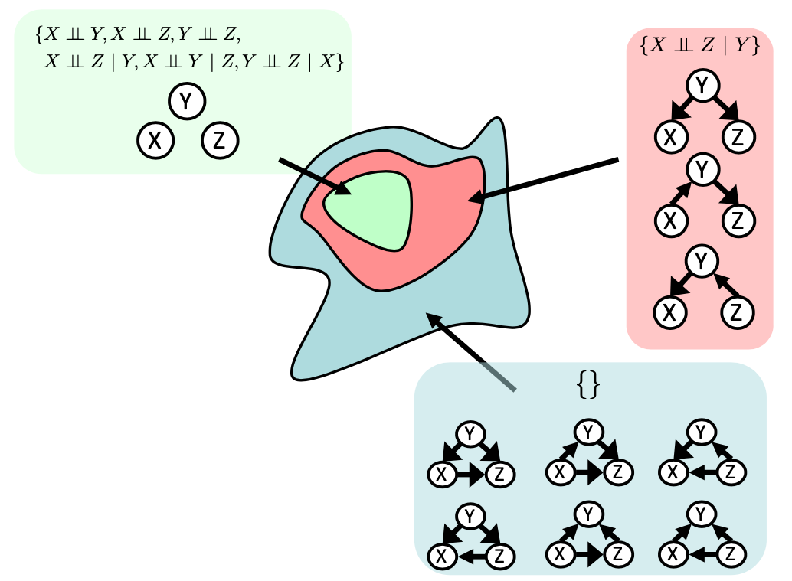

# Bayesian Network

Technique for describing complex joint distributions using simple, local distributions (conditional probabilities)

Also known as probabilistic graph model

Bayes net = Graph + Local conditional probabilities

Local interactions chain together to give global, indirect interactions

Note: Kindly go through [Bayes' Theorem in Probability and Statistics](./../../1_Core/Probability_%26_Statistics/02_Bayes_Theorem.md)

## Semantics

DAG that represents the dependence b/w vars

- Nodes - represents variables
- Links - X points to Y, implies X has direct influence over Y or X is a parent of Y
- Conditional Probability Table - each node has a conditional probability distribution which determines the effect of the parent on that node

## Why needed?

Inefficient to use full joint distribution table as probabilistic model

- Joint is way too big to represent explicitly
- Hard to learn/estimate anything empirically about more than few variables at a time

## Aspects

|                   |                                                              |
| ----------------- | ------------------------------------------------------------ |
| Definition        | $P(X=x)$                                                     |
| Representation    | Given a BN graph, what kinds of distributions can it encode? |
| Modelling         | What BN is most appropriate for a given domain               |
| Inference         | Given a fixed BN, what is $P(X \vert e)$                     |
| Learning          | Given data, what is best BN encoding                         |
| Diagnosis         | Infer P(problem type \| symptoms)                            |
| Prediction        | Infer prob dist for values that are expensive/impossible to measure |
| Anomaly detection | Detect unlikely obs                                          |
| Active learning   | Choose most informative diagnostic test to perform given obs |

## Joint Probability Distribution

$$
\begin{aligned}
P(x_i|x_{i \ne j})
&= P(x_i |\text{Pa}(x_i)) \\
P(x_1, \dots, x_m)
&= \prod_{i=1}^m P(x_i |\text{pa}(x_i))
\end{aligned}
$$

## Independence in BN

$x {\perp \!\!\! \perp} y | z$ is read as $X$ is conditionally independent of $Y$ given $Z$

$$
X {\perp \!\!\! \perp} Y | Z \iff
P(x, y \vert z) = P(x \vert z) \cdot P(y \vert z)
$$
Are 2 nodes independent given evidence?

- If yes: prove using algebra (tedious)
- If no: prove with counter example

## D-Separation

Condition that explains the independence of subgraphs

Query:
$$
x_i {\perp \!\!\! \perp} x_j \vert \{ x_{k_1}, \dots, x_{k_n} \}
$$
Check all (undirected) paths between $x_i$ and $x_j$

|                          | Independence guaranteed |
| ------------------------ | ----------------------- |
| If one/more paths active | ❌                       |
| All paths inactive       | ✅                       |

## Casual chains

```mermaid
graph LR
x((x))-->y((y))
y((y))-->z((z))
```

$x {\perp \!\!\! \perp} y | z$ guaranteed

### Common Cause

```mermaid
  graph TD;
    y((y))-->x((x));
    y((y))-->z((z));
```

$x {\perp \!\!\! \perp} y | z$ guaranteed

### Common effect

```mermaid
graph TD;
x((x))-->z((z));
y((y))-->z((z));
```

- $x {\perp \!\!\! \perp} y$ guaranteed
- $x \centernot{\perp \!\!\! \perp} y | z$ guaranteed

## Active

A path is active if every triple in path is active

_NOTE : All possible configurations for active and inactive triples are below_

```mermaid
graph TB

subgraph Inactive

direction LR
subgraph i1
direction LR;
Ai1(("x")) --> Bi1["z"] -->Ci1(("y"));
style Bi1 fill : #808080
end

subgraph i2
direction TB
Bi2["z"]-->Ai2(("x")) & Ci2(("y"));
style Bi2 fill : #808080
end

subgraph i3
	direction TB
	Ai3(("x")) & Bi3(("y")) --> Ci3(("z"))
end


subgraph i4
	direction TB
	Ai4(("x")) & Bi4(("y")) --> Ci4(("z")) --> Di4((" "))
end

end

subgraph Active
direction LR
subgraph 4
	direction TB
  x4(("x"))-->C4(("z"));
  y4(("y"))-->C4(("z"));
  C4(("z"))-.->D4[" "]
  style D4 fill : #808080
end

subgraph 3
  direction TB
  A3(("x"))-->C3["z"];
  B3(("y"))-->C3["z"];
  style C3 fill : #808080
end

subgraph 2
  direction TB
  B2(("z"))-->A2(("x")) & C2(("y"));
end

subgraph 1
direction LR
A1(("x"))-->B1(("z"));
B1(("z"))-->C1(("y"));
end
end
```
## Topology Limits Distributions

Given some graph topology $G$, only certain joint distributions can be encoded

The graph structure guarantees certain (conditional) independencies

Bayes net’s joint distribution may have further (conditional) independencies that is not detectable until inspection of specific distribution

Adding arcs increases set of distributions but has several costs

Full conditioning can encode any distribution

## Building a Bayes Net

1. Choose set of relevant vars
2. Represent each var by a node
3. Choose ordering for vars $x_1, \dots, x_m$ such that if $x_i$ influences $x_j$, then $i < j$
4. Add links: Link structure must be acyclic
5. Add conditional probability table for each node

## Interpreting

1. Given parents, each node is conditionally independent of all non-descendents in the tree
2. 2 unconnected vars may still be correlated
3. Whether 2 vars are conditionally-independent can be deduced using “d-separation”

## Inference

- Doing exact inference is computationally hard
  - Tractable in some cases: trees
- We can instead perform approximate inference
  - Likelihood-weighted sampling

1. Marginal probability
   1. Rewrite in terms of joint distribution
      1. Fix query vars
      2. Sum over unknown vars
2. Conditional probability
   1. Fix query vars
   2. Fix evidence vars
   3. Sum over unknown vars
   4. Add normalization constant $\alpha$ such that
3. Rewrite joint probability using Bayes Net factors
4. Choose variable order; take summations inside

## Learning

- Structure learning
- Parameter learning

## Variable Elimination

Eliminating all vars in turn until there is a factor (function from set of vars) with only query var

To eliminate a var

1. Join all factors containing that var
2. Sum out influence of var on a new factor
3. Exploits product form of joint distribution

