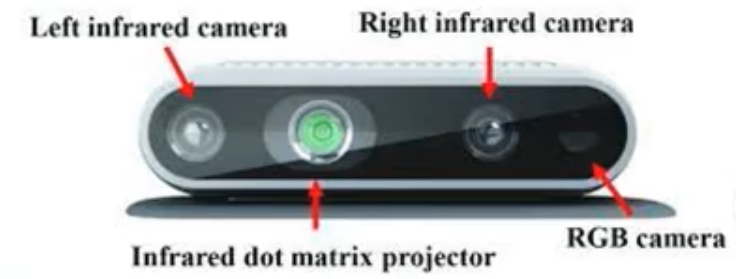

# Sensors

We can combine multiple sensors to measure the same quantity, and we can use each to verify the others.

## LiDaR

Light Detection and Ranging

Remote sensing method using light in the form of pulsed laser to measure ranges (variable distances).

These light pulses generate precise, 2D/3D maps.

Lidar instrument consists of a laser, scanner, specialized receiver.

## Ultrasound Sensors

Measures distance of object by emitting Ultrasonic sound waves, and converts reflected sound into electrical signal.

Ultrasonic waves travel faster than speed of audible sound

### Components

- Emitter
- Receiver

Sends out an Ultrasonic pulse at 40 kHz which travels through the air, and returns if it bounces back from an object.

By calculating the travel time & speed of sound, the distance can be calculated

## Stereo Cameras

Single camera/ordinary multi-camera system can only help in basic obstacle detection/surround view. However, in order to measure depth to infer and analyze distance between objects, cameras ned to act as a stereo pair

Usually contain 2 cameras placed horizontally next to each other. It helps cameras to view the same area and assess the depth and distance of the object using pixel disparity technique.

They are often pared with LiDar sensor to improve reliability and accuracy.

## Odometry

Use of data from motion sensors to estimate change in position over time. It is used in robotics by some legged/wheeled robots to estimate their position wrt starting location.

Types

- Wheel odometry
- Laser/Ultrasonic odometry
- GPS
- INS (Interval navigation system)
- Visual Odometry (VO)

Encoders are fundamental robotics motion control as they provide accurate and precise feedback about angle, position, and speed.

## GPS

Receiver devices continuously receive signals from satellites and help calculate distance between receiver devices and network of satellites. The distance estimated with the help of 4/more satellites present in outer space help locate the exact position of the object.

## Radar

Uses radio waves to detect vehicles and other obstructions in the environment.

The duration of pulse returning can be used to determine the other objects’ speed and direction of motion.

## IMU

Inertial Measurement Unit

Measure velocity, orientation, and gravitational forces together.

### Components

| Component        | Detect                                                       |
| ---------------- | ------------------------------------------------------------ |
| Accelerometer    | Accelerations in $X, Y, Z$ directions, using static & dynamic forces |
| Gyroscope        | Angular momentum orientation                                 |
| Magnetic Compass | Direction                                                    |

