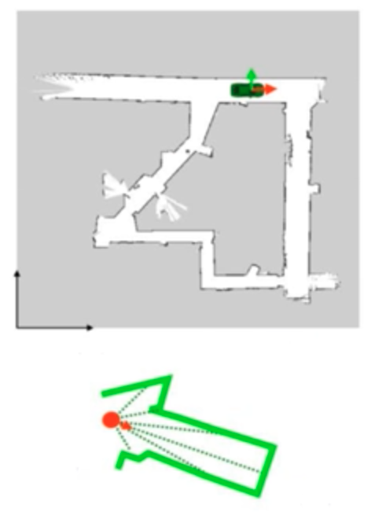
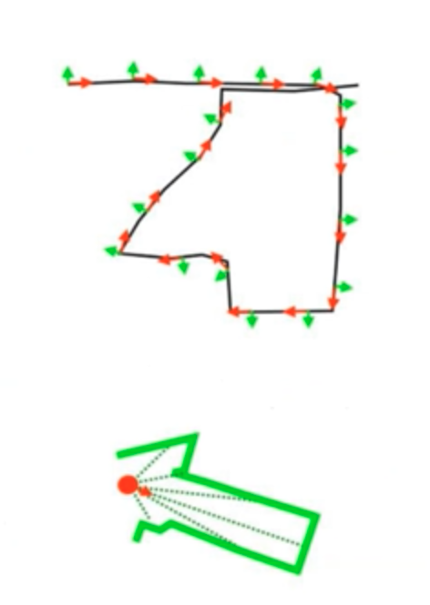
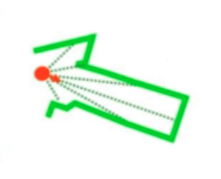

# Mapping & SLAM

## Mapping

Computer vision and cartography

Goal for an autonomous robot is to be able to construct (and/or use) a map/floor plan and to localize itself and its recharging bases.

## SLAM

Simultaneous Localization and Mapping

Method for autonomous vehicles that enables building a map and localization of vehicle in that map at the same time.

Allow vehicle to map out unknown environments

```mermaid
flowchart LR
sd[/Sensor<br/>Data/] --> fe --> be --> pose[Pose Graph <br/>& Map Information]

subgraph fe["Frontend<br/>(Sensor-Dependent)"]
	direction LR
	me["Motion<br/>Estimation"] 
	ole["Obstacle<br/>Location<br/>Estimation"]
end

subgraph be["Backend<br/>(Sensor-Independent)"]
	direction LR
	rpg["Register<br/>Pose Graphs"]
	go[Graph<br/>Optimization]
end
```

|                    | Localization                                                 | Mapping                                                      | SLAM                                                         |
| ------------------ | ------------------------------------------------------------ | ------------------------------------------------------------ | ------------------------------------------------------------ |
| given              | Map                                                          | object’s trajectory (position at each time)                  |                                                              |
| Use sensor data to | estimate current position of object                          | map                                                          | Build map and estimate trajectory                            |
|                    |  |  |  |

## Need for Map

- Path planning
- Limiting error in state estimates, by providing opportunity to ‘reset’

## 2D Graph SLAM

Considering uncertainty in $x$ and $y$, gaussian functions are applied to maximize probability of product
$$
\mu = \Omega^{-1} \epsilon
$$
where

- $\mu =$ locations of landmarks and robot positions
- $\Omega=$  matrix of $X$ and landmarks
- $\epsilon=$ vector of constraints

## Constraints

- Initial constraint
- Relative motion constraint
- Relative measurement constraint
