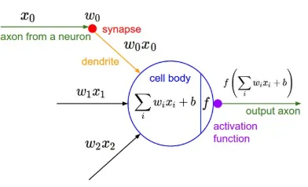
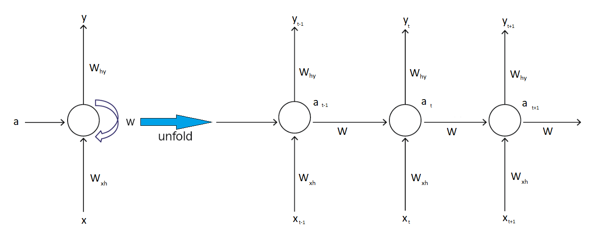

## Machine Learning

Machine learning is a part of AI which provides intelligence to machines with the ability to automatically learn with experiences without being explicitly programmed.

> For more insight, refer Machine Learning course

### Neuron
Neural networks are loosely based on how our human brain works, and the basic unit of a neural network is a neuron.

A neuron does two things -  
1. Receive input from other neurons and combine them together
2. Perform some kind of transformation to give the neuron’s output

We usually take a mathematical combination of inputs and apply an activation function to acheive an output.

Example - A linear combination of 3 inputs $x_1, x_2$ and $x_3$ can be written as  
$b + w_1x_1 + w_2x_2 + w_3x_3$  
where $w_1,w_2\;and\;w_3$ are weights and $w_0$ is bias.

Common examples of activation function -  
- Sigmoid Function - A function which ‘squeezes’ all the initial output to be between 0 and 1
- tanh Function - A function which ‘squeezes’ all the initial output to be between -1 and 1
- ReLU Function - If the initial output is negative, then output 0. If not, do nothing to the initial output

Visual representation of a neuron - 

### Neural Networks

A neural network is simply made out of layers of neurons, connected in a way that the input of one layer of neuron is the output of the previous layer of neurons (after activation)

We use a metric known as loss function which describes how badly the model is performing based on how far off our predictions are from the actual value in our data-set.

Our task is to come up with an algorithm to find the best parameters (i.e. weights and bias) in minimizing this loss function

Once a loss function is chosen, we use gradient descent to to find the right parameters. The idea behind gradient descent is to move the parameters slowly in the direction where the loss will decrease.

$NEW\;PARAMETERES = OLD\;PARAMETERS - STEP\;SIZE \times GRADIENT$

Once loss has been reduced, our model can encounter overfitting. Overfitting occurs when our model has fitted so well to the training dataset that it has failed to generalize to unseen examples. This is characterized by a high test loss and a low train loss. 

Use strategies such as L2 regularization, Early stopping and dropout to deal with overfitting

### RNN

A recurrent neural network (RNN) is a kind of artificial neural network mainly used in speech recognition and natural language processing (NLP).  

A recurrent neural network looks similar to a traditional neural network except that a memory-state is added to the neurons.

### CNN

Convolutional Neural Networks is a type of architecture that exploits special properties of image data and are used in computer vision applications.

Images are a 3-dimensional array of features: each pixel in the 2-D space contains three numbers from 0–255 (inclusive) corresponding to the Red, Green and Blue.

The first important type of layer that a CNN has is called the Convolution (Conv) layer. It uses parameter sharing and applies the same smaller set of parameters spatially across the image. 

Essentially the parameters (i.e. weights) associated to the input remain the same but the input itself is different as the layer computes the output of the neurons at different regions of the image.

Hyperparameters of conv layers are 
- Filter size - corresponds to how many input features in the width and height dimensions one neuron takes in
- Stride - how many pixels we want to move (towards the right/down direction) when we apply the neuron again

Then we have the pooling layer. The purpose of the pooling layer is to reduce the spatial size (width and height) of the layers. This reduces the number of parameters (and thus computation) required in future layers.

We use a fully connected layers at the end of our CNNs. When we reach this stage, we can flatten the neurons into a one-dimensional array of features.

### LSTM

> Notes for LSTM need to be added