# Introduction

## Human Perception of Sound

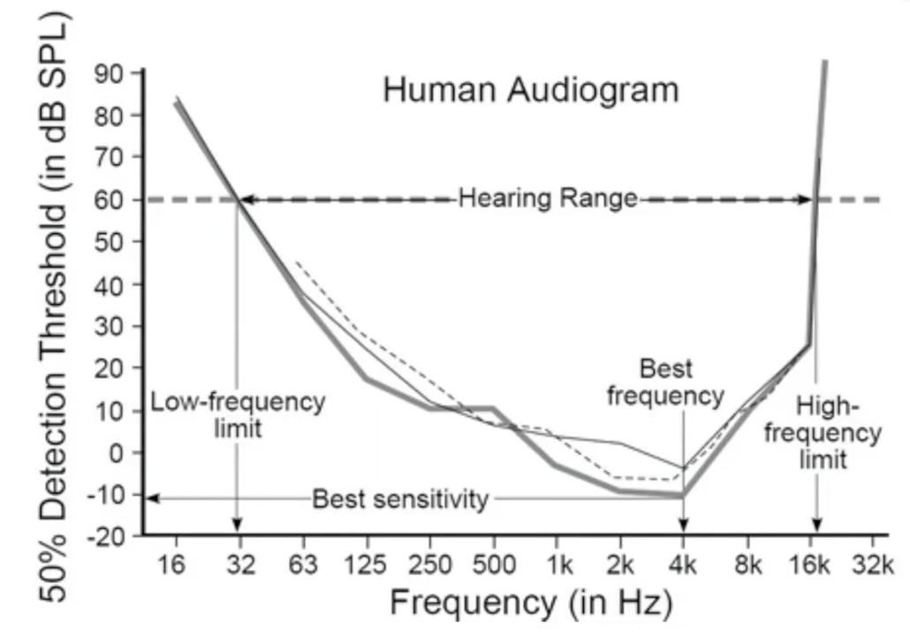{ loading=lazy }

## Dataset

### Building
- Who are the users
- What do they need
- What task are they trying to solve
- How do they interact with the system
	- Distance
	- Environment
		- Background Noise
		- Reverb
- Quality Control
	- Only keep whatever a human can understand
### Industry-Standard
- Google Speed Commands dataset
	- Recorded as individual words, not sentences
	- 1000-4000 examples of each word

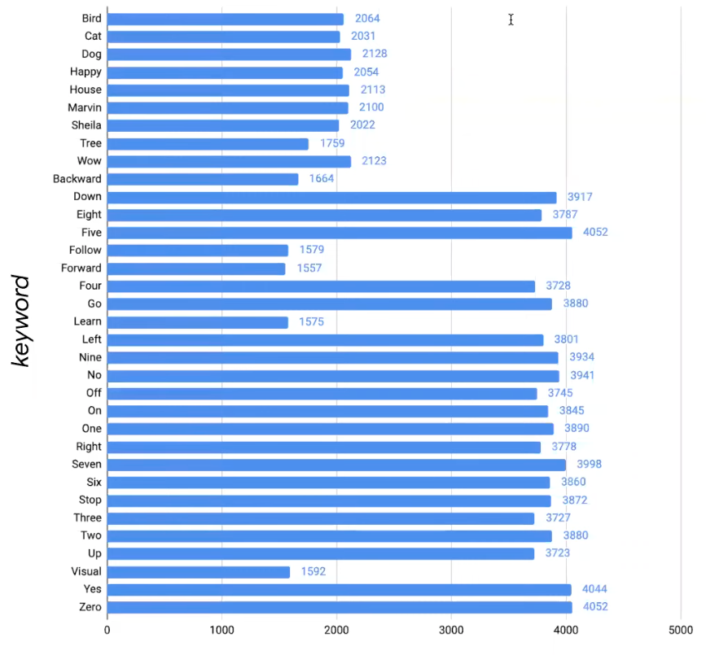{ loading=lazy }
 
## Good Characteristics of Model

|                   |                                         |
| ----------------- | --------------------------------------- |
| Volume Invariance | 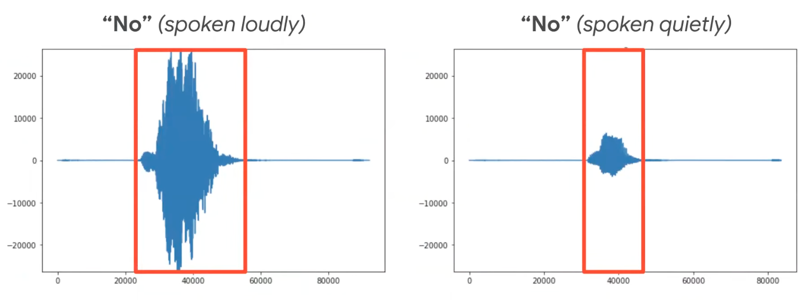{ loading=lazy } |
|                   |                                         |

## Pre-Processing

What aspects of the signal should you sent to the neural network

1. Align on start point
2. Normalization of amplitude
3. Denoise
4. Convert to frequencies, using Fast Fourier transform
	1. Extract features
	2. Sliding window
5. Cut on end point

| Word | Volume | Waveform                           | Spectrogram                           | MFCC                          |
| ---- | ------ | ---------------------------------- | ------------------------------------- | ----------------------------- |
| Yes  | Loud   | 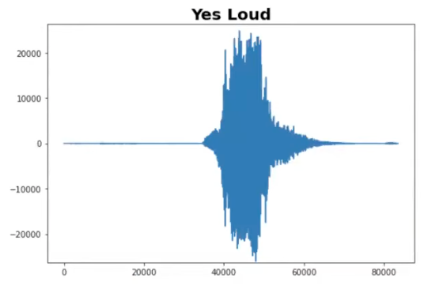{ loading=lazy }  | 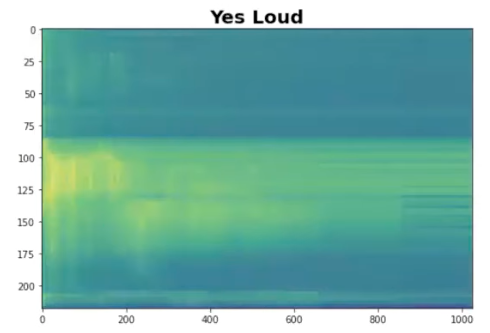{ loading=lazy }  | 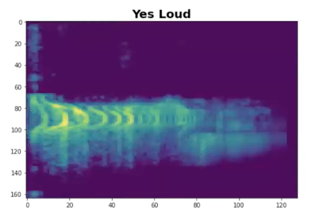{ loading=lazy } |
|      | Quiet  | 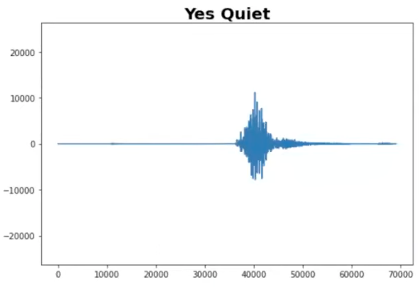{ loading=lazy } | 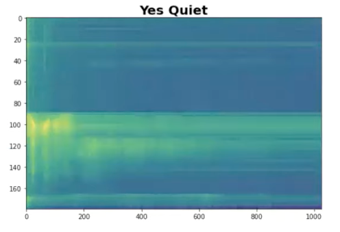{ loading=lazy } |                               |
| No   | Loud   | 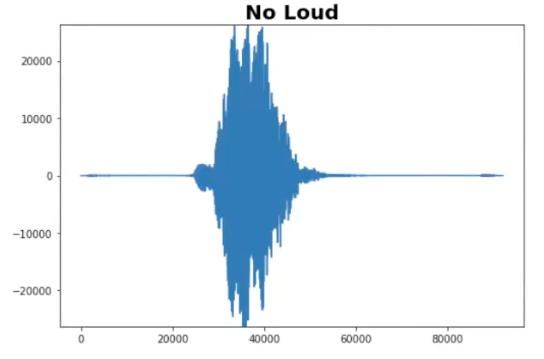{ loading=lazy }   | 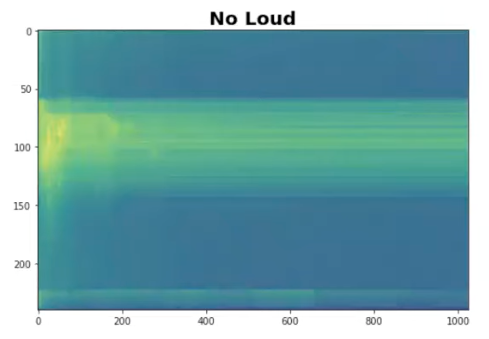{ loading=lazy }   | 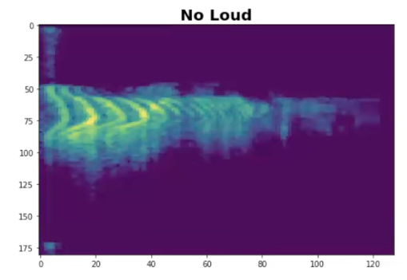{ loading=lazy }  |
|      | Quiet  | 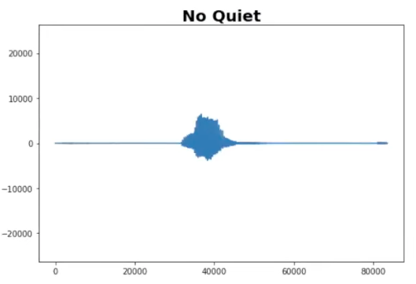{ loading=lazy }  | 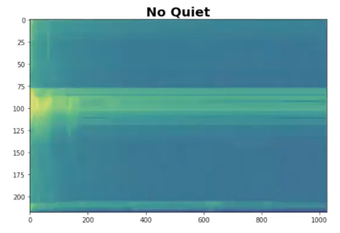{ loading=lazy }  |                               |

### Mel Filterbanks

{ loading=lazy }