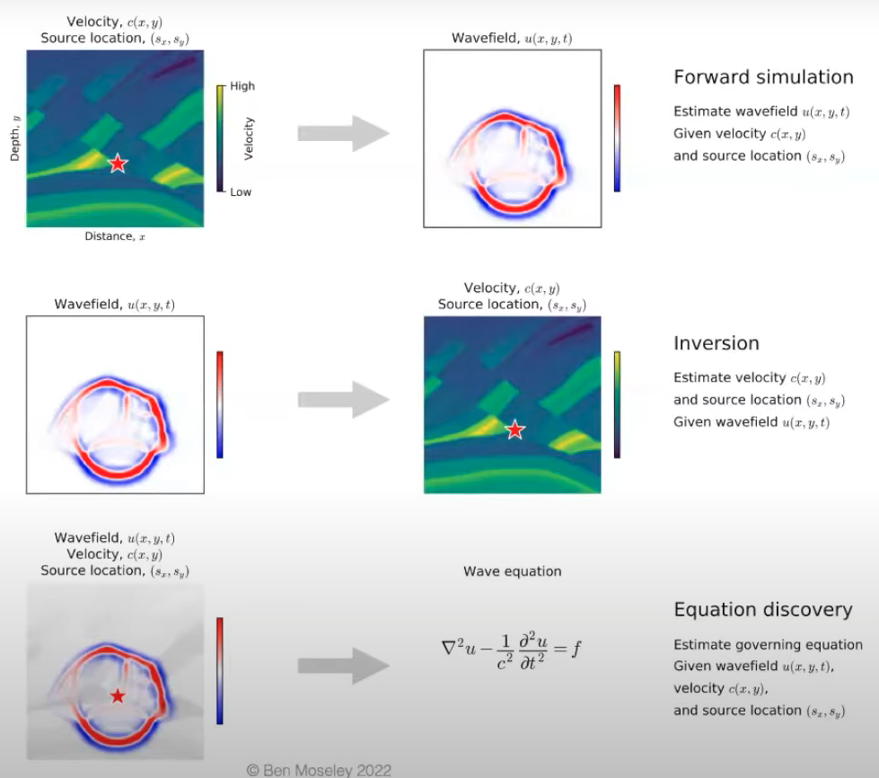
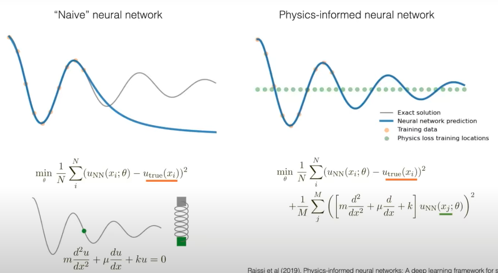
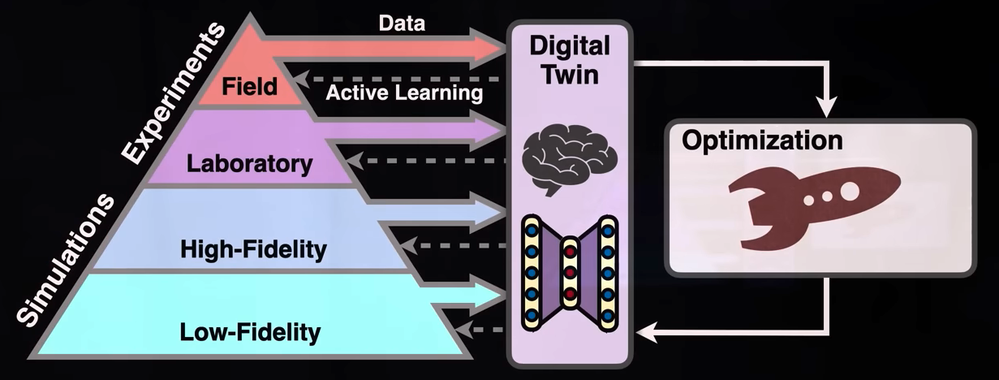
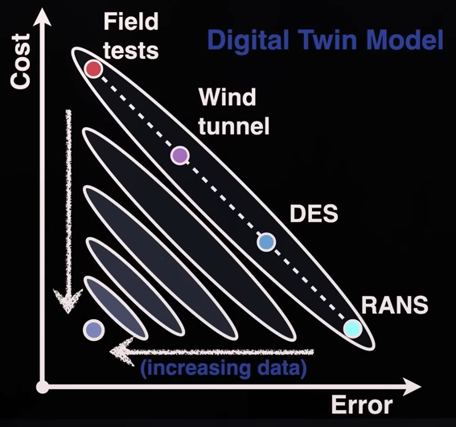

## Typical Scientific Tasks

 

{ loading=lazy }

## PINN

Physics-Informed Neural Networks

{ loading=lazy }

## Digital Twin

{ loading=lazy }

{ loading=lazy }

## Physics’ Properties Preferred in Machine Learning

- Interpretability

- Generalizability

- Parsimony/Simplicity

- Symmetries/Conservations

  - Invariance: $(f \circ g)(x) = f(x)$
  - Equivariance: $(f \circ g)(x) = (g \circ f)(x)$

  where

  - $f$ is deep learning model
  - $g$ is a transformation such as rotation

