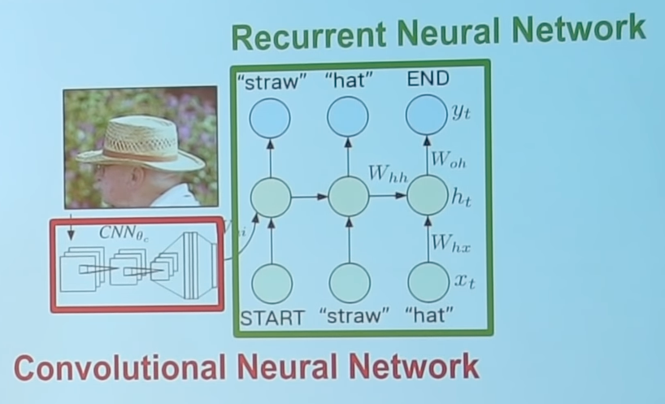
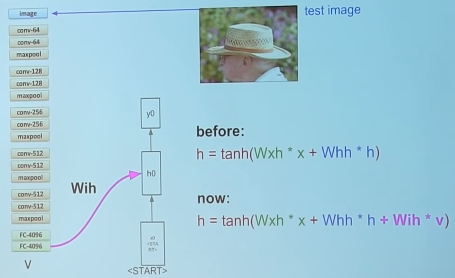
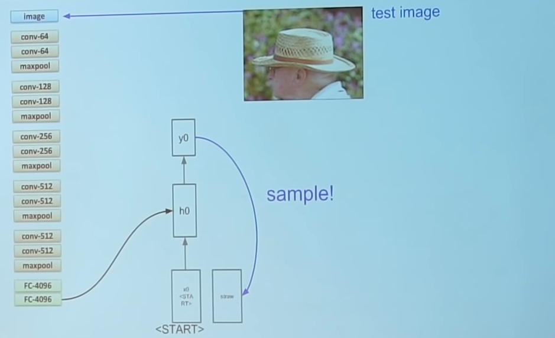
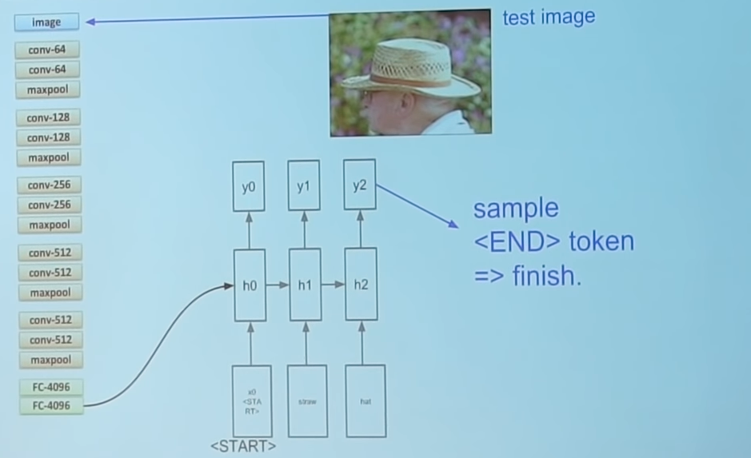

# Image Captioning

{ loading=lazy }

Rather than instructing the RNN to sample text at random, we are conditioning that sampling by the output of the CNN

## Forward Pass

{ loading=lazy }

{ loading=lazy }

{ loading=lazy }

### Backward pass

- If you start with pre-trained CNN, only backprop for the RNN
- Else, backprop through the RNN and CNN
