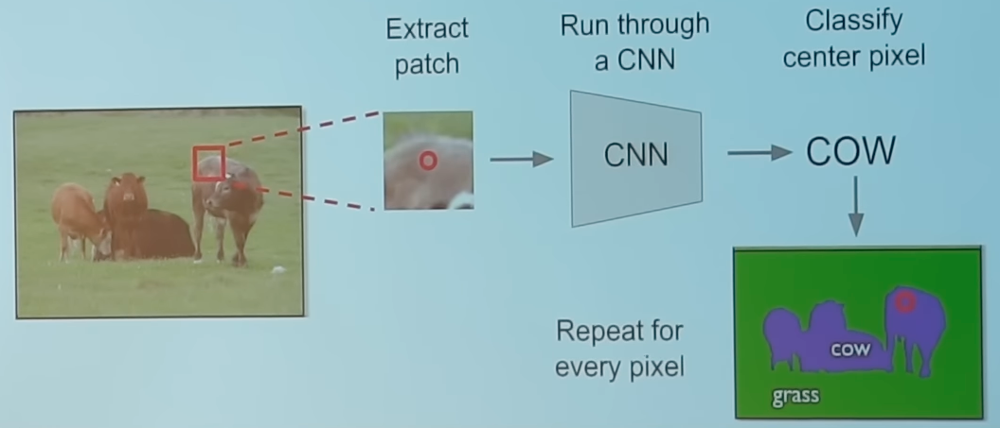
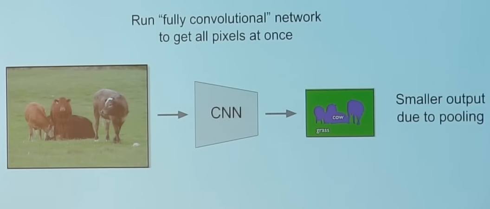
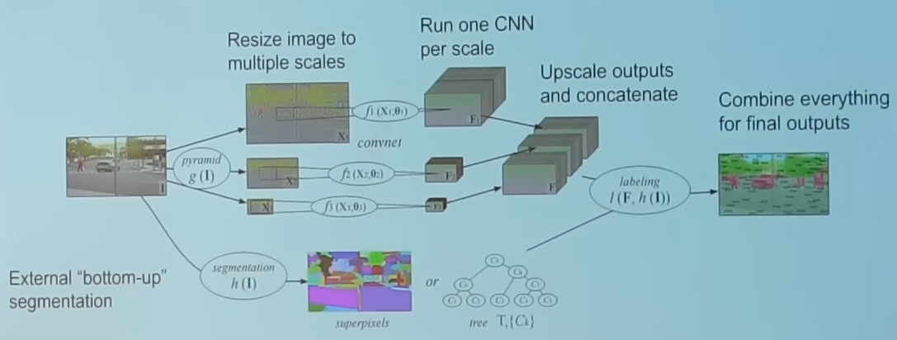
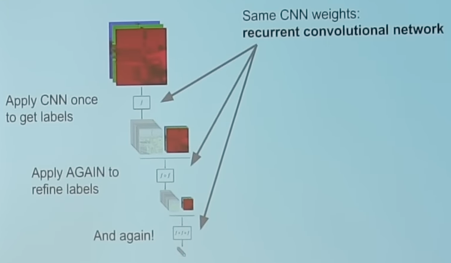
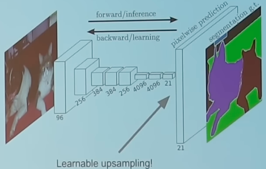
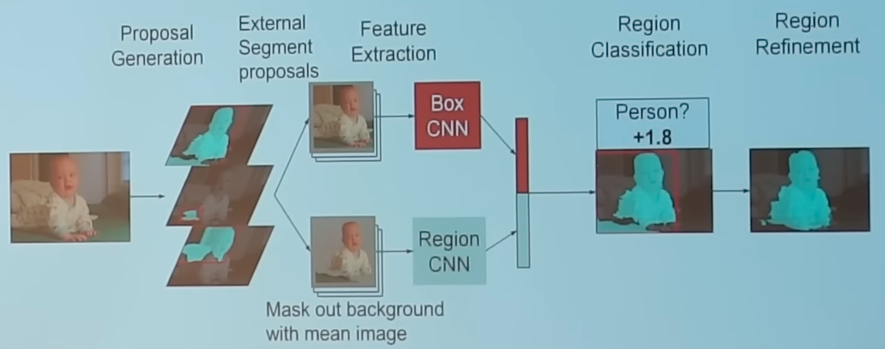
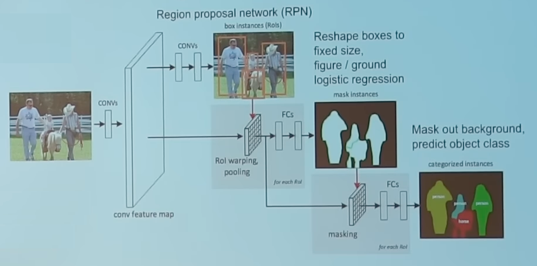
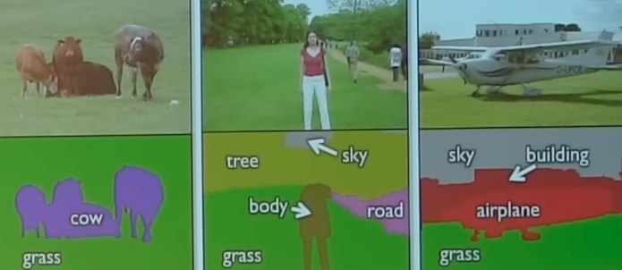
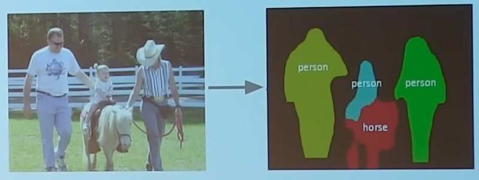
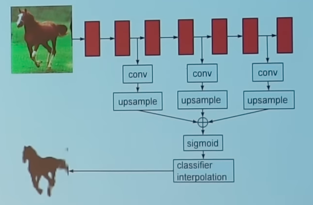

# Segmentation
## Types

|                         | Semantic                                                                                                                                                                                                                                                                                                                                                                                               | Instance/ Simultaneous detection & segmentation                                                                       |
| ----------------------- | ------------------------------------------------------------------------------------------------------------------------------------------------------------------------------------------------------------------------------------------------------------------------------------------------------------------------------------------------------------------------------------------------------ | ------------------------------------------------------------------------------------------------------------------------ |
| Label                   | every pixel                                                                                                                                                                                                                                                                                                                                                                                            |                                                                                                                          |
| Differentiate instances | ❌                                                                                                                                                                                                                                                                                                                                                                                                      | ✅                                                                                                                        |
| Working                 | Method 1 { loading=lazy }  Method 2 { loading=lazy }  Method 3: Multi-Scale { loading=lazy }  Method 4: Iterative refinement { loading=lazy }  Method 5: Upsampling { loading=lazy } | R-CNN { loading=lazy }  Fast R-CNN { loading=lazy } |
| Example                 | { loading=lazy }                                                                                                                                                                                                                                                                                                                                                        | { loading=lazy }                                                                          |

## Region Refinement

{ loading=lazy }