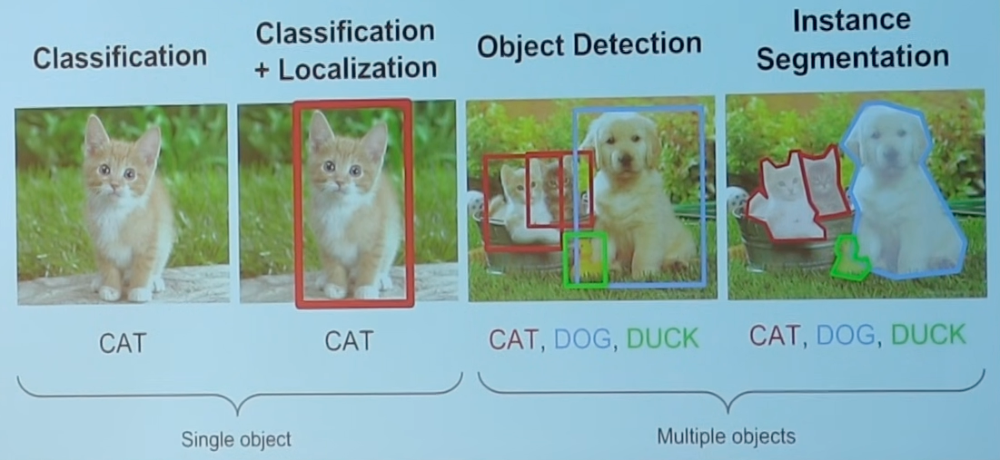

# Computer Vision

Visual recognition using computers

## Tasks

{ loading=lazy }

## References

- [ ] Deep Learning for Computer Vision | Fei-Fei Lee Andrej Karpathy | Stanford CS231n
	- [ ] [2025](https://www.youtube.com/playlist?list=PLoROMvodv4rOmsNzYBMe0gJY2XS8AQg16)
	- [ ] [2016 - Andrej Karpathy](https://www.youtube.com/playlist?list=PLkt2uSq6rBVctENoVBg1TpCC7OQi31AlC)
- [ ] [Deep Learning for Computer Vision | IITM](https://www.youtube.com/playlist?list=PLyqSpQzTE6M_PI-rIz4O1jEgffhJU9GgG)
- [ ] [Introduction to Computer Vision | UC Berkeley](https://www.youtube.com/playlist?list=PLhwIOYE-ldwL6h-peJADfNm8bbO3GlKEy)
- [ ] [Computer Vision | UC Berkeley](https://www.youtube.com/playlist?list=PLzWRmD0Vi2KVsrCqA4VnztE4t71KnTnP5)
- [ ] [Photo Forensics: Physics-Based Techniques | UC Berkeley](https://www.youtube.com/playlist?list=PLhwIOYE-ldwKNkco425lUSet1zTGDPF6O)
- [ ] [Introduction| First Principles of Computer Vision](https://www.youtube.com/playlist?list=PL2zRqk16wsdoz4eycyq7EmeV2KpE6JN76)
- [ ] Image Analysis Class | UniHeidelberg
	- [ ] [2020](https://www.youtube.com/playlist?list=PLuRaSnb3n4kRAbnmiyGd77hyoGzO9wPde)
	- [ ] [2013](https://www.youtube.com/playlist?list=PLuRaSnb3n4kSgSV35vTPDRBH81YgnF3Dd)

## Current Video
