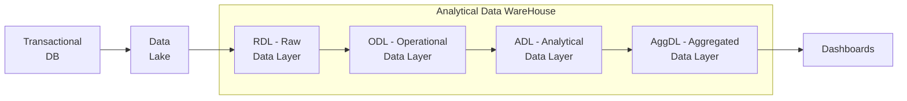

## Incremental Aggregate Tables

Prefer tables whenever possible, then views if too much effort

```
CREATE OR REPLACE VIEW agg_view AS

(
SELECT order_date, order_count
FROM agg_table_before_2026
WHERE order_date < '2026-01-01' -- optimizer hint to avoid unnecessary scans at query time
)

UNION ALL

(
SELECT order_date, order_count
FROM live_data_after_2026
-- complex query with joins
WHERE order_date >= '2026-01-01' -- optimizer hint to avoid unnecessary scans at query time
)
```