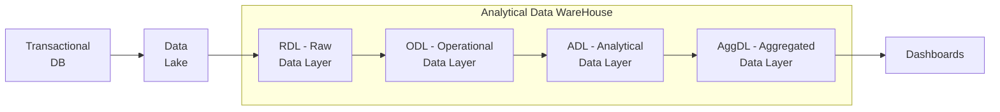

## Incremental Aggregate Tables

Prefer tables whenever possible, then views if too much effort

```
--- Run once
CREATE OR REPLACE TABLE my_dataset.agg_table_before_2026 
PARTITION BY (order_month)
AS (
SELECT
	DATE_TRUNC(order_date, MONTH) AS order_month,
	SUM(gmv_amount_lc) AS gmv_amount_lc,
FROM my_dataset.fct_table
-- complex query with joins
WHERE order_date <= '2026-01-01'
);


--- Run once
CREATE OR REPLACE MATERIALIZED VIEW my_dataset.agg_table_after_2026
PARTITION BY (order_month)
AS (
SELECT
	DATE_TRUNC(order_date, MONTH) AS order_month,
	SUM(gmv_amount_lc) AS gmv_amount_lc,
FROM my_dataset.fct_table
-- complex query with joins
WHERE order_date >= '2026-01-01'
);


--- Run once
CREATE OR REPLACE VIEW agg_view AS (
SELECT order_month, gmv_amount_lc FROM my_dataset.agg_table_before_2026
WHERE order_month < '2026-01-01' -- optimizer hint to avoid unnecessary scans at query time
UNION ALL
SELECT order_month, gmv_amount_lc FROM my_dataset.agg_table_after_2026
WHERE order_month >= '2026-01-01' -- optimizer hint to avoid unnecessary scans at query time
);
```