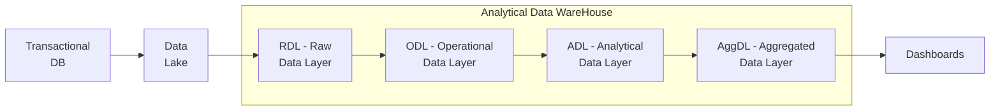

```mermaid
flowchart LR

tdb[Transactional<br/>DB] -->
dl[Data<br/>Lake] -->
rdl

aggdl -->
Dashboards

subgraph dwh["Analytical Data WareHouse"]
rdl[RDL - Raw<br/>Data Layer] -->
odl[ODL - Operational<br/>Data Layer] -->
adl[ADL - Analytical<br/>Data Layer] -->
aggdl[AggDL - Aggregated<br/>Data Layer]
end
```

## Incremental Aggregate Tables

Prefer tables whenever possible, then views if too much effort

```
CREATE OR REPLACE TABLE agg_table AS

(SELECT * FROM agg_table_before_2026)
UNION ALL
(SELECT * FROM live_data_after_2025)
```