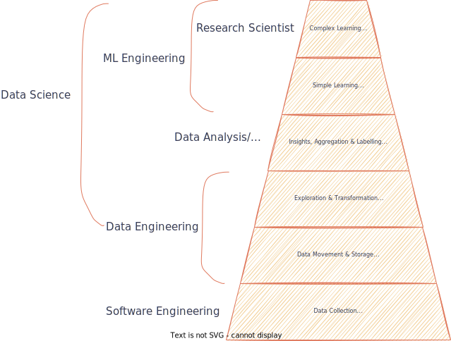

Many times very high-quality professionals are not able to produce well, as they are usually incentivized to use complex methodologies. But data science is best when you actually solve the problem at hand, and help make decisions.

## Fields Overview

|           | Analytics   | AI/ML                                          | Statistical Inference               |
| --------- | ----------- | ---------------------------------------------- | ----------------------------------- |
| Goal      | Descriptive | Predictive                                     | Prescriptive                        |
| Decisions | None        | Large scale repetitive (with uncertainty) | Small scale (with uncertainty) |

## Project Lifecycle

```mermaid
flowchart TB

subgraph Scoping
	dp[Define<br/>Project] -->
	me["Define Metrics<br/>(Accuracy, Recall)"] -->
	re[Resources<br/>Budget] -->
    ba["Establish<br />Baseline"]
end

subgraph Data
	d[(Data Source)] -->
	l[Label &<br />Organize Data]
end

subgraph Modelling
  pre[Preprocessing] -->
	s[Modelling] -->
	train[Training] -->
  pp[Post<br />Processing] -->
	vt[Validation &<br />Testing] -->
	e[Error Analysis] -->
	pre
end

subgraph Deploy
	dep[Deploy in<br />Production] -->
	m[Monitor &<br />Maintain] & dss[Decision<br />Support System]
end

Scoping --> Data --> Modelling --> Deploy
```

https://www.youtube.com/watch?v=UyEtTyeahus&list=PLkDaE6sCZn6GMoA0wbpJLi3t34Gd8l0aK&index=5

## Data Mining

Generate Decision Support Systems

> Non-trivial extraction of implicit, previously-unknown and potentially useful information from data

> Automatic/Semi-automatic means of discovering meaningful patterns from large quantities of data

## Predictive Tasks

Predict value of target/independent variable using values of independent variables

- Regression - Continuous
- Classification - Discrete

## Descriptive Tasks

Goal is to find

- Patterns
- Associations/Relationships

### Association Analysis

Find hidden assocations and patterns, using association rules

#### Applications

- Gene Discovery
- Market Baset Data Analysis
  Find items that are bought together

### Clustering/Cluster Analysis

Grouping similar customers

#### Metrics

- Similarity
- Dissimilarity/Distance Metrics

#### Applications

- Grouping similar documents

- Clustering documents

  1. Vocabulary - All terms(key words) from all docs

  2. Generate document-term frequency matrix

     | Document \vert  Term | T1   | T2   | …    | Tn   |
     | ---------------- | ---- | ---- | ---- | ---- |
     | D1               |      |      |      |      |
     | D2               |      |      |      |      |
     | …                |      |      |      |      |
     | Dm               |      |      |      |      |

### Deviation/Outlier/Anomaly Detection

Outlier is a data point that does not follow the norms.

Don’t mistake outlier for noise.

#### Application

- Credit Card Fraud Detection
    - Collect user profile such as Name, Age, Location
    - Collect user behavior data

- Network Intrusion Detection
- Identify anomalous behavior from surveillance camera videos
