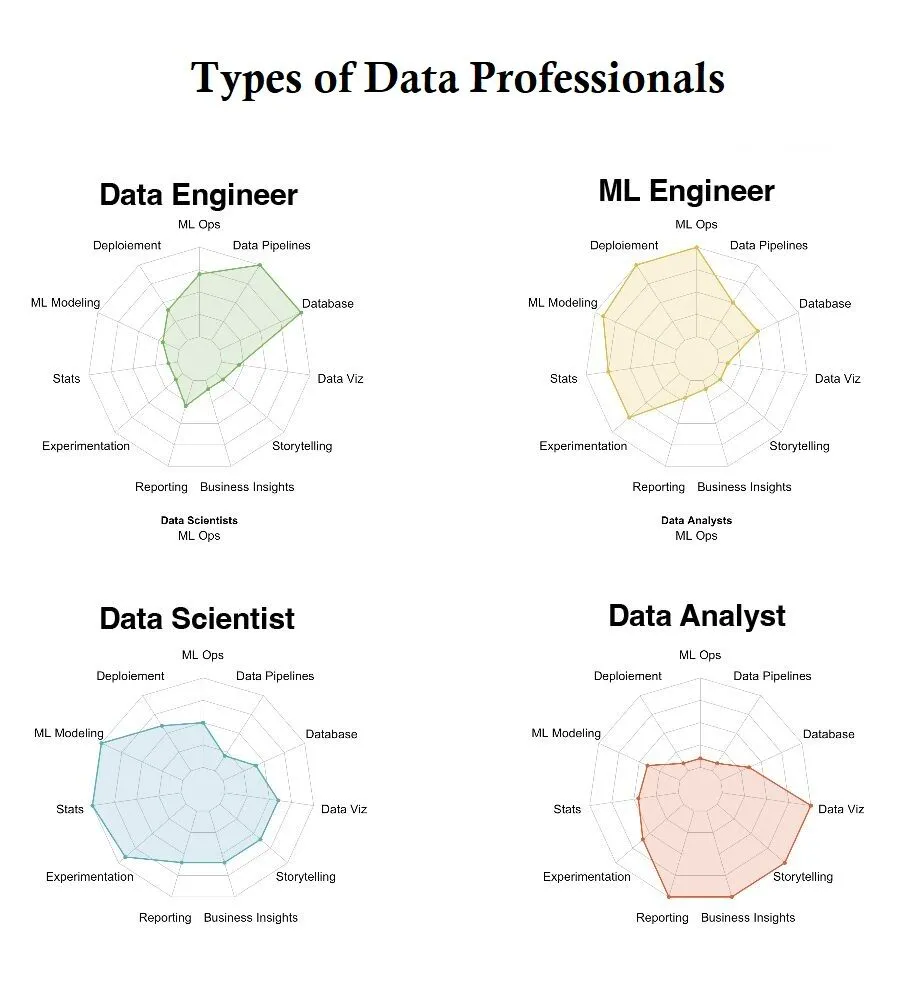
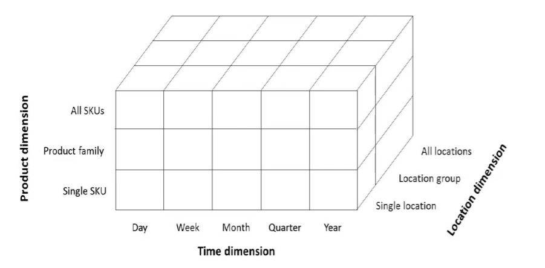

# Introduction

Data science is turning raw data into understanding, insight, and knowledge to drive data-driven decisions and solve problems
- Collecting data
- Analyzing data
	- Statistics
	- Machine learning
	- Deep learning
- Communicating analysis

We cannot move away from domain knowledge and solely depend on algorithms

## Stages

1. Theory
2. ⁠Simulation
3. ⁠Empirical

Order should not be changed, as otherwise we can make up the story as we wish

## IDK

Always use GUIs for exploration
- ease
- ⁠rapid iteration
Use code to finalize
- reproducibility
- ⁠automation

## Data Professionals

## Decision-Making

Iterative process with feedback loops; not linear

### Knowledge Hierarchy

Chain of increasing value

```mermaid
flowchart LR
Data -->
Information -->
Knowledge -->
Decision
```

|             |                                                                                  |
| ----------- | -------------------------------------------------------------------------------- |
| Data        | Collection of numbers with known context and uncertainty estimates               |
| Information | Right data at right time in right context, organized for access                  |
| Knowledge   | Interpretation of information based on model (understanding) of cause and effect |
| Decision    | Acting on knowledge for benefit                                                  |

### Process

- Preparation: Plan to turn data into information, with a specific model and decision in mind
- Testing/Experimenting/Measurement
- Analysis, with uncertainty: Use model to turn information to knowledge
- Decision
  - Using uncertainty
  - Risk/benefit analysis
- Post-mortem: Learnings to improve things

## Notes

- All models are wrong, some are useful
- Applying data mining algorithms on data that you don’t understand may result in false conclusions
- Always keep track of performed tests & analyses, to factor in data snooping

## Questions

| Question |                                                                                                                                                                                                                                    |
| -------- | ---------------------------------------------------------------------------------------------------------------------------------------------------------------------------------------------------------------------------------- |
| Why      | Precise (not vague)  Bad: - Planning - Decision-making  Good - What plans/decisions - How are these plans/decisions made - How would data mining help                                 |
| What     | Goal, Level of aggregation, Forecast horizon  Bad - Sales - Market share  Good - Demand                                                                                                         |
| When     | Frequency Time of day/year                                                                                                                                                                                                    |
| Who      | Human judgement Computer-generated with human judgement Computer-generated  Considerations - Number & frequency of predictions - Availability of historical data - Relative accuracy of options |
| Where    | Predictions originate in different departments                                                                                                                                                                                     |
| How      |                                                                                                                                                                                                                                    |

## Fields Overview

|           | Analytics   | AI/ML                                          | Statistical Inference               |
| --------- | ----------- | ---------------------------------------------- | ----------------------------------- |
| Goal      | Descriptive | Predictive                                     | Prescriptive                        |
| Decisions |             | Large scale repetitive (with uncertainty) | Small scale (with uncertainty) |

## Objectives

| Objective                                        |                                                                                                                                                         |
| ------------------------------------------------ | ------------------------------------------------------------------------------------------------------------------------------------------------------- |
| Prediction                                       | Estimation of unseen data                                                                                                                               |
| Modelling/ Characterization/ Inference | How do inputs affect output  Obtain the Sample CEF/Conditional Distribution which closely matches the Population CEF/Conditional Distribution |
| Optimization                                     | What input values produce desired outputs (both mean and variance)                                                                                      |
| Control                                          | How to adjust controlled inputs to maximize control of outputs                                                                                          |
| Simulation                                       |                                                                                                                                                         |
| Causal Inference                                 | How does using treatment affect output                                                                                                                  |

Use ML models to discover structural models, and then let the structural models to make the predictions, not the ML models

- Why: Black swans can be predicted by theory, even if they cannot be predicted by ML
- How: Use a non-parametric ML to identify important variables and then develop a parametric structural form model.

## Types of Analysis

| Type                       | Topic                                     | Nature                   | Time   | Comment                                                                             | Examples                                                                                                                                                     |
| -------------------------- | ----------------------------------------- | ------------------------ | ------ | ----------------------------------------------------------------------------------- | ------------------------------------------------------------------------------------------------------------------------------------------------------------ |
| Explorative                | ***What*** could be happening             |                          | Past   | Hypothesis testing                                                                  | Explorations of correlations                                                                                                                                 |
| Descriptive/ Positive | **What** is happening?                    | Objective                | Past   | No emotions/explanations if good or bad                                             | Increasing taxes will lower consumer spending Increasing interest rate will lower demand for loans Raising minimum wage will increase unemployment |
| Normative                  | Is this good or bad?                      | Subjective               | Past   |                                                                                     | "Current inflation is higher than desirable"                                                                                                                 |
| Diagnostic                 | **Why** is it happening?                  | Objective/ Subjective | Past   | Helps in understanding root cause  Decompose into internal & external factors |                                                                                                                                                              |
| Predictive                 | **What will happen** if condition happens | Subjective               | Future | Understanding future, using history                                                 |                                                                                                                                                              |
| Prescriptive               | **What** to do                            | Subjective               | Future | what actions to be taken                                                            | Taxes must be increased                                                                                                                                      |

The complexity increases as we go down the above list, but the value obtained increases as well

## Project Lifecycle

```mermaid
flowchart TB

subgraph Scoping
	dp[Define<br/>Project] -->
	me["Define Metrics<br/>(Accuracy, Recall)"] -->
	re[Resources<br/>Budget] -->
    ba["Establish<br />Baseline"]
end

subgraph Data
	d[(Data Source)] -->
	l[Label &<br />Organize Data]
end

subgraph Modelling
  pre[Preprocessing] -->
	s[Modelling] -->
	train[Training] -->
  pp[Post<br />Processing] -->
	vt[Validation &<br />Testing] -->
	e[Error Analysis] -->
	pre
end

subgraph Deploy
	dep[Deploy in<br />Production] -->
	m[Monitor &<br />Maintain] & dss[Decision<br />Support System]
end

Scoping --> Data --> Modelling --> Deploy
```

https://www.youtube.com/watch?v=UyEtTyeahus&list=PLkDaE6sCZn6GMoA0wbpJLi3t34Gd8l0aK&index=5

## Data Mining

Generate Decision Support Systems

> Non-trivial extraction of implicit, previously-unknown and potentially useful information from data

> Automatic/Semi-automatic means of discovering meaningful patterns from large quantities of data

## Predictive Tasks

Predict value of target/independent variable using values of independent variables

- Regression - Continuous
- Classification - Discrete

## Descriptive Tasks

Goal is to find

- Patterns
- Associations/Relationships

### Association Analysis

Find hidden assocations and patterns, using association rules

#### Applications

- Gene Discovery
- Market Baset Data Analysis
  Find items that are bought together

### Clustering/Cluster Analysis

Grouping similar customers

#### Metrics

- Similarity
- Dissimilarity/Distance Metrics

#### Applications

- Grouping similar documents

- Clustering documents

  1. Vocabulary - All terms(key words) from all docs

  2. Generate document-term frequency matrix

     | Document \vert  Term | T1   | T2   | …    | Tn   |
     | ---------------- | ---- | ---- | ---- | ---- |
     | D1               |      |      |      |      |
     | D2               |      |      |      |      |
     | …                |      |      |      |      |
     | Dm               |      |      |      |      |

### Deviation/Outlier/Anomaly Detection

Outlier is a data point that does not follow the norms.

Don’t mistake outlier for noise.

#### Application

- Credit Card Fraud Detection
    - Collect user profile such as Name, Age, Location
    - Collect user behavior data

- Network Intrusion Detection
- Identify anomalous behavior from surveillance camera videos

## Misconceptions

- All forecasts will be inaccurate, so no point
- If we had the latest forecasting technology, all problems would be solved

## IDK

Ensure you are looking at the correct scale

Model $y_t/y_0$ instead of $y_t$ to standardize all time series

## Common problems with analysis

- Poorly-defined goals
- Data doesn’t meet needs of analysis objectives
- Analysis makes unwarranted assumptions
- Model is wong
- Data doesn’t support conclusion

Learning Process

1. Model building: Functional form
2. Identify parameter weights
3. Distribution of random errors

Each of them can have different levels of generalizability

For eg: Ohm’s Law

1. $V=IR$ remains constant for all materials (under certain conditions)
2. $R$ Changes for different materials
3. Errors are dependent on measurement and experimental methods, and are independent of materials

## Communication of Results

Storytelling is important

### Pitfalls

- Manipulation
	- Don't lie
	- Emphasize the story, but make the full data available
- Misrepresentation
	- Control expectations
	- Exaggerate your work, but do not over-exaggerate
- Ethos
	- Ethos $\ne$ Credentials
	- Credentials do not make an expert
	- Credentials do not *not* make an expert
- Equity
	- Don't dumb down: Just translate in a simpler way
	- Amplify underrepresented voices

