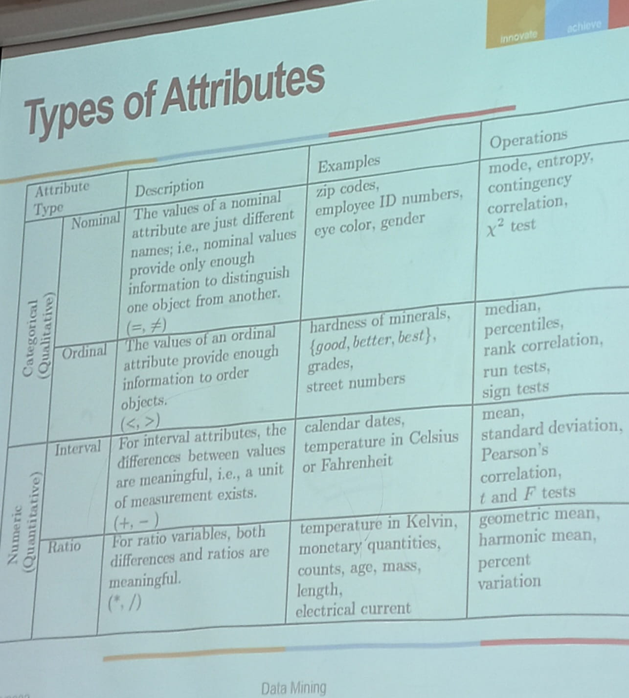
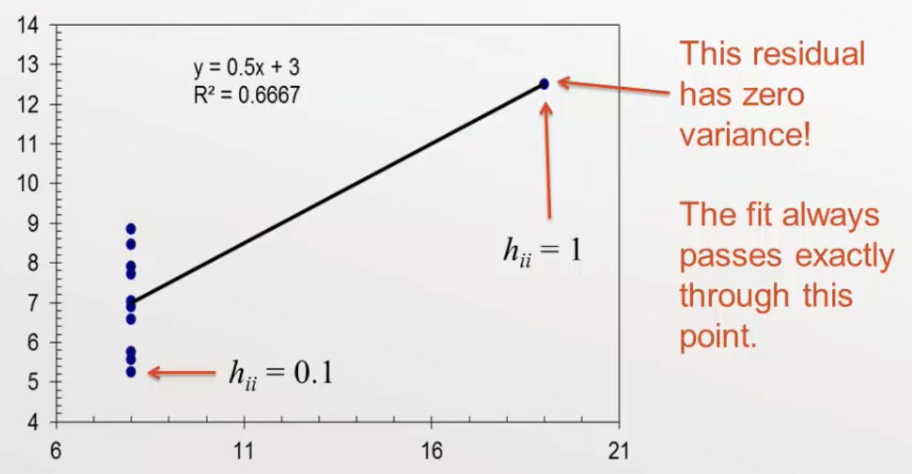
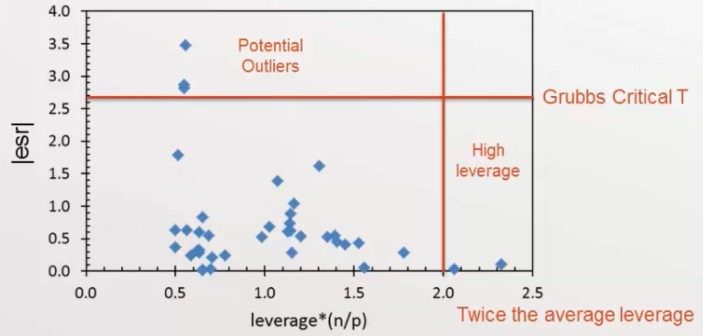
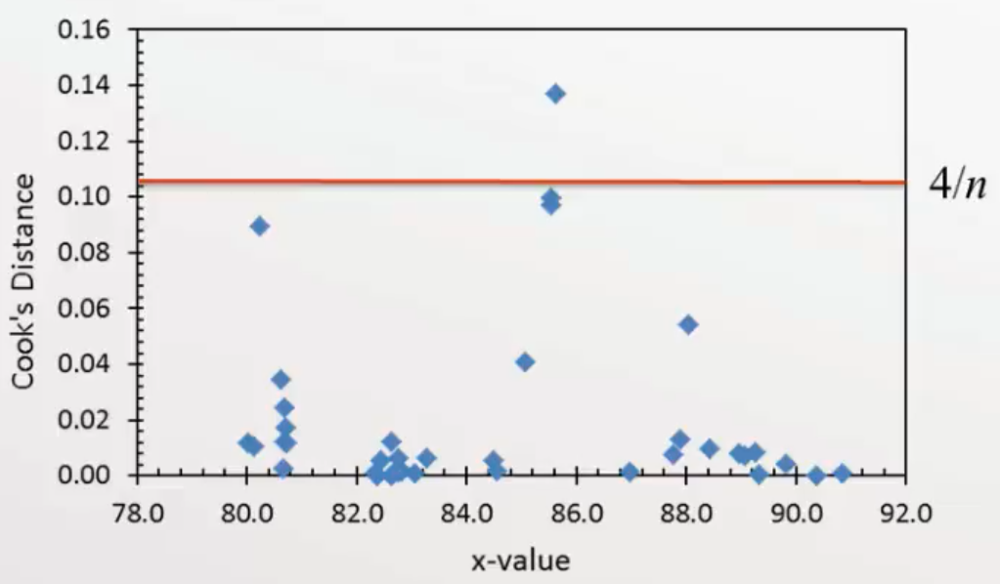
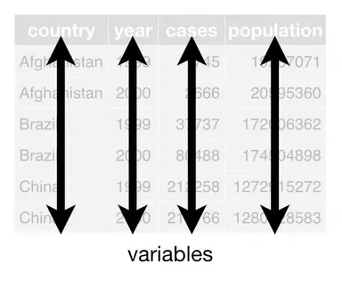
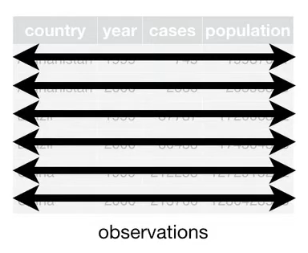
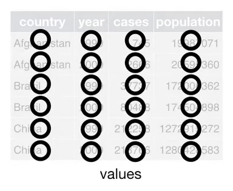

# Data

Data can be anything. It depends on the data engineer on what the input and output data is

Data = results of measurement

- Definition of measurand (quantity being measured)
- Measurement value
  - number
  - unit

- Experimental context
  - Test method
  - sampling technique
  - environment

- Estimate of uncertainty
  - Measurement uncertainty: estimate of dispersion of measurement values around true value
  - Context uncertainty: uncertainty of controlled and uncontrolled input parameters
- Metrology/Measurement model: science of measurement; theory, assumptions and definitions used in making measurement

## Types

- Structured
  - Numbers
  - Tables 
- Unstructured
  - Audio
  - Image
  - Video

## Datasets

Collection of data in rows and columns

- Rows = Objects, Records, Samples, Instances
- Columns = Attributes, Variables, Dimensions, Features

### Types

- Labelled has Target variable
- Unlabelled does not have target variable

## Data Collection

### Stages
- Motivation
- Composition
- Collection process
- Labelling
- Preprocessing
- Uses
- Distribution
- Maintenance

### Metadata

| Aspect           |                 |
| ---------------- | --------------- |
| Filename         |                 |
| Format           | csv             |
| URL              |                 |
| Domain           | healthcare      |
| Keywords         | medicine, drugs |
| Type             | tabular         |
| Rows             | 500             |
| Columns          | 18              |
| Missing %        | 5.2%            |
| License          | MIT             |
| Release Date     | Jan 2024        |
| Time range: FROM | Aug 2020        |
| Time range: TO   | Dec 2020        |
| Description      |                 |
### Means of data collection

Garbage-in, Garbage-out

- Manual Labelling
  - Manually marking as cat/not cat, etc.
- Observing Behaviour
  - taking data from user activity and seeing whether they purchased or not
  - machine temperatures and observing for faults or not
- Download from the web

### Mistakes

1. Waiting too long for implementing a data set
   1. implement it early so that AI team can give feedback to the IT team
2. Not all data is valuable
3. Messy
   1. Garbage in, garbage out
   2. incorrect data
   3. multiple types of data

## Types of Attributes

{ loading=lazy }

|                  | Nominal                                                      | Ordinal                                                      | Interval                                                     | Ratio                                                        |
| ---------------- | ------------------------------------------------------------ | ------------------------------------------------------------ | ------------------------------------------------------------ | ------------------------------------------------------------ |
| Order            |                                                              | ✅                                                            | ✅                                                            | ✅                                                            |
| Magnitude        |                                                              |                                                              | ✅                                                            | ✅                                                            |
| Absolute Zero    |                                                              |                                                              |                                                              | ✅                                                            |
| Mode             | ✅                                                            | ✅                                                            | ✅                                                            | ✅                                                            |
| $=$              | ✅                                                            | ✅                                                            | ✅                                                            | ✅                                                            |
| $>, \ge, <, \le$ |                                                              | ✅                                                            | ✅                                                            | ✅                                                            |
| $-, +$           |                                                              |                                                              | ✅                                                            | ✅                                                            |
| $/, \times$      |                                                              |                                                              |                                                              | ✅                                                            |
| Type             | D                                                            | D                                                            | N                                                            | N                                                            |
| Median           |                                                              | ✅                                                            | ✅                                                            | ✅                                                            |
| Mean             |                                                              |                                                              | ✅                                                            | ✅                                                            |
| Min/Max          |                                                              |                                                              | ✅                                                            | ✅                                                            |
| t-Test           |                                                              |                                                              |                                                              | ✅                                                            |
| Example          | - Colors  - Player Jersey # - Gender - Eye color - Employee ID | - Ratings - Course Grades  - Finishing positions in a race; 4star is not necessarily twice as good as 2 star | - Temperature units - 100C > 50C > 0C; 0C, 0F doesn't mean no temperature; 50C isn't $\frac{1}{2}$ of 100C  - pH scale | - Age - Kelvin - 0K is absolute absence of heat; 50K = half of 100K  - Number of children |

- D = Discrete/Qualitative/Categorical
- N = Numerical/Quantitative/Continuous

### Asymmetric Attributes

Attributes where only non-zero values are important. It can be

- Binary (0 or 1)
- Discrete (0, 1, 2, 3, …)
- Continuous (0, 33.35, 52.99, …)

## Characteristics of Dataset

### Minimum Sample Size

To learn effectively

|                     | $n_\text{min}$  |
| ------------------- | --------------- |
| Structured: Tabular | $k+1$           |
| Unstructured: Image | $1000 \times C$ |

where

- $n =$ no of sample points
- $k =$ no of input variables
- $C =$ no of classes

### Dimensionality

No of features

### Sparseness

If majority of attributes have 0 as value, depending on the context

### Resolution

Detail/Frequency of the data (hourly, daily, monthly, etc)

## Types of Datasets

### Records

Collection of records having fixed attributes, without any relationship with other records

| Type               | Characteristic                                         | Example                                                      |
| ------------------ | ------------------------------------------------------ | ------------------------------------------------------------ |
| Data Matrix        | All attributes are numerical                           | Usually what we have                                         |
| Sparse Data Matrix | Majority of values are 0                               | - Frequency distribution kinda thingy for market basket data - Document term matrix |
| Market Basket Data | Every record of transactions, with collection of items | - Association analysis market data                           |

### Graph

| Type                            |                                                             | Example                |
| ------------------------------- | ----------------------------------------------------------- | ---------------------- |
| Data objects with relationships | Nodes(data objects) with edges (relationships) between them | Google Search indexing |
| Data objects that are graphs    |                                                             | Chemical structures    |

### Ordered

Relationships between attributes

#### Sequential/Temporal

Extension of record, where each record has a time associated with it.

Even this can be time series data, if recorded periodically.

| Time | Customer | Items Purchased |
| ---- | -------- | --------------- |
| t1   | c1       | A, B            |
| t2   | c2       | A, C            |

#### Time-Associated

| Customer | Time and Items Purchased           |
| -------- | ---------------------------------- |
| C1       | $\{t1, (A, B) \}, \{t2, (A, C) \}$ |
| C2       | $\{t1, (B, C) \}, \{t2, (A, C) \}$ |

#### Sequence Data

Sequence of entities

Eg: Genomic sequence data

#### Time Series Data

Series of observations over time recorded periodically

Each record is a time series as well.

|              | 12AM | 6AM  | 12PM | 6PM  |
| ------------ | ---- | ---- | ---- | ---- |
| June 11 2020 |      |      |      |      |
| June 12 2020 |      |      |      |      |
| June 13 2020 |      |      |      |      |
| June 14 2020 |      |      |      |      |

#### Spatial Data

Data has spatial attributes, such as positions/areas

Weather data collected for various locations

#### Spatio-Temporal Data

Data has both spatial and temporal attributes

|              | Abu Dhabi | Dubai | Sharjah | Ajman | UAQ  | RAK  | Fujeirah |
| ------------ | --------- | ----- | ------- | ----- | ---- | ---- | -------- |
| June 11 2020 |           |       |         |       |      |      |          |
| June 12 2020 |           |       |         |       |      |      |          |
| June 13 2020 |           |       |         |       |      |      |          |
| June 14 2020 |           |       |         |       |      |      |          |

## Issues with Data Quality

| Issue                                               |                                                              | Solution is to ___ data object/attributes        | Example                                    |
| --------------------------------------------------- | ------------------------------------------------------------ | ----------------------------------------------------- | ------------------------------------------ |
| Improper sampling                                   |                                                              |                                                       |                                            |
| Unknown context                                     |                                                              |                                                       |                                            |
| Noise                                               | - Random component of measurement - Distorts the data   | Drop                                                  |                                            |
| Anomaly/ Rare events                           | Obs that occur very rarely but it is possible                |                                                       | Height of Person is 7’5                    |
| Artifacts/ Spurious Obs                        | Known Distortion that can be removed                         |                                                       | Height of Person is -10                    |
| Outliers/ Flyers/ Wild obs/ Maverick | Actual data, but very different from others Extreme value of $y$ | Depends                                               | Height of Person is 8’5                    |
| Leveraged points                                    | Extreme value of $x$                                         |                                                       |                                            |
| Influential points                                  | Outliers with high leverage Removing the data point ‘substantially’ changes the regression results |                                                       |                                            |
| Missing Values                                      | Null values                                                  | - Eliminate - Estimate/Interpolate - Ignore |                                            |
| Inconsistent Data                                   | illogical data                                               |                                                       | 50yr old with 5kg weight                   |
| Duplicate Data                                      |                                                              | De-Duplication                                        | - Same customer goes to multiple showrooms |

### Estimation

| Attribute Type | Interpolation Value                           | Example |
| -------------- | --------------------------------------------- | ------- |
| Discrete       | Mode                                          | Grade   |
| Continuous     | Mean/Median (depending on the situation) | Marks   |

## Data

Data can be structured/unstructured

- Each column = feature
- Each row = instance

### Data Split

- Train-Inner Validation-Outer Validation-Test is usually 60:10:10:20
- Split should be mutually-exclusive, to ensure good out-of-sample accuracy

The size of test set is important; small test set implies statistical uncertainty around the estimated average test error, and hence cannot claim algo A is better than algo B for given task.

Random split is the best. However, random split will not work well all the time, where there is auto-correlation, for eg: time-series data

```mermaid
flowchart LR

td[(Training Data)] -->
|Training| m[Model] -->
|Validation| vd[(Validation)] -->
|Tuning| m --->
|Testing| testing[(Testing Data)]
```

### Multi-Dimensional Data

can be hard to work with as

- requires more computing power
- harder to interpret
- harder to visualize

### Feature Selection

### Dimension Reduction

Using Principal Component Analysis

Deriving simplified features from existing features

Easy example: using area instead of length and breadth.

## Categories of Data

|                                                           | Mediocristan                              | Extremistan                                                  |
| --------------------------------------------------------- | ----------------------------------------- | ------------------------------------------------------------ |
| Each observation has **low** effect on summary statistics | ✅                                         | ❌                                                            |
| Example                                                   | IQ, Weight, Height, Calories, Test Scores | Wealth, Sales, Populations, Pandemics                        |
| Law of Large Numbers                                      |                                           | Requires more samples for approaching the true mean          |
|                                                           |                                           | Mean is meaningless                                          |
|                                                           |                                           | Regression does not work $R^2$ reduces with larger sample sizes |
|                                                           |                                           | Payoffs diverge from probabilities It’s not just about how often you are right, but also what happens when you’re wrong: Being wrong 1 time can erase the gain of being right 99 times |

## “Fat-Tailedness”

Degree to which rare events drive the aggregate statistics of a distribution

- Lower $\alpha \implies$ Fatter tails
  - 
- Kurtosis (breaks down for $\alpha \le 4$)
- Variance of Log-Normal distribution
  - 
- Taleb’s $\kappa$ metric
  - 

## Leverage

Leverage points = data points with extreme value of input variable(s)

Like outliers, high leverage data points can have outsize influence on learning
$$
h_{ii} = \dfrac{\text{cov}(\hat y_i, y_i)}{\text{var}(y_i)}
\\
h_{ii} \in [0, 1]
\\
\sum h_{ii} = k \implies \bar h = p/n
$$
For univariate regression
$$
h_{ii} = \dfrac{1}{n} + \dfrac{1}{n-1} \left( \dfrac{x_i - \bar x}{s_x} \right)^2
$$
High leverage points have lower variance
$$
\text{var}(u_i) = \sigma^2_u (1-h_{ii}) \\
\text{SE}(u_i) = \text{RMSE} \sqrt{1-h_{ii}}
$$

Hence, when doing statistical tests on residuals (Grubbs’ test, skewness, etc.) you should only use externally-studentized residuals 

|              | Internally                                                   | Externally                                                   |
| ------------ | ------------------------------------------------------------ | ------------------------------------------------------------ |
| Data         | all data are included in the calculation                     | $i$th data point is excluded from calculation of $\text{RMSE}$ |
| Formula      | $\text{isr}_i = \dfrac{u_i}{\text{SE}(u_i)} \\ = \dfrac{u_i}{\text{RMSE} \sqrt{1-h_{ii}}}$ | $\text{esr}_i = \text{isr}_i \sqrt{\dfrac{n-p-1}{n-p- (\text{isr}_i)^2}}$ |
| Distribution | Complicated                                                  | $t$ distributed with DOF=$n-p-1$ for $u \in N(0, \sigma_u)$  |

### Normalized Leverage

$$
\begin{aligned}
h_\text{norm}
&= \dfrac{h_{ii}}{\bar h} \\
&= h_{ii} \times \dfrac{n}{p} \\
\end{aligned}
$$

### William’s Graph

To inspect for both outliers and high-leverage data, plot the ESR vs Normalized Leverage

## Influence

They are of concern, due to fragility of conclusions: our conclusions may depend only on a few influential data points

We just identify influential points: We don’t remove/adjust highly influential points

$\hat y_{j(i)}$ is $\hat y_j$ without $i$ in the training set

|                      | Formula                                                      | Criterion $n \le 20$ $n > 20$         |                                                              |
| -------------------- | ------------------------------------------------------------ | ----------------------------------------------- | ------------------------------------------------------------ |
| Cook’s Distance      | $\begin{aligned} & D_i \\ & = \dfrac{\sum\limits_{j=1}^n (\hat y_{j (i)} - \hat y_j)}{k \times \text{MSE}} \\ &= \dfrac{u_i^2}{k \times \text{MSE}} \times \dfrac{h_{ii}}{(1-h_{ii})^2} \\ &= \dfrac{\text{isr}_i^2}{k} \times \dfrac{h_{ii}}{(1-h_{ii})} \end{aligned}$ | $1$ $4/n \quad \approx F(k, n-k)$.inv(0.5) |  |
| Difference in Beta   | $\begin{aligned} & \text{DFBETA}_{i, j} \\ &= \dfrac{\beta_j - \beta_{j(i)}}{\text{SE}(\beta_{k(i)})} \end{aligned}$ | $1$ $\sqrt{4/n}$                           |                                                              |
| Difference in Fit    | $\begin{aligned} &\text{DFFITS}_{i} \\ &= \dfrac{ \hat y - \hat y_{i(i)} }{ s_{u(i)} \sqrt{h_{ii}} } \\ &= \text{esr}_i \sqrt{ \dfrac{h_{ii}}{1-h_{ii}} } \end{aligned}$ | $1$ $\sqrt{4k/n}$                          |                                                              |
| Mahalanobis Distance |                                                              |                                                 |                                                              |

## Tidy Data

Also called long data

| Characteristic                   | Visual                                 |
| -------------------------------- | -------------------------------------- |
| Each variable has its own column |     |
| Each observation has its own row |  |
| Each value has its own cell      |        |
