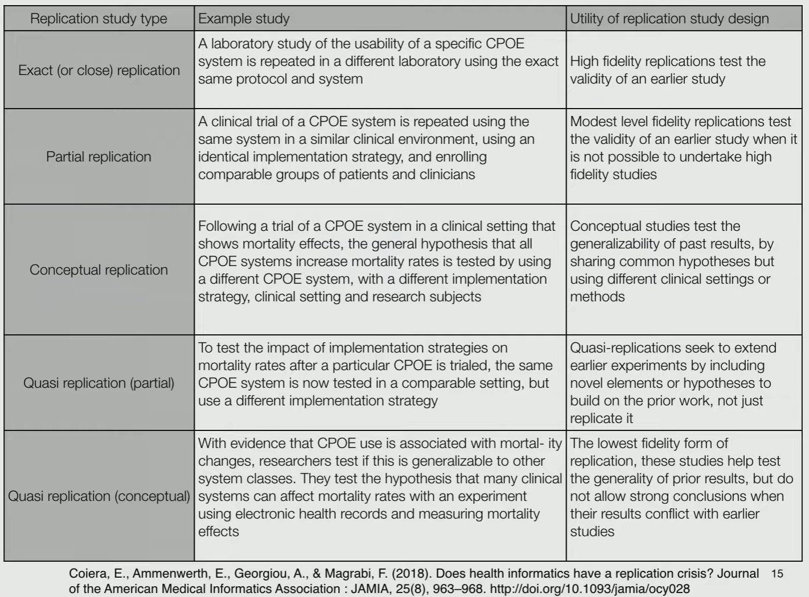

# Measurement

## Notes

- Most measurements are indirect: What we actually measure is different what we want to study
  - For eg: measuring temperature with mercury thermometer: we look at the difference in mercury height
- Measurement can change the thing that you are measuring

## Measurement Stability

Temporal & Spatial

Repeated measurements are taken at different times, locations, conditions

- How constant is the sample
- How constant is the measurement process
- How constant is the measurement context

## Observation Decomposition

Process observation

- Process True Value
- Process Error
- Measurement Error
  - Procedure Error
  - Sensor Error

## Error Components

- Systematic errors
  - Produces bias
  - We try to correct systematic error, but can never be totally free from systematic error
  - We can put an upper limit on the expected systematic errors
- Random errors: Can be evaluated statistically, through repeated measurements

## Measurement Metrics

- Accuracy: 1 - systematic error
- Precision: standard deviation of repeated measurements (random error component)
  - Repeatability: standard deviation of repeated measurements under conditions as nearly identical as possible
  - Reproducibility: standard deviation of repeated measurements under conditions that vary (different operators, instruments, days, time)

## Uncertainty Types

- Type A: Process Noise
  - Caused by fluctuations in nature that propagate through measurement model
  - obtained by statistical analysis of repeated measurements
- Type B: Measurement Noise
  - Types
    - Measurement Procedure Noise
      - Incomplete definition of measurement
      - Imperfect realization of procedure
      - Sample not representative
      - Environmental conditions
      - Biases in reading analog scales
      - Instrument resolution
      - Values of constants used in calculations
      - Changes in measuring instrument performance since last calibration
      - Approximations/assumptions in measurement model
    - Sensor Noise
  - Evaluated by scientific judgement (Prior experience or data, manufacture’s specs)

## Effective Degrees of Freedom

When using combined uncertainty , we assume that the measurement is t-distributed

Welch-Satterthwaite approximation
$$
\text{DOF}_\text{eff} = \dfrac{(\sum u_i^2)^2}{\sum (u_i^4/\text{DOF}_i)}
$$

## Replication

