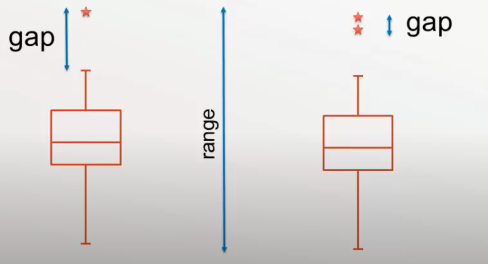

# Outliers

## Causes

- True distribution has heavy tails
- Data “contaminated” by another distribution withe either
  - significantly different mean
  - significantly larger variance

## Studentized Data

How many SD away from the mean is this data point
$$
t_i =\dfrac{x_i - \bar x}{s_x}
$$

## Robustness & Outliers

$$
E[\bar x] = \mu + \dfrac{x_o - \mu}{n} 
\\
E[s^2_x] = \sigma^2_x + \dfrac{(x_o - \mu)^2}{n}
$$

For large outliers $x_o \gg n\mu, n\sigma$
$$
\bar x \approx \dfrac{x_o}{n} \\
s \approx \dfrac{\vert x_o \vert}{\sqrt{n}} \\
\implies T = \dfrac{\vert x_o - \bar x \vert}{s} \approx \dfrac{n-1}{\sqrt{n}}
$$

## Testing for Outliers

Outlier: Observation so different from others that it is suspected to be generated by a different mechanism with a one-time, large systematic error

Useful only when $n>20$

### Causes

- Error in measurement recording
- Failure of measurement process/tool
- One sample was fundamentally different from other samples being measured
- Failure of experimental process (eg: sample didn't receive proper treatment)

### IDK

Detecting outliers is the first step to discover the mechanism that caused the outlier

Sometimes the causes of outliers is more insightful that the analysis of the “good” data

### Rareness Detection

$$
x \text{ is outlier} \iff P(x) < 1/n
$$

$p$-value $\times n$ = probability of getting one data point (out on $n$) this unusual or more due to random chance

Assumes that we know the underlying distribution

Chauvenet’s criterion: reject if $p$-value $<1/(2n)$

Simple, assumes normal distribution, arbitrary cut-off, not rigorous

Not recommended

### Multiple of IQR

- IQR = Q3-Q1
- Outliers
  - Upper cutoff = Q3 + 1.5 IQR
  - Lower cutoff = Q1 - 1.5 IQR
  - Using this technique, usually about 1% of data points could be expected to be labelled as outliers
- Far outliers
  - Upper cutoff = Q3 + 3 IQR
  - Lower cutoff = Q1 - 3 IQR

Robust test

### Dixon $Q$-test

Identify one extreme data point
$$
Q = \dfrac{\vert x_\text{suspect} - x_\text{closest} \vert}{x_\max - x_\min}
$$
Classify as outlier if $Q > Q_\alpha$, where $\alpha=$ risk of rejecting good data

- Usually use $\alpha<$ what you use for other tests
- For eg: use $\alpha=0.01$ instead of $0.05$

Mostly used when $n<20$ and where calculating SD is difficult

#### Problem

Masking (what if there are multiple outliers)

### Grubbs’ Test

The test assumes that underlying distribution is normal; given this assumption holds true, Grubb’s test has more power than Q-test

Steps

1. Identify number of outliers that you want to test
   1. For 2 outliers, we use a different critical value depending on whether the outliers are in the same/different tails
2. Calculate Grubb’s statistic

$$
\begin{aligned}
\text{G} &= \dfrac{\text{SSE}_{\cancel o}}{\text{SSE}_{o}} \\
\text{SSE} &= \sum (x_i - \bar x)^2
\end{aligned}
$$

where

- $\text{SSE}_{\cancel o} =$ SSE for dataset without outlier (after removal)
- $\text{SSE}_{o} =$ SSE for dataset with outlier (before removal)

$$
t_c =
\dfrac{n-1}{\sqrt{n}}
\sqrt{
\dfrac{
(t_{(\alpha/2n), n-2})^2
}{
n-2 + (t_{(\alpha/2n), n-2})^2
}
}
$$

- Usually, we take $\alpha/2$, but here we are looking at a collection of $n$ numbers
- $(n-2) =$ degree of freedom
- $(n-1)/\sqrt{n} =$ max value of $t$

#### Multiple outliers

Iterative Grubb’s Test Extreme Studentized Deviate

To find unknown number of outliers $k$, apply Grubb’s test iteratively

1. Search for outliers
2. If outlier detected
   1. remove it
   2. else, stop
3. Repeat steps 1-2

Note: the $t_c$ depends on $k$

### Peirce’s Criterion

Compare probability of the data with outliers to probability of the data without the outliers

Assumes a normal distribution

Can remove multiple outliers in a single iteration

Not as common as Grubb’s test

## Handling outliers

```mermaid
flowchart LR

i{Identify<br />outlier cause?}

dc{Data<br />correction<br />possible?}

c["1. Correct data<br />2. Include in analysis"]
r["1. Address outlier<br />2. Document removal"]

p["Perform analysis<br />1. w/ outlier<br />2. w/o outlier"]
da{"Influential outlier?<br/>(Affects conclusions?)"}
dw["1. No issues<br />2. Document everything"]
ouch["1. Take more data (Repeat exp)<br />2. Abandon normality assumption"]


start([ ]) -->
i --> |Y| dc -->
|Y| c

dc --> |N| r

i --> |N| p --> da

da --> |N| dw
da --> |Y| ouch
```

Techniques to address outlier

- Delete outlier
  - Always delete spurious data
- Truncate (delete both min and max data points)
- Winterize outlier (set value equal to closest neighbor)
- Replace outlier with expected value from Q-Q plot
- Use robust methods instead

### Identifying causes

Always identify cause outlier as there could be lessons to be learnt

| Time of identifying cause | Comment                                                      | Report?                                            |
| ------------------------- | ------------------------------------------------------------ | -------------------------------------------------- |
| Before outlier detection  | Measurement instrument breaks and must be repaired; you suspect calibration will be off | ⚠️ Depends; not very useful, but good practice |
| After outlier detection   | Beware of just-so stories                                    | ✅                                                  |
| Never                     |                                                              | ✅                                                  |

## IDK

Importance of outlier depends on decision you are trying to make

Spurious vs outlier depends on what is important to you

## Recommend Testing Sequence

1. Graph the data: histogram, box plot, Q-Q plot
2. Perform moment tests (mean, standard deviation, skewness, kurtosis)
3. If non-normality detected, check for outliers
4. If outliers removed, recheck for outliers
5. If non-normal distribution suspected, use empirical CDF to identify candidate distributions