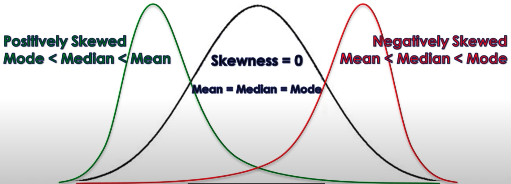

## Exploratory Data Analysis

Preliminary investigation of data, to understand its characteristics

Helps identify appropriate pre-processing technique and data mining algorithm

Involves

- Summary Statistics
- Visualization

## Univariate Summary Statistics

Minimal set of value(s) that captures the characteristics of large amounts of data, and show the properties of a distribution

|                                  | Meaning                                             | Formula                                                      | Moment           | Comment                                                      |
| -------------------------------- | --------------------------------------------------- | ------------------------------------------------------------ | ---------------- | ------------------------------------------------------------ |
| Mean/ Arithmetic Mean       | Central tendency of distribution                    | $\dfrac{\sum x_i}{n}$                                        | 1                |                                                              |
| Trimmed Mean                     |                                                     |                                                              |                  |                                                              |
| Weighted Mean                    |                                                     | $\dfrac{\sum w_i x_i}{n}$                                    |                  |                                                              |
| Geometric Mean                   |                                                     | $\sqrt[{\Large n}]{\Pi x}$                                   |                  |                                                              |
| Harmonic Mean                    |                                                     | $\dfrac{n}{\sum \frac{1}{x}}$                                |                  | Gives more weightage smaller value                           |
| Median                           | Middle most observation 50th quantile          | $\begin{cases} x_{{n+1}/2}, & n = \text{odd} \\ \dfrac{x_{n} + x_{n+1}}{2}, & n = \text{even}\end{cases}$ |                  | Robust to outliers                                           |
| Mode                             | Most frequent observation                           |                                                              |                  | Unstable for small samples                                   |
| Variance                         | Squared average deviation of observations from mean |                                                              | 2nd Centralised  |                                                              |
| Standard Deviation               | Average deviation of observations from mean         |                                                              |                  |                                                              |
| Skewness                         | Direction of tail                                   | $\dfrac{\sum (x_i - \mu)^3}{n \sigma^3}$ $\dfrac{3(\mu - \text{Md})}{\sigma}$ $\dfrac{\mu - \text{Mo}}{\sigma}$ | 3rd Standardized | 0: Symmetric $[-0.5, 0.5]$: Approximately-Symmetric $[-1, 1]$: Moderately-skewed else: Higly-skewed |
| Kurtosis                         | Peakedness of distribution                          | $\dfrac{\sum (x_i - \mu)^4}{n \sigma^4}$                     | 4th standardized |                                                              |
| Max                              |                                                     |                                                              |                  |                                                              |
| Min                              |                                                     |                                                              |                  |                                                              |
| Quantile                         | Divides distributions into 100 parts                |                                                              |                  | Unstable for small datasets                                  |
| Quartile                         | Divides distributions into 4 parts                  |                                                              |                  |                                                              |
| Decile                           | Divides distributions into 10 parts                 |                                                              |                  |                                                              |
| Range                            | Range of values                                     | Max-Min                                                      |                  | Susceptible to outliers                                      |
| IQR Interquartile Range     |                                                     | Q3 - Q1                                                      |                  | Robust to outliers                                           |
| CV Coefficient of Variation |                                                     | $\dfrac{\sigma}{\mu}$                                        |                  |                                                              |

### Relationship between Mean, Median, Mode

$$
\text{Mo} = 3 \text{Md} - 2 \mu
$$

### Skewness

| Skewness | Property             |                   |
| -------- | -------------------- | ----------------- |
| $> 0$    | Mode < Median < Mean | Positively Skewed |
| $0$      | Mode = Median = Mean |                   |
| $<0$     | Mean < Median < Mode | Negatively Skewed |

### Moment

$$
M_k = E(x^k) = \frac{x^k}{n}
$$

## Multivariate Summary Statistics

|                               |             |                         |
| ----------------------------- | ----------- | ----------------------- |
| How 2 variables vary together | Covariance  | $-\infty < C < +\infty$ |
|                               | Correlation | $-1 \le r \le +1$       |

### Covariance Matrix

It is always $n \times n$, where $n =$ no of attributes

|       |         $A_1$          |         $A_2$          |         $A_3$          |
| :---: | :--------------------: | :--------------------: | :--------------------: |
| $A_1$ |    $\sigma^2_{A_1}$    | $\text{Cov}(A_1, A_2)$ | $\text{Cov}(A_1, A_3)$ |
| $A_2$ | $\text{Cov}(A_2, A_1)$ |    $\sigma^2_{A_2}$    | $\text{Cov}(A_2, A_3)$ |
| $A_3$ | $\text{Cov}(A_3, A_1)$ | $\text{Cov}(A_3, A_2)$ |    $\sigma^2_{A_3}$    |

The diagonal elements will be variance of the corresponding attribute

$$
\begin{aligned}
\text{Cov}(x, y)
&= \frac{1}{n} \sum_{k=1}^n (x_k - \bar x) (y_k - \bar y) \\
\implies \text{Cov}(x, x)
&= \frac{1}{n} \sum_{k=1}^n (x_k - \bar x) (y_k - \bar y) \\
&= \frac{1}{n} \sum_{k=1}^n (x_k - \bar x) (x_k - \bar x) \\
&= \frac{1}{n} \sum_{k=1}^n (x_k - \bar x)^2 \\
&= \sigma^2_x
\end{aligned}
$$

### Correlation Matrix

|       |     $A_1$     |     $A_2$     |     $A_3$     |
| :---: | :-----------: | :-----------: | :-----------: |
| $A_1$ |      $1$      | $r(A_1, A_2)$ | $r(A_1, A_3)$ |
| $A_2$ | $r(A_2, A_1)$ |      $1$      | $r(A_2, A_3)$ |
| $A_3$ | $r(A_3, A_1)$ | $r(A_3, A_2)$ |      $1$      |

The diagonal elements will be 1

$$
\begin{aligned}
r(x, y)
&= \frac{
\text{Cov}(x, y)
}{
\sigma_x \sigma_y
} \\
\implies
r(x, x)
&= \frac{
\text{Cov}(x, x)
}{
\sigma_x \sigma_x
} \\
&= \frac{
\frac{1}{n} \sum_{k = 1}^n (x_k - \bar x) (x_k - \bar x)
}{
\left(
\sqrt{ \frac{1}{n} (x_k - \bar x)^2 }
\right)^2
} \\
&= 1
\end{aligned}
$$

## Why $(n-k)$ for sample statistics?

where $k=$ No of estimators

1. High probability that variance of sample is low, so we correct for that
1. Lost degree of freedom
