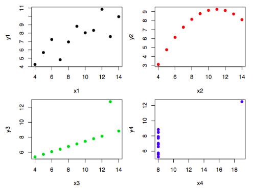

## Visualization

Display of data in a graphical/tabular format

Helps us understand the data

## Why is visualization important?

Widely different distributions can have the same statistical properties

Below is the Anscombe’s quartet

## Note

Use the correct minimum & max range, such that only possible values are included

- Do not skew the axis
- For eg: for human body temperature, you should show 98-105 F; you shouldn’t start at 0

## Uni-Variate

### Box/Box-Whiskers Plot

Helps understand the range and central tendancy of a variable

{ loading=lazy }

### 1D Histogram

Visualizes the frequency distribution of attribute

Relative uncertainty of each bin frequency $\propto \dfrac{1}{\sqrt{\text{count}}}$ 

#### Categorical Data

Each category will have a line denoting the frequency associated with that category

#### Continuous Data

- Apply binning
    - Usually equal-width binning
- Each bin will be treated as a different category
- Now each bin will have a line denoting the frequency associated with that category

The convention of analyzing these bins

> - Values are left-inclusive and right-exclusive
> - Last bin is right-inclusive
>
> ~ Oracle Docs

#### Limitations

- Shape may change dramatically depending on bin settings
- Bins with few counts have high statistical uncertainty
- Interpretation can be difficult without huge amounts of data

### Q-Q Plot

Quantile-Quantile plot comparing a distribution’s quantiles with quantiles of a known distribution (such as Normal distribution)

## Bi-Variate

### Scatter Plot

### Line Plot

### 2D Histogram

Helps understand frequency of co-occurance of 2 attributes

{ loading=lazy }

### Pair Plot

Basically a matrix of scatter plots

### Stem & Leaf Plots

Understand the distribution of values of an attribute

Useful when there aren’t many values

### Steps

- Split values into groups, where each group contains those values that are the same except for the last digit
- Each group becomes a stem, while the last digit of a group are the leaves
    - Stems will be the higher-order digits
    - Leaves will be the lower-order digits
- Plot stems vertically and leaves horizontally

## Tri-Variate

### Contour Plots

Used for spacial data

## Multi-Variate

### Parallel Coordinates

## Conditional Quantitative Plots

- Bin quantitative data
- Make different plots

This will be useful for error distribution inspection

## Cheat Sheet

## Data Visualization Guidelines

| Company                                                      | Guideline                                                    | Last Updated     | Description                                                  |
| ------------------------------------------------------------ | ------------------------------------------------------------ | ---------------- | ------------------------------------------------------------ |
| Adobe                                                        | https://spectrum.adobe.com/page/data-visualization-fundamentals/ | December 2019    | Data visualization guidelines for Spectrum—Adobe's design system. |
| Airbnb                                                       | https://airbnb.io/visx                                       |                  |                                                              |
| Amazon Web Services                                          | https://cloudscape.design/patterns/general/data-vis/         |                  |                                                              |
| Apple                                                        | https://developer.apple.com/design/human-interface-guidelines/charts | September 2022   | General data visualization guidelines for application developers |
| Aviva                                                        | https://standards.aviva.com/framework/element-library/components/pie-chart/ | 2021             | Some guidelines on the graph / charts styles                 |
| Baltimore City Data Fellows Project                          | https://storymaps.arcgis.com/stories/d19f7d4d2a9b49c7b8f68730e3cda1e6 | April 1, 2022    |                                                              |
| BBC                                                          | https://www.bbc.co.uk/gel/guidelines/how-to-design-infographics | 2016             | How we design infographics for BBC editorial content and how you can make your own. |
| BBC                                                          | https://bbc.github.io/rcookbook/                             | 2019             | An R package and an R cookbook to make the process of creating publication-ready graphics in our in-house style using R’s ggplot2 library a more reproducible process, as well as making it easier for people new to R to create graphics. |
| BBC Audiences                                                | https://public.tableau.com/profile/bbc.audiences#!/vizhome/BBCAudiencesTableauStyleGuide/Hello | 2022             | Guide for Tableau Desktop users. This style guide is here to help you achieve consistent user experiences, help you make effective visualisations and make your visualisation a part of the high quality output of the BBC's Audiences team. |
| Cato Institute                                               | https://github.com/glosophy/CatoDataVizGuidelines/blob/master/PocketStyleBook.pdf | 2019             | It is meant to improve the quality of data visualization in order to create a more appealing experience for the reader and to more effectively communicate Cato’s mission and message to the public.  You will find graphic guidelines for each figure and table as well as the justification for each one’s design. |
| Consumer Financial Protection Bureau                         | https://cfpb.github.io/design-system/guidelines/data-visualization-guidelines | 2018             | The data visualization design manual provides guidance to designers, business intelligence analysts, researchers and developers to consider who their audience is, and the impacts of what they include in a title, some basics for accessibility, as well as keeping everything feeling like CFPB. |
| Data Design System Collection                                | https://airtable.com/appmJoE6s8PAWWHaU/shrSvvfZySawZHvQa/tblLVYunaKUqILW3k/viwZ8ay3WHvzmCC6Z?blocks=hide |                  | Hey there - first of all big thanks and kudos to you for all the ressources and articles here!  Just wanted to add a collection which i started also last year - maybe there is soemthing new for your google list or if you want to exchange on the metrics and way of representation. Best regards, Emanuel |
| Dallas Morning News                                          | https://drive.google.com/file/d/16qdtjdnMPQt_rJDfSCEwr8sUUO555W4I/view | 2005             | In the following pages you will find more than just specifications of our graphics style; you’ll find guidelines that should be considered for every graphic you make as well as clarity of graphic choice. |
| DHL                                                          | https://www.dpdhl-brands.com/en/dhl/tables-and-charts        | January 2024     | Basic guidelines for shipping company DHL.                   |
| Elastic                                                      | https://eui.elastic.co/#/elastic-charts/creating-charts      |                  |                                                              |
| Finastra                                                     | https://design.fusionfabric.cloud/data-visualization         |                  |                                                              |
| Gitlab                                                       | https://design.gitlab.com/data-visualization/overview        |                  |                                                              |
| GitLab                                                       | https://handbook.gitlab.com/handbook/business-technology/data-team/platform/tableau-style-guide/ | November 3, 2023 | GitLab's style guide specifically for Tableau                |
| Goldman Sachs                                                | https://design.gs.com/components/charts                      |                  |                                                              |
| Google- Material Design                                      | https://material.io/design/communication/data-visualization.html | 2019             | Sections include: Principles, Types, Selecting charts, Style, Behavior, Dashboards |
| Government of Canada                                         | https://design.gccollab.ca/data/data-overview/               |                  |                                                              |
| Human Managed                                                | https://www.figma.com/file/jixsiIT7pCeiPMk8oiM6Qb/Data-viz-system?node-id=547%3A12066 | 2021             | A style guide for Human Managed dashboards and data viz in general, with explanation on design choices and rationale. It's a work in progress. |
| Humanitarian Data Exchange HDX                               | https://data.humdata.org/dataviz-guide/dataviz-elements/     |                  |                                                              |
| International Business Communication Standards (IBCS®)       | https://www.ibcs.com/standards                               | 2018             | The International Business Communication Standards (IBCS®) are practical proposals for the design of reports, presentations, dashboards and the diagrams and tables contained therein. This involves the conception of the content, the visual perception and the application of a semantic notation. The further development of the IBCS® Standards is an ongoing process, which is managed by the not-for-profit IBCS Association. |
| IBM                                                          | https://www.ibm.com/design/v1/language/experience/data-visualization/ | 2016             | See how IBM uses data visualization to provide meaningful context and precision. |
| IBM                                                          | https://www.ibm.com/design/language/data-visualization/overview | 2020             | (new URL) - 2020 Brand guideline                             |
| Liferay                                                      | https://liferay.design/lexicon/core-components/charts/       |                  |                                                              |
| Mayo Clinic Genomic and Bioinformatic Services               | https://docs.google.com/document/d/1G1RluXmPC5xhiq8kddKYOOSl4Sqc3UtAHywva9FPh6g/edit | 2023             |                                                              |
| London City Intelligence                                     | https://data.london.gov.uk/blog/city-intelligence-data-design-guidelines/ | 2019             | A first step toward improvement was creating a set of guidelines to help us all understand the basic principles of data visualisation, provide some examples of good practice, working processes and links to tools we can all use.  The guidelines are a “work in progress”, that have evolved through documenting what processes and tools have worked well so far in our work, and we hope will expand further in the future.  As we begin to create more interactive data visualisation applications, built on the expanding Datastore platform, these guidelines will be important to underpin the design of those applications. |
| MailChimp                                                    | https://ux.mailchimp.com/patterns/data                       |                  | Data should be clear; it should not be overly decorative and it should be presented in a meaningful way. Below are a few standards that we’ve set for telling visual data stories. |
| Microsoft                                                    | https://docs.microsoft.com/en-us/office/dev/add-ins/design/data-visualization-guidelines | 2017             | Guidelines to help you design effective data visualizations in your add-ins for Excel and other Office apps. |
| MinnPost                                                     | http://code.minnpost.com/minnpost-styles/                    | 2016             | Welcome to MinnPost Styles, a super-fly, style guide focused on interactive and news applications made by the MinnData team. A work in progress.   MinnPost Styles is a CSS and JS framework. The CSS source is written in SASS and is extendable if you want to include the framework via SASS. The source code can be found on Github. |
| Monash Climate Change  Communication Research Hub  (MCCCRH)  | https://apo.org.au/node/314650                               |                  |                                                              |
| Morning Star                                                 | https://designsystem.morningstar.com/charts/chart-elements-status/ |                  |                                                              |
| NZZ                                                          | https://nzzdev.github.io/Storytelling-Styleguide/#/          | 2019-07-24       | This documentation is designed to collected and maintain the styles and visual language of the Neue Zürcher Zeitung’s Visuals team. |
| Office for National Statistics                               | https://style.ons.gov.uk/category/data-visualisation/        | 2019             | Guidance for creating charts and tables and best practice for using colour in your work. |
| Opower                                                       | https://ux.opower.com/opattern/how-to-charts.html            | 2015?            | How to create and use charts                                 |
| Pearson                                                      | https://accessibility.pearson.com/resources/dataviz/         | Unknown          | It seems to be a work in progress                            |
| Pinterest                                                    | https://gestalt.pinterest.systems/foundations/data_visualization/overview | 2023             |                                                              |
| Royal Statistical Society                                    | https://rss.org.uk/datavisguide                              | 2024             | Best practices and style guides for data visualisations which is written primarily for contributors to Royal Statistical Society publications – chiefly, Significance magazine, the Journal of the Royal Statistical Society Series A, and Real World Data Science – but the information and advice within is of broad relevance and use to any data visualisation task. |
| Salesforce                                                   | https://lightningdesignsystem.com/guidelines/charts/         | 2019             | Chart guidance in Lightning Design System                    |
| semrush                                                      | https://developer.semrush.com/intergalactic/data-display/chart-showcase/chart-showcase |                  |                                                              |
| Shopify                                                      | [https://polaris.shopify.com/design/data-visualizationst](https://polaris.shopify.com/design/data-visualizations) |                  | Outlines data visualization practices at Shopify and how to leverage them. By maintaining consistent styles and formats for our data visualizations, we ensure that data is presented in a truthful and accurate manner to maintain integrity with merchants. |
| Sonos                                                        | https://www.agencysr.co.uk/works/data-visualisation-guidelines |                  | Following an initial audit of the Sonos brand collateral and guidelines, Surgery red cow agency was asked to create a new set of guidelines for their data visualisation. |
| Sunlight Foundation                                          | https://sunlightfoundation.com/2014/03/12/datavizguide       | 2014             | The pdf guide covers the common applications and provides guidance on basic design and branding principles that all company charts should meet. Templates are created to get as close as possible to meeting the specs in this guide. |
| Trafford Data Lab                                            | https://www.trafforddatalab.io/graphics_companion/           | 5 June 2018      | The Graphics Companion provides the R code for different data visualisations that can be created using the ggplot2 package. |
| The Economist                                                | https://design-system.economist.com/documents/CHARTstyleguide_20170505.pdf | 2017             |                                                              |
| The Urban Institute                                          | https://urbaninstitute.github.io/graphics-styleguide/        |                  | Use this data visualization style guide to create a uniform look and feel to all of Urban’s charts and graphs. This site contains guidelines that are in line with data visualization best practices and proven design principles. It also eliminates the burden of design and color decisions when creating charts. |
| Trafford Data Lab                                            | https://www.trafforddatalab.io/interactive_graphics_companion/ | January 2019     | The Interactive Graphics Companion provides the raw JSON for creating different data visualisations in Vega-Lite. |
| U.S. Design System                                           | https://designsystem.digital.gov/components/data-visualizations/ | 2021             | Best practices for basic visualization design, including some accessibility guidance. |
| US Agency for International Development \| Office of HIV/AIDS | https://issuu.com/achafetz/docs/oha_styleguide               | Feb 2021         | The purpose of our style guide is to provide the USAID Office of HIV/AIDS (OHA) with a set of guide rails on how to present data in-line with an overall vision so that all OHA data visualizations have a common look and feel - through color choice, graphic elements, and principles. |
| Visa                                                         | https://developer.visa.com/pages/chart-components            |                  | Basic set of charts in a design system with a focus on accessibility. Support for React, Angular, and R. |
| VTEX                                                         | [https://styleguide.vtex.com/#/Components/%F0%9F%91%BB%20Experimental/Charts](https://styleguide.vtex.com/#/Components/👻 Experimental/Charts) |                  |                                                              |
| World Health Organization                                    | https://apps.who.int/gho/data/design-language/               | 2023             |                                                              |

