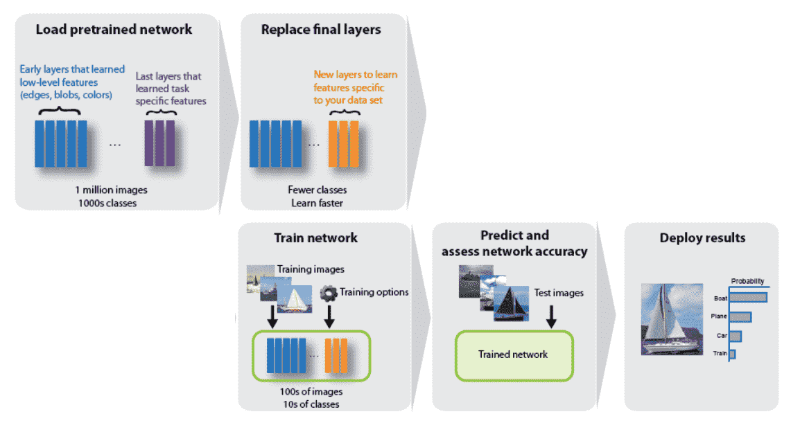
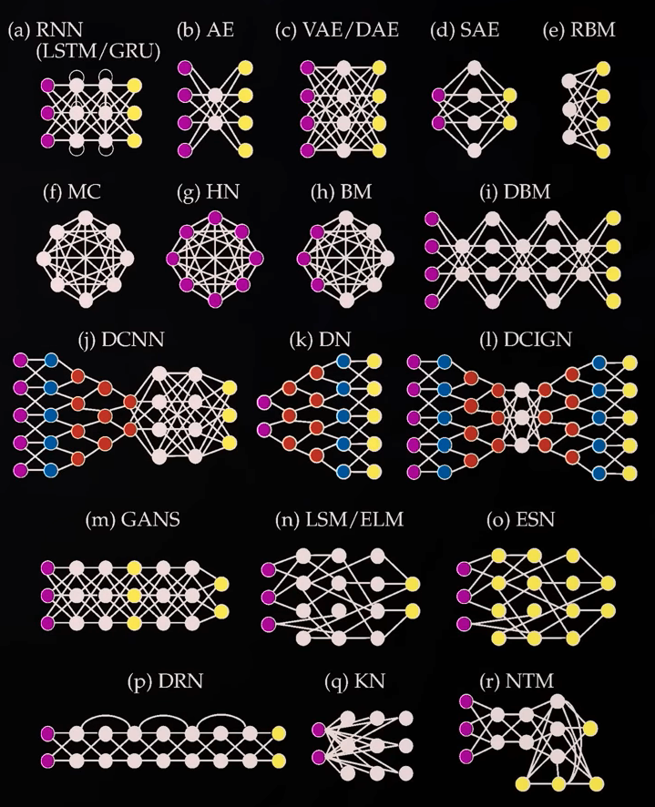

Deep Learning is subset of machine learning, which involves a deep neural network. Large availability of data in present-day has led to the rise in demand for deep learning applications.

Refer [Machine Learning](./../Machine_Learning/) concepts, to understand this course well.

## Types

```mermaid
flowchart TB
DL --> gm[Generative<br/>Models] & ha[Hybrid<br/>Architecture] & dm[Discriminative<br/>Models]

gm --> dbn[Deep<br/>Belief<br/>Networks] & da[Deep<br/>Autoencoder] & dbm[Deep<br/>Boltzmann<br/>Machine]

ha --> dnn[Deep<br/>Neural<br/>Networks]

dm --> cnn[Convolutional<br/>Neural<br/>Network] & dsn[Deep<br/>Stacking<br/>Networks]
```

## Applications of DL

- Object detection/counting
- Image/Video
  - classification
  - segmentation
  - captioning
  - sentence matching
  - face recognition
- Natural language processing
  - At the time of writing this sentence, ChatGPT’s successor GPT4 has come out, and it looks pretty insane

## Advantages

1. Automatic
2. Robust
3. Generalizable
4. Parallelizable $\implies$ Scalable

## Disadvantages

1. Low interpretability (Black box)
2. Computationally-expensive wrt to [Resource Constraints](#Resource-Constraints)

## Resource Constraints

1. Processor Speed
2. Memory Size
3. Power Consumption

## Challenges

- Lack of adequate data (addressed through [Transfer Learning](#Transfer Learning), Shallow learning, Incremental learning)
- Data inconsistencies
- Low battery life of edge devices (h/w controlling data flow at boundary b/w 2 networks)
- Resource-constrained algorithm development issues
- Diversity in computing units
- Privacy & security concerns (addressed through Encryption)

## Image Representation

Every images is a matrix of pixels, where each pixel is represented as a combination of **red, green, blue**; usually as a 8-bit value (0-255)

So if the width and height of image are $w, h$

## Key Metrics

- Accuracy
- Throughput
- Latency
- Energy efficiency
- Hardware costs
- Flexibility

## Major Architectures

|                                | Meaning                                               | Efficient at         | Major Application                                       | Computation Complexity |
| ------------------------------ | ----------------------------------------------------- | ------------------------- | ------------------------------------------------------------ | --------------------------- |
| CNN (Convolutional)       |                                                       | Detecting spatial pattens | Images, Videos                                               | High                        |
| RNN (Recurrent)           | Forward-feed, backward-feed, and self-loop is allowed |                           | Time Series                                                  |                             |
| ResNet (Residual Network) |                                                       |                           | Time Series                                                  |                             |
| U-Net                          |                                                       |                           | Basis of diffusion models Segmentation Super-Resolution Diffusion Models |                             |
| PINN (Physics-Informed)   |                                                       |                           |                                                              |                             |
| Lagrangian                     |                                                       |                           |                                                              |                             |
| Deep Operator                  |                                                       |                           |                                                              |                             |
| Fourier Neural Operator        |                                                       |                           |                                                              |                             |
| Graph Neural Networks          |                                                       |                           |                                                              |                             |

## Popular Models & Datasets

| Dataset | Sample Size | Content                                                      | Classes |
| :-----: | ----------: | ------------------------------------------------------------ | :-----: |
|  MNIST  |      50,000 | Images of handwritten digits (0-9)                           |   10    |
|  CIFAR  |      60,000 | Airplanes, cars, birds, cats, deer, dogs, frogs, horses, ships, and trucks |   10    |

## Transfer Learning

## IDK

