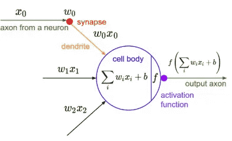

# Artificial Neural Networks

A neural network refers to a type of hypothesis class containing multiple, parameterized differentiable functions (layers) composed together in a manner to map the input to the output

It is made of layers of [neurons](#neuron), connected in a way that the input of one layer of neuron is the output of the previous layer of neurons (after activation)

They are loosely based on how our human brain works: Biological structure -> Biological function

You can think of a neural network as combining multiple non-linear decision surfaces into a single decision surface.

$$
\hat y = w \times \phi(x)
$$

where $\phi$ is a non-linear function

Neural networks can be thought of ‘learning’ (and hence optimizing loss by tweaking)

- features (instead of manual feature specification)
- parameters

## Universal Function Approximation

A 2 layer ANN is capable of approximate any function over a ==**finite subset**== of the input space

Catch: The size of NN should be equal to number of datapoints

Over-exaggerated property; same property is shared by Nearest Neighbors and splines, but no one cares
## Artificial Neuron

Most basic unit of an artificial neural network

### Tasks

1. Receive input from other neurons and combine them together
2. Perform some kind of transformation to give an output. This transformation is usually a mathematical combination of inputs and application of an [activation function](#activation-functions).

### Visual representation

## MP Neuron

McCulloch Pitts Neuron

Highly simplified compulational model of neuron

$g$ aggregates inputs and the function $f$ and gives $y \in \{ 0, 1 \}$

$$
\begin{aligned}
y &= f \circ g \ (x) \\
&= f \Big( g (x) \Big)
\end{aligned}
$$

$$
y = \begin{cases}
1, & \sum x_i \ge \theta \\
0, & \text{otherwise}
\end{cases}
$$

- $\sum x_i$ is the summation of boolean inputs
- $\theta$ is threshold for the neuron

### ❌ Limitation

MP neuron can be used to represent [linearly-separable functions](#Linearly-Separable-Function)

## Perceptron

MP neuron with a mechanism to learn numerical weights for inputs

✅ Input is no longer limited to boolean values

$$
\begin{aligned}
y
&= \begin{cases}
1, & \sum w_i x_i \ge \theta \\
0, & \text{otherwise}
\end{cases} \\
\Big(
x_0 &= 1, w_0 = -\theta
\Big)
\end{aligned}
$$

- $w_i$ is weights for the inputs

### Key Terms for Logic

- Pre-Activation (Aggregation)
- Activation (Decision)

### Perceptron Learning Algorithm

## Perceptron vs Sigmoidal Neuron

|                       | Perceptron | Sigmoid/Logistic |
| --------------------- | :--------: | :--------------: |
| Type of line          | Step Graph |  Gradual Curve   |
| Smooth Curve?         |     ❌      |        ✅         |
| Continuous Curve?     |     ❌      |        ✅         |
| Differentiable Curve? |     ❌      |        ✅         |

## General Form

$$
\begin{aligned}
w_{ij}^{(l)}
&= \begin{cases}
l \in [1, L] & \text{layers} \\
i \in [0, d^{(l-1)}] & \text{inputs} \\
j \in [1, d^{(l)}] & \text{outputs}
\end{cases} \\
x_{j}^{(l)}
&= \sigma(s_j^{(L)}) \\
&= \sigma \left( \sum_{i=0}^{d^{(l-1)}} w_{ij}^{(l)} x_i^{(l-1)} \right)
\end{aligned}
$$

