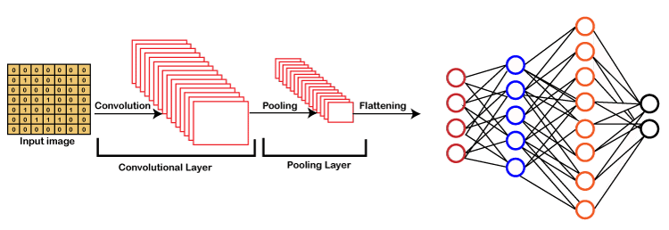
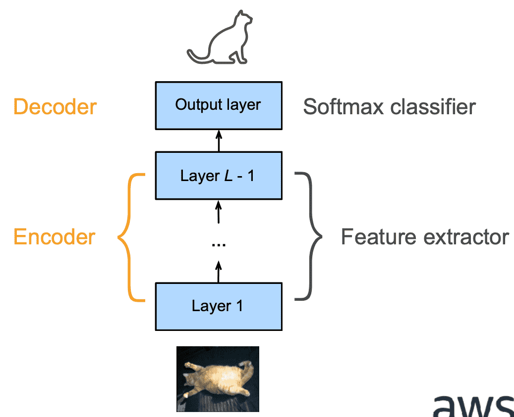
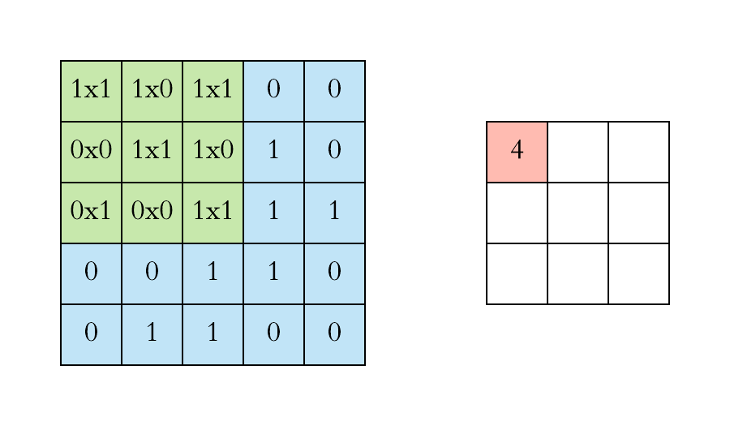
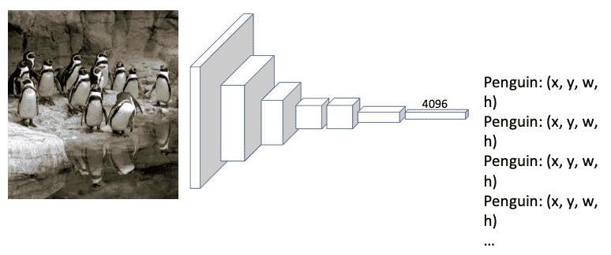
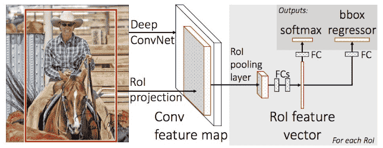

#  Convolutional Neural Networks

Convolutional Neural Networks is a type of architecture that exploits special properties of image data and are used in computer vision applications.

Images are a 3-dimensional array of features: each pixel in the 2-D space contains three numbers from 0–255 (inclusive) corresponding to the Red, Green and Blue.

The first important type of layer that a CNN has is called the Convolution (Conv) layer. It uses parameter sharing and applies the same smaller set of parameters spatially across the image. 

Essentially the parameters (i.e. weights) associated to the input remain the same but the input itself is different as the layer computes the output of the neurons at different regions of the image.

Hyperparameters of conv layers are 
- Filter size - corresponds to how many input features in the width and height dimensions one neuron takes in
- Stride - how many pixels we want to move (towards the right/down direction) when we apply the neuron again

Then we have the pooling layer. The purpose of the pooling layer is to reduce the spatial size (width and height) of the layers. This reduces the number of parameters (and thus computation) required in future layers.

We use a fully connected layers at the end of our CNNs. When we reach this stage, we can flatten the neurons into a one-dimensional array of features.





We control output shape via padding, strides and channels

Very nice [Youtube explanations](https://www.youtube.com/playlist?list=PLuhqtP7jdD8CD6rOWy20INGM44kULvrHu). Watch this!

## Variables in this page

| Variable | Meaning                                           |
| :------: | ------------------------------------------------- |
|   $I$    | Input matrix                                      |
|   $i$    | Size of input matrix                              |
|   $f$    | Size of filter matrix                             |
|   $p$    | Padding applied to input matrix (default=0)       |
|   $s$    | Stride length                                     |
|   $n$    | no of filters                                     |
|   $c$    | no of channels<br />- Grayscale: 1<br/>- Color: 3 |
|   $b$    | Bias                                              |

## Principles

- Translation invariance
- Locality

## Types of Layers

|                                             | Convolutional Layer                                          | Pooling Layer                                                |
| ------------------------------------------- | :----------------------------------------------------------- | ------------------------------------------------------------ |
| Purpose                                     | Control output shape via padding, strides and channels<br />Edge Detection<br />Image Sharpening | Gradually reduce spatial resolution of hidden representations<br />Some degree of invariance to translation<br />Image size reduction, without much data loss<br />Image Sharpening |
| Operation                                   | Cross Correlation                                            | Pooling                                                      |
| Representation<br />$O = $                  | $I \star F + b$<br />$\sum (I \star F + b)$ (multiple channels) |                                                              |
| $O_{i, j} =$                                | $\sum_{k=1}^f \sum_{l=1}^f F_{k, l} \odot  I_{i+k, j+l} + b$ | $\sum_{k=1}^f \sum_{l=1}^f \text{func}(F_{k, l} \odot  I_{i+k, j+l})$ |
| Steps to<br />calculate                     | 1. Perform padding<br/>2. Start from the left<br/>3. Place kernel filter over input matrix<br />(if there are multiple channels, place each filters over corr matrix)<br/>4. Output value of one element = sum of products + Bias<br />(if there are multiple channels, then sum of product of all the channels result in **one single value**)<br/>5. Perform stride rightward<br />6. Repeat steps 3-5, until there are no remaining columns on the right<br/>7. Repeat steps 2-6, until there are no remaining rows on the left | 1. Start from the left<br/>2. Place filter over input matrix<br/>3. Output value of one element = func(product of elements), where func = max, min, avg<br />4. Perform stride rightward<br/>5. Repeat steps 3-5, until there are no remaining columns on the right<br/>6. Repeat steps 2-5, until there are no remaining rows on the left |
| Default<br />stride length                  | 1                                                            | $f$                                                          |
| Size of<br />output                         | $\dfrac{i-f \textcolor{hotpink}{+2p}}{s} + 1$                | $\dfrac{i-f}{s} + 1$                                         |
| When Applied                                | First                                                        | Only after convolutional layer                               |
| Common<br />Padding<br />Value              | $f-1$                                                        | 0                                                            |
| Common<br />Stride<br />Value               | 1                                                            | 1                                                            |
| No of<br />input channels                   | $c$                                                          | 1                                                            |
| No of output<br />images                    | $n$                                                          | 1                                                            |
| No of<br />output channels per output image | 1                                                            | 1                                                            |

$$
\text{Total output dimension } o' = o \times n \times c
$$

### Notes

- Convolution and cross-correlation operations are slightly different, but it doesn’t matter if kernel is symmetric
- Since images are of different sizes, instead of using weight matrix of fixed size, convolution is applied various times depending on size of input
- 1 x 1 Convolutional Layer doesn’t recognize spatial patterns, but fuses channels
- $\times$ is not multiplication; it is depth/no of activation maps

### Example

The following shows convolution on with 0 padding and stride 1.



## Padding & Striding

|         | Padding                                                      | Striding                                                |
| ------- | ------------------------------------------------------------ | ------------------------------------------------------- |
| Meaning | Number of extra row(s) and columns added around matrix<br />If $p =$ odd, then pad $\lceil p/2 \rceil$ on one side and $\lfloor p/2 \rfloor$ on the other | Step length in movement of kernel filter on input image |
| Purpose | Overcome loss of pixels, by increasing effective image size  |                                                         |
|         | Zero padding means padding using 0s                          |                                                         |


## Common Filters

| Application               | Filter Used                                                  |
| ------------------------- | ------------------------------------------------------------ |
| Vertical edges detection  | $\begin{bmatrix}1 & 0 & -1 \\ 1 & 0 & -1 \\ 1 & 0 & -1\end{bmatrix}$ |
| Horizontal edge detection | $\begin{bmatrix}1 & 1 & 1 \\ 0 & 0 & 0 \\ -1 & -1 & -1\end{bmatrix}$ |
| Blur                      |                                                              |

## Object Detection

mAP = mean Average Precision




## Advanced CNN

|               | RCNN                                                         | Fast-RCNN                                                    | Faster RCNN                                                  |
| ------------- | ------------------------------------------------------------ | ------------------------------------------------------------ | ------------------------------------------------------------ |
| Major idea    | Region-Based                                                 | Do not recompute features for every box independently        | Integrate bounding box proposals in CNN predictions          |
| Steps         | 1. Generate category-independent region proposals (~2k)<br />2. Compute 4096-dimensional CNN feature vector from each region proposal<br />3. Classify regions w/ class- specific linear SVMs | 1. Produce **single** convolutional feature map with several convolutional & max-pooling layers <br />2. Region of interest (RoI) pooling layer extracts fixed-length feature vector from region feature map | 1. Compute proposals with a deep convolutional Region Proposal Network (RPN)<br />2. Merge RPN and Fast-RCNN into a single network |
| Advantages    | Simple<br />Improved mAP compared to RNN                     | Higher mAP<br />Single end-to-end training stage<br />No disk storage required | Cost-free region proposals                                   |
| Disadvantages | Slow<br />Multistage pipeline<br />Disk storage required for feature caching<br />Training is expensive | Proposals generation is computationally expensive            |                                                              |
| Flowchart     |                                    |            |  |

## YOLO

You Only Look Once

Single CNN

No proposal for bounding box

==Treat this as a single regression (not classification)==, straight from images pixels to bounding box coordinates and class probabilities

### Steps

1. Residual block
   1. Input split into 7x7 grids
   2. Each cell trains a detector
      1. Detector needs to predict object’s class distributions
      2. detector has 2 bounding box predictor to predict bounding box and confidence scores
   3. Generate probability for each grid having an object
   4. Confidence Score = probability * IOU
2. Bounding box regression
3. IoU (Intersection over Union)
4. Non-max supression

### Non-Max Supression

```pseudocode
Algorithm Non-Max Supression
	Input: A list of proposal boxes B, corresponding confidence scores S and overlap threshold N
	Output:
		List of filtered proposals D
	
	select proposal with highest confidence score, remove it from B and add it to the fnal proposal list D
	Compare IOU of this proposal with all the proposal. If IOU > N, remove proposal from B
	
	more steps are there
```

## IOU

Intersection Over Union

Let

- True bounding box be $T$
- Proposed bounding box be $P$

$$
\text{IOU} = \frac{\text{Area}(T \cap P)}{\text{Area}(T \cup P)}
$$

### Interpretation

| IOU   |           |
| ----- | --------- |
| > 0.9 | Excellent |
| > 0.7 | Good      |
| < 0.7 | Poor      |

## Popular Architectures

| Architecture Name | Description                                  |
| ----------------- | -------------------------------------------- |
| LeNet-5           | Recognizing handwritten digits               |
| AlexNet           |                                              |
| VGGNet            |                                              |
| DenseCap          | Image captioning                             |
| SqueezeNet        |                                              |
| GoogLeNet         | Inception Modules (Network inside a network) |
| DCNN              |                                              |
| ResNet            |                                              |
| CUImage           |                                              |
| SENet & SE-ResNet |                                              |

## Depth-wise Convolution


