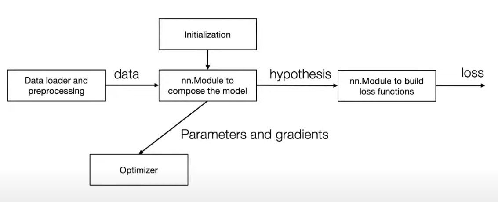

# Deep Learning Systems

Easy-to-use automatic differentiation tools (Keras, Tensorflow, PyTorch) have been the biggest cause of rapid development in DL

## Why Learn?

Understand internals of deep learning systems helps

- build/improve deep learning systems
- so that you can use them better
- not too difficult

## Frameworks

|                | Paradigm                  |      |
| -------------- | ------------------------- | ---- |
| PyTorch        | Imperative                |      |
| chainer        | Imperative                |      |
| Tensorflow 1.0 | Declarative               |      |
| Theano         | Declarative               |      |
| Caffe          | Forward & Backward layers |      |
| Jax            |                           |      |
| mxnet          |                           |      |

| Paradigm                  | Advantage                                                    | Disadvantage    |
| ------------------------- | ------------------------------------------------------------ | --------------- |
| Imperative                | Easy to debug Allow mixing of programming control flow and computational graph construction | Eager execution |
| Declarative               | Lazy execution                                               | Hard to debug   |
| Forward & Backward layers |                                                              |                 |

