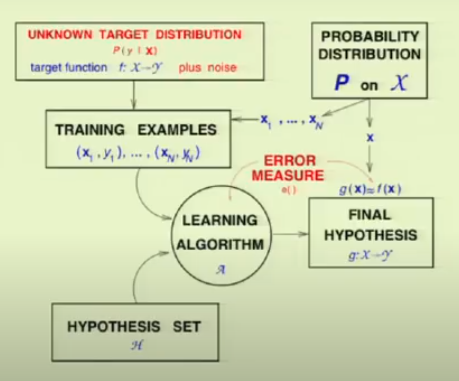
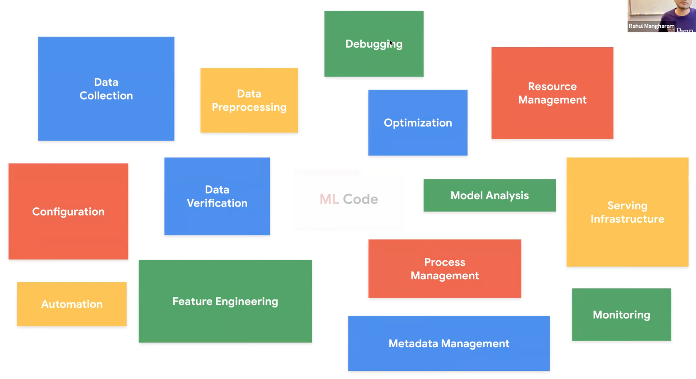
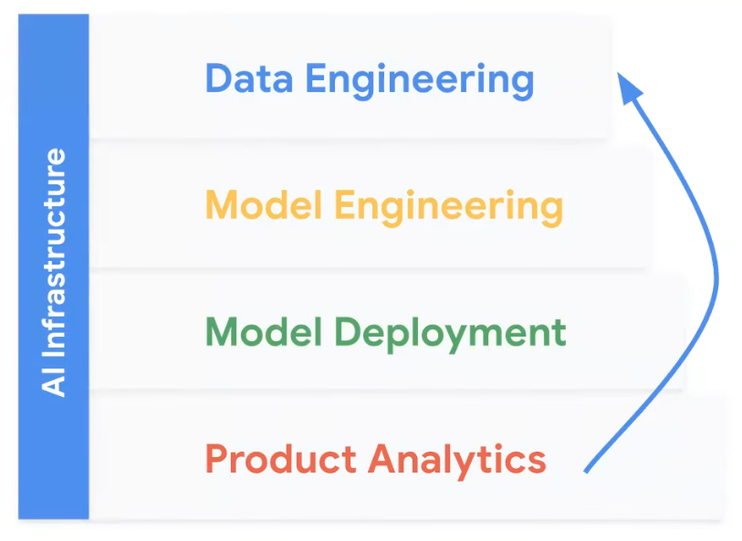

# Introduction

This introductory page is a big long, but that's because all the below concepts are common to every upcoming topic.

## Machine Learning

> Field of study that enables computers to learn without being explicitly programmed; machine learns how to perform task $T$ from experience $E$ with performance measure $P$.

Machine learning is necessary when it is not possible for us to make rules, ie, easier for the machine to learn the rules on its own

```mermaid
flowchart LR

subgraph Machine Learning
	direction LR
	i2[Past<br/>Input] & o2[Past<br/>Output] -->
	a(( )) -->
	r2[Derived<br/>Rules/<br/>Functions]
	
	r2 & ni[New<br/>Input] -->
	c(( )) -->
	no[New<br/>Output]
end

subgraph Traditional Programming
	direction LR
	r1[Standard<br/>Rules/<br/>Functions] & i1[New<br/>Input] -->
	b(( )) -->
	o1[New<br/>Output]
end
```

## Why do we need ML?

To perform tasks which are easy for humans, but difficult to generate a computer program for it

## Requirements

1. $\exists$ pattern
   - If $\not \exists$ pattern and its just noise, it is impossible to model it
2. We cannot quantify pattern mathematically
3. $\exists$ data

## Modelling Lifecycle

```mermaid
flowchart TB

subgraph Mathematics
direction TB
mp[Math problem]
mm[Mathematical Model]
ms[Solution]
end

subgraph Real World
direction TB
rwp[/Real world<br/>problem/]
d[/Data/]
rws[/Real world<br/>solution/]
end

d --> |Instantiate| mm
d --> |Validate| rws

rwp -->
|Translation| mp -->
|Model with<br/>assumptions| mm -->
|Solve| ms -->
|Translation| rws -->
|Review & correct| rwp
```

## Guiding Principles

| Principle                     | Questions                                                                                                                                                                                                                                   |
| ----------------------------- | ------------------------------------------------------------------------------------------------------------------------------------------------------------------------------------------------------------------------------------------- |
| Relevance                     | Is the use of ML in a given context solving an appropriate problem                                                                                                                                                                          |
| Representativeness            | Is the training data appropriately selected                                                                                                                                                                                                 |
| Value                         | - Do the predictions inform human decisions in a meaningful way - Does the machine learning model produce more accurate predictions than alternative methods - Does it explain variation more completely than alternative methods |
| Explainability                | - Data selection, Model selection, (un)intended consequences - How effectively is use of ML communicated                                                                                                                               |
| Auditability                  | Can the model's decision process be queried/monitored by external actors                                                                                                                                                                    |
| Equity                        | The model should benefit/harm one group disproportionately                                                                                                                                                                                  |
| Accountability/Responsibility | Are there mechanisms in place to ensure that someone will be responsible for responding to feedback and redressing harms, if necessary?                                                                                                     |

## Learning Problem

Given training examples and hypothesis set of candidate models, generate a hypothesis function using a learning algorithm to estimate an unknown target function

$P(x)$ quantifies relative importance of $x$

Learning model

- Learning algorithm
- Hypothesis set

## Stages of Machine Learning

|     | Stage             | Sub Steps                                                                   |
| --- | ----------------- | --------------------------------------------------------------------------- |
| 1   | Data Collection   |                                                                             |
| 2   | Observations      | - Influence Detection (Leverage & Outliers)                                 |
| 3   | Features          | - VIF for Multi-Collinearity - Feature importance - Feature selection |
| 4   | Causality         | - Causal Discovery - Causal Theory building                              |
| 5   | Model Building    | - Feature engineering - Model specification                              |
| 6   | Tuning            | - Model class/Learning algorithm selection - Hyperparameter tuning       |
| 7   | IDK               | - Model comparison - Model selection                                     |
| 8   | Evaluation        | - Performance - Robustness                                               |
| 9   | Novelty Detection |                                                                             |
| 10  | Inference         | - Model prediction - Model explanation                                   |

### Model Engineering

```mermaid
flowchart LR
subgraph Data Engineering
	direction LR
	dc[(Data<br/>Collection)] -->
	|Raw<br/>Data| di[(Data<br/>Ingestion)] -->
	|Indexed<br/>Data| da[(Data<br/>Analysis, Curation)] -->
	|Selected<br/>Data| dl[(Data<br/>Labelling)] -->
	|Labelled<br/>Data| dv[(Data<br/>Validation)] -->
	|Validated<br/>Data| dp[(Data<br/>Preparation)]
end

td[Task<br/>Definition] -->
dc

subgraph ML Engineering
	direction LR
	l[Learning<br/>Type] -->
	c[Define<br/>Cost] -->
	mo[Optimization] -->
	|Trained<br/>Model| me[Evaluate] -->
	|KPIs| mv[Model<br/>Validation] -->
	|Certified<br/>Model| md[/Deploy/]
end

subgraph Data Quality
od{Outlier<br/>Detection}
ad{Anomaly<br/>Detection}
ootd{Out-of-Training-Distribution<br/>Detection}
end

dp --> od --> |Non-Outlier| ad
od --> |Non-Outlier| l
od --> |Outlier| outlier

md --> rb

subgraph Models
	rb["Rule-Based Model(s)"]
	rb_pc{Rule-based<br/>Confidence}

	ml["ML Model(s)"]
	ml_pc{ML<br/>Confidence}

	fb["Fallback Model(s)"]
	fb_pc{Fallback<br/>Confidence}
end

ad --> |Non-Anomalous| ootd
ad --> |Anomalous| anomaly

ootd --> |In-Training-Distribution| rb
ootd --> |Out-of-Training-Distribution| ood

rb --> rb_pc
rb_pc --> |High| rb_pred
rb_pc --> |Low| ml

ml --> ml_pc
ml_pc --> |High| ml_pred
ml_pc --> |Low| fb

fb --> fb_pc
fb_pc --> |High| fb_pred
fb_pc --> |Low| us

subgraph Outputs
    outlier[/Outlier/]
    anomaly[/Anomaly/]
    ood[/Out of Training Distribution/]
	rb_pred[/Rule-based Prediction/]
	ml_pred[/ML Prediction/]
    fb_pred[/Fallback Prediction/]
	us[/Unsure/]
end

ld[(Live <br/>Data)] --------> od
```

1. Design
	1. Why am I building?
	2. Who am I building for?
	3. What am I building?
	4. What are the consequences if it fails?
2. Development
	1. What data will be collected to train the model
	2. Does the dataset follow AI ethics?
3. Deployment
	1. How will model drift be monitored?
	2. How should preventive security measures be taken?
	3. How to react to security breaches?

Confidence
- If different "good" models give significantly different results for a particular prediction, then it is low confidence

## 3 Dimensions of Prediction

- Point estimate
- Time
- Probabilistic
  - Intervals
  - Density
  - Trajectories/Scenarios

## Good Prediction Characteristics

- Forecast/Prediction consistency: Forecasts/Predictions should correspond to forecaster’s best judgement on future events, based on the knowledge available at the time of issuing the Forecasts/Predictions
- Forecast/Prediction quality (accuracy): Forecasts/Predictions should describe future events as good as possible, regardless of what these Forecasts/Predictions may be used for
- Forecast/Prediction value: Forecasts/Predictions should bring additional benefits (monetary/others) when used as input to decision-making

Hence, sometimes you may choose the Forecast/Prediction with the better value even if its quality is not the best

## Performance vs Parsimony

- Parsimonious models are more explainable
- Parsimonious models generalize better
  - Small gains with deep models may disappear with dataset shift/non-stationary

## Aspects

| Aspect       | Equivalent in Marco Polo game |
| ------------ | ----------------------------- |
| Loss         | Goal                          |
| Model Class  | Map                           |
| Optimization | Search                        |
| Data         | Sound                         |

## Open-source Tools

|              |     |
| ------------ | --- |
| Scikit-Learn |     |
| TensorFLow   |     |
| Keras        |     |
| PyTorch      |     |
| MXNet        |     |
| CNTK         |     |
| Caffe        |     |
| PaddlePaddle |     |
| Weka         |     |

## Doesn’t do well for Forecasting

Machine Learning cannot provide *reliable* time-series forecasting, without causal reasoning. This is why AI/ML cannot be blindly trusted for stock price prediction.

Related topics

- Model ends up being a Naive forecaster: just blindly predicts $\hat y_{t+h} = y_t$
- Counter-factual simulation: Never-before-seen events, such as
  - declining house prices
  - Negative oil prices
- Distribution drift
- Turkey problem

In the face of external factors that is not factored into the model, human intervention is required