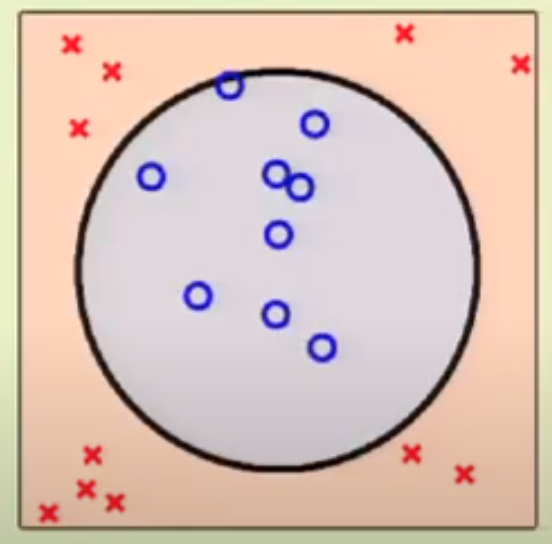

# Task $T$

Process of learning itself is not the task; learning is the means of attaining ability to perform the task

Usually described in terms of how the machine
learning system should process an instance (collection of features), which is usually represented as a vector.

## Tasks

|                                  |                                                              | Function Mapping                                             | Example                                                      |
| -------------------------------- | ------------------------------------------------------------ | ------------------------------------------------------------ | ------------------------------------------------------------ |
| Regression                       | Predicting a continuous numerical output                     | ${\mathbb R}^n \to {\mathbb R}$                              | Stock value prediction                                       |
| Classification                   | Categorizing input into a discrete output<br/>or outputing a probability dist over classes<br />Derived from regression<br /><br />If binary and very imbalanced dataset, use anomaly detection instead | ${\mathbb R}^n \to [1, C]$                                   | Categorizing images<br />Fraud detection                     |
| Anomaly Detection                | Identify abnormal events                                     | $\mathbb R \to [0, 1]$                                       | Fraud detection                                              |
| Classification w/ missing inputs | Learn distribution over all variables, solve by marginalizing over missing variables | ${\mathbb R}^n \to [1, C]$                                   |                                                              |
| Clustering                       | Assigning class label to set of unclassified items, to group observations into clusters | $\hat y = \hat f(x) = \text{Cluster}(x)$<br />${\mathbb R}^n \to [1, C ]$ | Grouping similar images                                      |
| Density estimation               | Estimating probability distribution from data                | ${\mathbb R}^n \to P(x)$                                     |                                                              |
| Transcription                    | Convert unstructured data intro discrete textual form        |                                                              | OCR<br />Speech Recognition                                  |
| Machine Translation              | Convert it<br/>into a sequence of symbols into another language |                                                              | Natural Language Translation                                 |
| Structured Output                | Output data structure has<br/>relationships between elements |                                                              | Parsing<br />Image segmentation<br />Image captioning        |
| Synthesis & Sampling             | Generate new samples similar to those in<br/>training data   |                                                              | Texture generation<br />Speech synthesis<br />Supersampling images |
| Data Imputation                  | Predict values of missing entries                            |                                                              |                                                              |
| Denoising                        | Predict clean output from corrupt input                      |                                                              | Image/Video denoising                                        |
| Density Estimation               | Identify underlying probability distribution of set of inputs |                                                              |                                                              |

## Types of Predictions

|              | $x_\text{new}$                                                        | Uncertainty|
|---           | ---                                                                   | ---|
| Intrapolation? | $\in X_\text{train}$ | Low |
|Interpolation | $\in [X_{\text{train}_\text{min}}, X_{\text{train}_\text{max}}]$      | Moderate |
|Extrapolation | $\not \in [X_{\text{train}_\text{min}}, X_{\text{train}_\text{max}}]$ | High|
|Smoothing |  | |

## Regression

### Probabilistic Regression

- Probability of prediction is required
- Understand impact of input
- Regression target is the sum of individual binary outcomes

$$
y'_i = p_i = \dfrac{y_i}{n_i}
$$

#### Binary Aggregate Outcomes

$$
\begin{aligned}
y_i &\sim \text{Binomial}(n_i, p_i) \\
p_i &= \sigma(\beta x_i) \\ 
\implies y_i &\sim \text{Bernoulli}\Big( \sigma(x_i' \beta) \Big)
\end{aligned}
$$

```
	temperature	fields cultivated percentCultivated
1 13.18475				 63         49	0.7777778
2 12.35680				165        147	0.8909091
3 17.57882				 38         30	0.7894737
4 20.86867				152         95	0.6250000
5 13.88084				 88         69	0.7840909
6 17.18088				191        141	0.7382199
```

#### Multiple Aggregate Outcomes

$$
\begin{aligned}
y_i &\sim \text{Multinomial}(n, p) \\
p_j &= \text{Softmax}(\beta_j x) \\
&= \dfrac{\exp(\beta_j x)}{\sum_k^K \exp(\beta_k x) }
\end{aligned}
$$

When $n_i=1,$ this becomes multi-class classification

Example

```
		 temperature  rainfall fields noncrop corn wheat rice
1    13.18475			75.26666     63       8   31    17    7
2    12.35680			102.37572    165       7  100    30   28
3    17.57882			101.61363     38       1   26     3    8
4    20.86867			64.35788    152      45   78    12   17
5    13.88084			107.54101     88       4   54    15   15
```

## Classification

### Decision Boundary/Surface

The boundary/surface that separates different classes

Generated using decision function

If we have $d$ dimensional data, our decision boundary will have $(d-1)$ dimensions

### Linear Separability

Means the ability to separate points of different classes using a line, with/without a non-linear activation function

$$
f(u) = \begin{cases}
1, & u \ge 0 \\
0, & \text{otherwise}
\end{cases}
$$

| Logic Gate | Linearly-Separable? | Comment                                                 |
| :--------: | :-----------------: | ------------------------------------------------------- |
|    AND     |          ✅          |                                                         |
|     OR     |          ✅          |                                                         |
|    XOR     |          ❌          | Linearly separable if we add $(x \cdot y)$ as a feature |
|    XNOR    |          ❌          | Linearly separable if we add $(x \cdot y)$ as a feature |


### Linearly Non-Separable

|                           Slightly                           |                          Seriously                           |
| :----------------------------------------------------------: | :----------------------------------------------------------: |
|  |  |

### Discriminant Function

Functions which takes an input vector $x$ and assigns it to one of the $k$ classes

### Multi-Class Classification

|                                            | One-vs-Rest                                            | One-vs-One                               |
| ------------------------------------------ | ------------------------------------------------------ | ---------------------------------------- |
| No of classifiers                          | $k$                                                    | $\frac{k(k-1)}{2}$                       |
| Retains valid probabilistic interpretation | ✅                                                      | ❌                                        |
| Limitation                                 | Some point may have multiple classes/no classes at all | Multiple classes assigned to some points |

## Clustering

### Analyzing clusters

Understand the characteristics of each cluster

1. Select features $x_j$
   - Do not use all features to perform clustering
   - where $x_j=$ sensible features such as
     - Spending habits
2. Perform clustering
3. Perform statistical analysis on $x_{\centernot{j}}$

For example: 4 clusters

|         | $x_1=0$ | $x_1=1$ |
| ------- | ------- | ------- |
| $x_2=0$ | A       | B       |
| $x_2=1$ | C       | D       |

