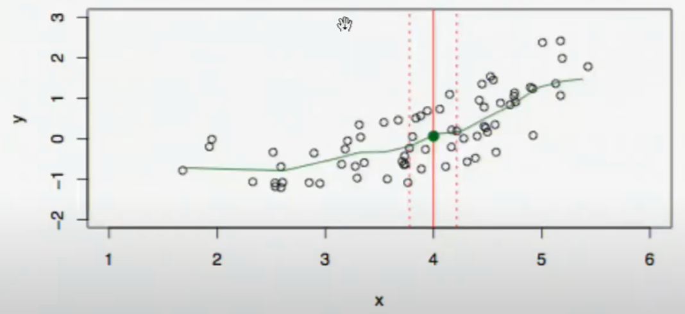
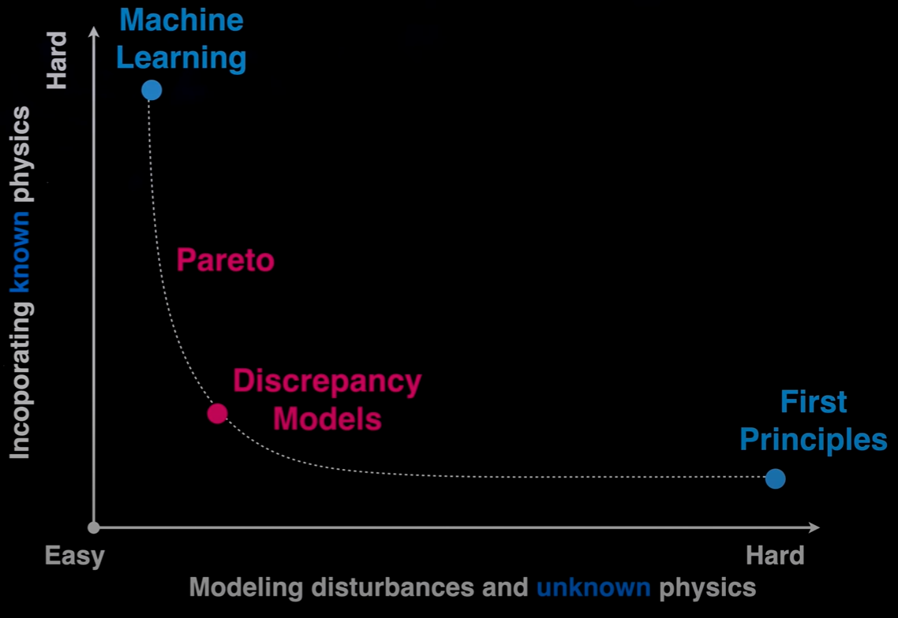
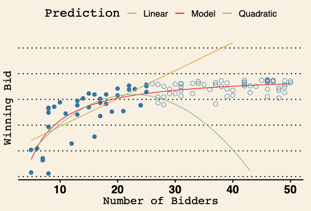
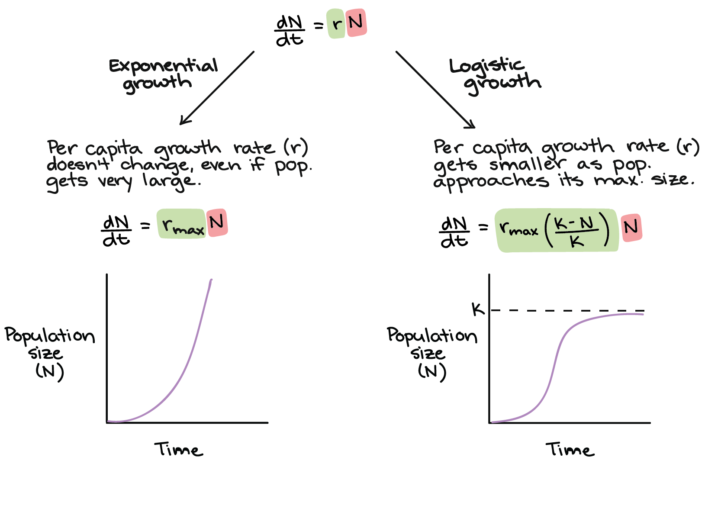

# Model

$$
\hat y = \hat f(x) + u \\ 
\hat f(x) = E[y \vert x]
$$

where

| Denotation     | Term                                                    | Comment                                                      |
| -------------- | ------------------------------------------------------- | ------------------------------------------------------------ |
| $x$            | input; feature; predictor                               |                                                              |
| $y$            | output; target; response                                |                                                              |
| $\hat y$       | prediction                                              |                                                              |
| $E[y \vert x]$ | CEF (Conditional Expectation Function)                  |                                                              |
| $\hat f$       | Target function Hypothesis Model              | Gives mapping b/w $x$ and $y$ to obtain CEF                  |
| $p(y \vert x)$ | Target distribution/ Posterior distribution of $y$ | Gives mapping b/w $x$ and $y$ to obtain Conditional Distribution |
| $u$            | Random component                                        |                                                              |

## IDK

```mermaid
flowchart LR
d[Data<br/>Generation] -->
|Input| m[Modelling] -->
|Analysis| si[Scientific<br/>Investigation]

si -->
|Improve Model| m

si -->
|Improve DoE/Data Generation| d
```

## Desired Properties

- Unbiased: Mean of residuals = 0
- Efficient: Variance of residuals and learnt parameters is min
- Maximum likelihood $P(D, \theta)$
- Robust
- Consistent: $n \to \infty \implies E[u_i] \to 0$

Attributes of probabilistic forecast quality

1. Reliable: probabilistic calibration
   1. For quantile forecasts with level $\alpha$, observations $y_{t+k}$ should be less than $\hat y_{t+k}$ $\alpha$ times
   2. For interval forecasts with coverage $p$, observations $y_{t+k}$ should be within the interval $p$ times
   3. For predictive densities composed of $m+1$ quantile forecasts with nominal levels $\alpha_0, \alpha_1, \dots, \alpha_m$, all these quantile forecasts are evaluated individually using the above
   4. Q-Q Plots
2. Sharp: informative
   1. Concentration of probability: how tight the predictive densities are
   2. Perfect probabilistic forecast gives a probability of 100% on a single value
   3. CRPS
      1. Average of each predictive density and corresponding observation
      2. $\text{CRPS}_{t, h} = \int_y \ \Big( \hat F_{t+h \vert t} - 1(y_{t+h} \le y) \Big)^2 \ \cdot dy$
      3. $\text{CRPS}_h = \text{avg}(\text{CRPS}_{t, h})$
3. Skilled
4. High resolution

## Note

Every model is only limited to its ‘scope’, which should be clearly documented

## IDK

- > "If you understand your solution better than the problem, then you are doing something wrong" ~ Vincent Warmerdam
- Think more about system design rather than just machine learning
- Simple linear models work. Most of the times non-linear/ensembles/deep learning models are not required

## Model Types

|                                 | Ideal                                                        | Non-Parametric (Nearest Neighbor)                       | Semi-Parametric               | Parametric                                                   |
| ------------------------------- | ------------------------------------------------------------ | ------------------------------------------------------------ | ----------------------------- | ------------------------------------------------------------ |
| $\hat y$                        | $\text{Mean}(y \vert x)$                                     | $\text{Mean} \Big(y \vert x_i \in N(x) \Big)$ $N(x)$ is neighborhood of $x$ |                               | $f(x)$                                                       |
| Functional Form assumption      | None                                                         | None                                                         |                               | Assumes functional form with a finite & fixed number of parameters, before data is observed |
| Advantages                      | Perfect accuracy                                             | - learns complex patterns - in a high-dimensional space - without being specifically directed - learns interactions |                               | Compression of model into a single function                  |
| Limitation                      | Not possible to obtain                                       | Suffers from curse of dimensionality: Requires large dataset, especially when $k$ is large  Black box: Lacks interpretability Large storage cost: Stores all training records Computationally-expensive |                               | Lost information?                                            |
| Visualization                   |  |  |                               |                                                              |
| Space Complexity is function of |                                                              | Training set size                                            | Number of function parameters | Number of function parameters                                |
| Example                         |                                                              | Nearest Neighbor averaging                                   | Spline                        | Linear Regression                                            |

Fundamentally, a parametric model can be though of data compression

## Modelling Types

|                                                              | Discriminative/ Reduced Form                            | Generative/ Structural/ First-Principles           | Hybrid/ Discrepancy                   |
| ------------------------------------------------------------ | ------------------------------------------------------------ | ------------------------------------------------------------ | ------------------------------------------ |
| Characteristic                                               | Mathematical/Statistical                                     | Theoretical (Scientific/Economic)                       | Mix of first principles & machine learning |
| Effect Modifiers [Read more](../Causal_Inference/08_Causal_Graphical_Model.md#Effect-Modifiers) | Assumes that effect modifiers will remain same as during learning | Incorporates effect modifiers                                |                                            |
| Goal                                                         |   1. $\hat p(y \vert x)$ 2. $\hat y = \hat E(y \vert x)$ | 1. $\hat p(x \vert y)$ 2. $\hat p(x, y)$ 3. $\hat p(y \vert x)$ 4. $\hat y = \hat E(y \vert x)$ | $\hat y = \text{g}(x) + d(x)$              |
|                                                              |                                                              | This model defines a “story” for how the data was generated. To obtain a data point  1. Sample class $y \sim \text{Categorical}(p_1, p_2, \dots, p_C)$ with class proportions given by $p_c$ 2. Then, we sample $x$ from the gaussian distribution $\mathcal N(\mu_c, \Sigma_c)$ for each class |                                            |
| Includes Causal Theory                                       | ❌                                                            | ✅                                                            | Same as Structural                         |
| Intrapolation?                                               | ✅                                                            | ✅                                                            | ✅                                          |
| Interpolation                                                | ⚠️                                                            | ✅                                                            | ⚠️                                          |
| Extrapolation                                                | ❌                                                            | ✅                                                            | ❌                                          |
| Counter-factual simulation                                   | ❌                                                            | ✅                                                            | ❌                                          |
| Can adapt to data drift                                      | ❌                                                            | ✅                                                            | ⚠️                                          |
| Stable for Equilibrium effects                               | ❌                                                            | ✅                                                            | ⚠️                                          |
| Synthetic data generation                                    | ❌                                                            | ✅                                                            | ❌                                          |
| Out-of-Sample Accuracy                                       | Low                                                          | High (only for good theoretical model)                  | Same as Structural                         |
| Derivation Time                                              | 0                                                            | High                                                         | Same as Structural                         |
| Example models                                               | Non-Probabilistic classifiers Logistic regression       | Probabilistic classifiers (Bayesian/Gaussian)                |                                            |
| Comment                                                      | The shortcoming of reduced form was seen in the 2008 Recession The prediction model for defaults was only for the case that housing prices go up, as there was data only for that. Hence, the model was not good for when the prices started going down. | Learning $p(x, y)$ can help understand $p(u, v)$ if $\{x, y \}$ and $\{ u, v \}$ share a common underlying causal mechanism  For eg: Apples falling down trees and the earth orbiting around the sun both inform us of the gravitational constant. |                                            |
| Example 1: General                                           | $f=\sigma(kx), \hat f = e^{kx}$ $f = x^2, \hat f = x$ $f=e^x, \hat f=x^2$ | $f = x^2, \hat f = x^2$                                      |                                            |
| Example 2: Chemical Kinetics                                 | Fit curve to given data                                      | Solve the rate law equation for the given data               |                                            |
| Example 3: Astronomy                                         | Mars position wrt Earth, assuming that Mars revolves around the Earth | Mars position wrt Earth, assuming that Mars & Earth revolve around the Sun |                                            |
| Example 4: Wage vs Education                                 | Relationship of wage vs education directly                   | Relationship of wage vs education, with understanding of demand-supply curve (ie, effects of supply of college educated students in the market)  eg: Kerala |                                            |
| Example 5: Time-Series Forecasting                           | Univariate model with lags and trends                        | Multi-variate model with lags of $y$ and $x$                 |                                            |

### Structural vs Reduced-Form

## Number of Variables

|          | Univariate Regression   | Multi-Variate                     |
| -------- | ----------------------- | --------------------------------- |
| $\hat y$ | $f(X_1)$                | $f(X_1, X_2, \dots, X_n)$         |
| Equation | $\beta_0 + \beta_1 X_1$ | $\sum\limits_{i=0}^n \beta_i X_i$ |
| Best Fit | Straight line           | Place                             |

## Degree of Model

|                         | Simple Linear Regression              | Polynomial Linear Regression                                 | Non-Linear Regression                                        |
| ----------------------- | ------------------------------------- | ------------------------------------------------------------ | ------------------------------------------------------------ |
| Equation                | $\sum\limits_{j=0}^k \beta_j X_j$     | $\sum \limits_{j=0}^k \sum\limits_{i=0}^n \beta_{ij} (X_j)^i$ | Any of the $\beta$ is not linear                             |
| Example                 | $\beta_0 + \beta_1 X_1 + \beta_1 X_2$ | $\beta_0 + \beta_1 X_1 + \beta_1 X_1^2 + \beta_1 X_2^{10}$   | $\beta_0 + e^{\textcolor{hotpink}{\beta_1} X_1}$             |
| Best Fit                | Straight line                         | Curve                                                        | Curve                                                        |
| Solving method possible | Closed-Form Iterative            | Closed-Form Iterative                                   | Iterative                                                    |
| Limitations             |                                       |                                                              | 1. Convergence may be slow 2. Convergence to local minima vs global minima 3. Solution may depend heavily on initial guess |
| Comment                 |                                       |                                                              | You can alternatively perform transformation to make your regression linear, but this isn’t best 1. Your regression will minimize transformed errors, not your back-transformed errors (what actually matters). So the weights of errors will not be what is expected 2. Transformed errors will be normal, but your back-transformed errors (what actually matters) won’t be a normal |

The term linear refers to the linearity in the coefficients $\beta$s, not the predictors

### Jensen’s Inequality

$$
E[\log y] < \log (E[y])
$$

Therefore
$$
\hat y = \exp(\beta_0 + \beta_1 x) + u_i \\
E[y \vert x] \ne E[\exp(\beta_0 + \beta_1 x)]
$$
However, if you assume that $u \sim N(0, \sigma^2)$
$$
E[y \vert x] = \exp(\beta_0 + \beta_1 x + \dfrac{\sigma^2}{2})
$$

## Multi-Layer Models

Boosting with different function and/or model class for each component of $f(x)$
$$
\hat f(x) = \sum_{j=1}^k \hat f_j(x_j) \\
\hat f: x_j \to u_{j-1} \\
u_0 = y
$$
```mermaid
flowchart LR
x1 --> h1
y ---> u1
h1 --> u1

x2 --> h2
u1 --> u2
h2 ---> u2
```

Model in the following order to avoid fitting the noise:

1. Components: low-frequency components first, then high-frequency components
1. Model: low-variance models preferred, then high-variance models; or you can optimize the entire thing as a carefully-crafted neural network

For eg: Time Series modelling

- Trend with LR: $\hat f(t)$
- Seasonality with KNN
- Holidays with Decision Tree

## Categorial Inputs

### Binary

$$
\begin{aligned}
\hat y &= \beta_0 + \beta_1 x + \beta_2 T + + \beta_3 x T + u \\
\\
T = 0 \implies \hat y &= \beta_0 + \beta_1 x + u \\
T = 1 \implies \hat y &= (\beta_0 + \beta_2) + (\beta_1+\beta_3) x + u
\end{aligned}
$$

where $T=$ treatment/binary var

### Discrete Var

For $C$ possible values of discrete var, you need to create $(C-1)$ dummy vars, as all zeros is also scenario

Else, if you have $C$ dummy vars, you will have perfect multi-collinearity (dangerous)

## Model Hints

Known properties of $f$ that can be used to improve $\hat f$, especially with small datasets

- Monotonicity
- Reflexivity
- Symmetry
- Rotational invariance
- Translational invariance

Can be enforced through

- Modifying features
  - Eg: using $\vert x \vert$ instead of $x$ for symmetry
- [Regularization Penalty](14_Model_Tuning.md#Weight-Decay)
- Data augmentation

## Latent Variable Models

### Examples

1. Image classification

   - Contains variability due to gender, eye color, hair color, pose, etc

   - Unless these images are annotated, these factors of variation are not explicitly available

2. Classification

   1. Gaussian mixture models

### Limitations

- Computationally-expensive: requires approximations

