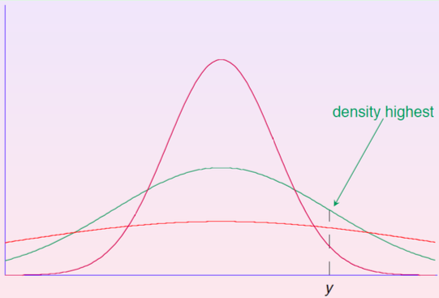

# Maximum Likelihood Estimation

## Likelihood

Probability of observing data $x$ according to pdf $p(x)$

$$
\begin{aligned}
L(p)
&= Pr_q(x) \\
&= \prod_{i=1}^n p(x_i) \\
\implies \log L(p)
&= \sum_{i=1}^n \log p(x_i) \\
\end{aligned}
$$

## Maximum Likelihood Estimation

Chooses a distribution $p(x)$ that maximizes the (log) likelihood function for $x$

Below example shows MLE for a single point

## MLE for Regression

$$
\begin{aligned}
\log L
&= \sum_{i=1}^n \log \Bigg\{
\dfrac{1}{\sigma \sqrt{2 \pi}}
\text{exp} \left(
\dfrac{-1}{2 \sigma^2} u_i^2
\right)
\Bigg \} \\
&= \dfrac{-N}{2} \log(2 \pi) - N \log \sigma - \dfrac{1}{2\sigma^2} \underbrace{\sum_{i=1}^n u_i^2}_\text{RSS}
\end{aligned}
$$

$$
\min \log L \\
\implies \dfrac{\partial \log L}{\partial \beta} = 0
$$

