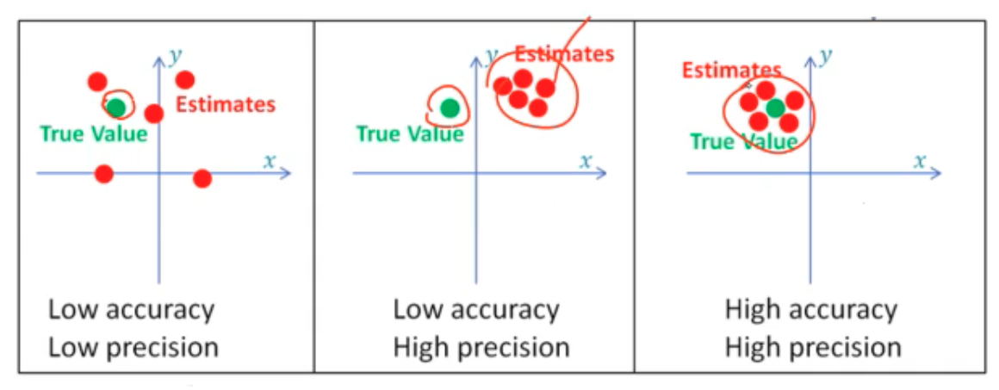
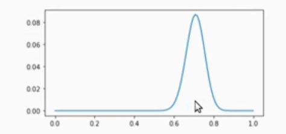

# Model Evaluation

## Guidelines

- Metrics computed from validation set may not be representative of the true population
- Never trust a single summary metric
- Always look at all the individual metrics: false positives and false negatives are seldom equivalent. Understand the medical problem to known the right tradeoff

## IDK

- Stratification: Train, Validation and Test sets should have the same distribution

## Data Leakage

Cases where some information from the training set has “leaked” into the validation/test set. Estimation of the performances is likely to be optimistic

Causes

- Perform feature selection using the whole dataset
- Perform dimensionality reduction using the whole dataset
- Perform parameter selection using the whole dataset
- Perform model or architecture search using the whole dataset
- Report the performance obtained on the validation set that was used to decide when to stop training (in deep learning)
- For a given patient, put some of its visits in the training set and some in the validation set
- For a given 3D medical image, put some 2D slices in the train- ing set and some in the validation set

## Baseline

Always establish a baseline

- Basic/Naive/Dummy predictions
- Human Level Performance
- Literature Review
- Performance of older system

## Comparison

We don’t test the model on the same we trained it with, because it will give high in-sample accuracy, but may give low out-of-sample accuracy(which is really what we want).

Out-of-sample accuracy is the accuracy of the model when tested when never-before-seen data.

Once the model is finalized, you should train your model with the testing data afterwards.


|                                   | Type          | Purpose                                       | Color Scheme Below                                        |
| --------------------------------- | ------------- | --------------------------------------------- | --------------------------------------------------------- |
| Training evaluation               | In Sample     | Evaluating underfitting                       | <span style="background:green;color:white">Green</span>   |
| Inner Validation                  | Out of Sample | Hyperparameter tuning                         | <span style="background:orange;color:white">Orange</span> |
| Outer Validation                  | Out of Sample | Model Tuning                                  | <span style="background:yellow;color:black">Yellow</span> |
| Testing evaluation<br />(Holdout) | Out of Sample | Evaluating overfitting<br />Model performance | <span style="background:Red;color:white">Red</span>       |

## Sampling Types

|                  | Sampling        |                                                    |
| ---------------- | --------------- | -------------------------------------------------- |
| Bootstrapping    | w/ Replacement  | Better as we can have a large repetitions of folds |
| Cross Validation | w/o Replacement |                                                    |

## Split Types

==Make sure to **shuffle** all splits for cross-sectional data==

| Type                       |                       Cross-Sectional                        |                         Time Series                          | Notes                                                        |
| -------------------------- | :----------------------------------------------------------: | :----------------------------------------------------------: | ------------------------------------------------------------ |
| Train-Test                 |            |            |                                                              |
| $k$- Fold Sampling         |  |  | 1. Split the dataset into $k$ random groups<br/>  - $k$ is most commonly set as 4 or 5<br/>  - $k$ is called as decision parameter<br/>2.$(k-1)$ groups are used to train and evaluated on remaining group<br/>3. Take average of all performance scores |
| Repeated $k$-Fold Sampling |  |                              ❌                               | Repeat $k$ fold with different splits and random seed        |
| Nested Train-Test          |  |  |                                                              |
| Nested $k$-Fold            |  |  |                                                              |
| Nested Repeated $k$-Fold   |  |                              ❌                               |                                                              |

## Prediction Bias & Variance

We want **low value** of both

If a measurement is biased, the estimate will include a constant systematic error

|                       |                  Bias                  |                       Variance                        |
| :-------------------: | :------------------------------------: | :---------------------------------------------------: |
|       Indicates       |               Inaccuracy               |                      Imprecision                      |
|        Meaning        | How close prediction is to true values |               Variability in prediction               |
|   Regression Metric   |                  MBE                   |                         RMSE                          |
| Classification Metric |                                        |                                                       |
|        Formula        |            $E[\hat y] - y$             | $E \Bigg[ \ \Big(\hat y - E[\hat y] \ \Big)^2 \Bigg]$ |

$$
\text{MSE} = \text{Bias}^2 + \text{Variance} + \text{Bayes Error}
$$



## Fitting & Capacity

We can control the fitting of a model, by changing hypothesis space, and hence changing its capacity

|                       | Under-fitting                                                | Appropriate-Fitting | Over-Fitting                                                 |
| --------------------- | ------------------------------------------------------------ | ------------------- | ------------------------------------------------------------ |
| Capacity              | Low                                                          | Appropriate         | Low                                                          |
| Bias                  | ⬆️                                                            | ⬇️                   | ⬇️                                                            |
| Variance              | ⬇️                                                            | ⬇️                   | ⬆️                                                            |
| Steps to<br />address | Increase model complexity<br />Increase training data<br />Remove noise from data<br />Inc no of features |                     | Cross-Validation<br />More training data<br />Feature Reduction<br />Early Stopping<br />Regularization |


The capacity of a model increases with increased [degree of polynomial](#degree-of-polynomial)

## Probabilistic Evaluation

Now, we need to see if any increase or decrease in accuracy due to hyper-parameter tuning is statistically-significant, or just a matter of chance.

## Regression

| Metric                                    |                     Formula                      |   Unit   |   Range    | Signifies                                                    | Advantages<br />✅                    | Disadvantages<br />❌                                         | Comment                                                      |
| :---------------------------------------- | :----------------------------------------------: | :------: | :--------: | ------------------------------------------------------------ | ------------------------------------ | ------------------------------------------------------------ | :----------------------------------------------------------- |
| $R^2$<br />(Coefficient of Determination) |                 $1 - \text{RSE}$                 | Unitless |  $[0, 1]$  | Proportion of changes in dependent var explained by regressors.<br /><br />Proportion of variance in $y$ explained by model wrt variance explained by mean<br /><br/>Demonstrates ___ of regressors<br/>- Relevance<br/>- Power<br/>- Importance |                                      | Cannot use to compare same model on different samples, as it depends on variance of sample<br /><br />Susceptible to spurious regression, as it increases automatically when increasing predictors |                                                              |
| Adjusted $R^2$                            | $1 - \left[\dfrac{(1-R^2)(n-1)}{(n-k-1)}\right]$ | Unitless |  $[0, 1]$  |                                                              | Penalizes large number of predictors |                                                              |                                                              |
| Accuracy                                  |               $100 - \text{MAPE}$                |    %     | $[0, 100]$ |                                                              |                                      |                                                              |                                                              |
| Chi-Squared<br />$\chi^2$                 | $\sum \left( \dfrac{u_i}{\sigma_i^2} \right)^2$  |          |            |                                                              |                                      |                                                              |                                                              |
| DW<br />(Durbin-Watson Stat)              |                                                  |          |            | Confidence of error term being random process                |                                      |                                                              | Similar to $t$ or $z$ value<br />If $R^2 >$ DW Statistic, there is [Spurious Regression](#Spurious Regression) |

| $\dfrac{\chi^2}{n-k}$ | Meaning       |
| --------------------- | ------------- |
| $\approx 1$           | Good Fit      |
| $>>1$                 | Under-fitting |
| $<<1$                 | Over-fitting  |

The reason this works is because, here $\chi^2$ is just sum of normally-distributed error terms

### Probabilistic Evaluation

You can model the error such as MAE as a $\chi^2$ distribution with dof = $n-k$

The uncertainty can be obtained from the distribution

### Spurious Regression

Misleading statistical evidence of a relationship that does not truly exist

Occurs when we perform regression between

- 2 independent variables

  and/or

- 2 non-stationary variables

  (Refer econometrics)

You may get high $R^2$ and $t$ values, but $u_t$ is not white noise (it is non-stationary)

Variance of error term becomes infinite as we go further in time

## Classification

| Metric                                                       |                           Formula                            | Preferred Value |     Unit     |                            Range                             | Meaning                                                      |
| ------------------------------------------------------------ | :----------------------------------------------------------: | :-------------: | :----------: | :----------------------------------------------------------: | ------------------------------------------------------------ |
| Entropy of each classification                               |               $H_i = -\sum \hat y \ln \hat y$                |  $\downarrow$   |              |                        $[0, \infty)$                         | Uncertainty in a single classification                       |
| Mean Entropy                                                 |               $H_i = -\sum \hat y \ln \hat y$                |                 |              |                                                              | Uncertainty in classification of entire dataset              |
| **Accuracy**                                                 | $1 - \text{Error}$<br />$\dfrac{\text{TP + TN}}{\text{TP + FP + TN + FN}}$ |   $\uparrow$    |      %       |                          $[0, 100]$                          | $\dfrac{\text{Correct Predictions}}{\text{No of predictions}}$ |
| **Error**                                                    |      $\dfrac{\text{FP + FN}}{\text{TP + FP + TN + FN}}$      |    $[0, 1]$     | $\downarrow$ | $\dfrac{\text{Wrong Predictions}}{\text{No of predictions}}$ |                                                              |
| **F Score**<br />F~1~ Score<br />F-Measure                   |             $2 \times \dfrac{P \times R}{P + R}$             |   $\uparrow$    |   Unitless   |                           $[0, 1]$                           | Harmonic mean between precision and recall<br />Close to lower value |
| ROC-AUC<br />Receiver-Operator Characteristics-Area Under Curve |                                                              |   $\uparrow$    |   Unitless   |                           $[0, 1]$                           | How does the classifier compare to a classifier that predicts randomly |
| **Recall**<br />Sensitivity<br />True Positive Rate          | $\dfrac{\textcolor{hotpink}{\text{TP}}}{\textcolor{hotpink}{\text{TP}} + \text{FN}}$ |   $\uparrow$    |   Unitless   |                           $[0, 1]$                           | How many actual +ve values were correctly predicted as +ve   |
| **Precision**<br />PPV/<br />Positive Predictive Value       | $\dfrac{\textcolor{hotpink}{\text{TP}}}{\textcolor{hotpink}{\text{TP}} + \text{FP}}$ |   $\uparrow$    |   Unitless   |                           $[0, 1]$                           | Out of actual +ve values, how many were correctly predicted as +ve |
| **Specificity**<br />True Negative Rate                      | $\dfrac{\textcolor{hotpink}{\text{TN}}}{\textcolor{hotpink}{\text{TN}} + \text{FP}}$ |   $\uparrow$    |   Unitless   |                           $[0, 1]$                           | Out of actual -ve values, how many were correctly predicted as -ve |
| NPV<br />Negative Predictive Value                           | $\dfrac{\textcolor{hotpink}{\text{TN}}}{\textcolor{hotpink}{\text{TN}} + \text{FN}}$ |                 |   Unitless   |                           $[0, 1]$                           | Out of actual -ve values, how many were correctly predicted as -ve |
| $F_\beta$ Score                                              | $\dfrac{(1 + \beta^2)}{{\beta^2}} \times \dfrac{P \times R}{P + R}$ |   $\uparrow$    |   Unitless   |                            [0, 1]                            | Balance between importance of precision/recall               |
| **FP Rate**                                                  | $\begin{aligned}\alpha &= \dfrac{\textcolor{hotpink}{\text{FP}}}{\textcolor{hotpink}{\text{FP}} + \text{TN}} \\ &= 1 - \text{Specificity} \end{aligned}$ |  $\downarrow$   |   Unitless   |                           $[0, 1]$                           | Out of the actual -ve, how many were misclassified as Positive |
| **FN Rate**                                                  | $\begin{aligned}\beta &= \dfrac{\textcolor{hotpink}{\text{FN}}}{\textcolor{hotpink}{\text{FN}} + \text{TP}} \\ &= 1 - \text{Sensitivity} \end{aligned}$ |  $\downarrow$   |   Unitless   |                           $[0, 1]$                           | Out of the actual +ve, how many were misclassified as Negative |
| Balance Accuracy                                             |         $\frac{\text{Sensitivity + Specificity}}2{}$         |                 |   Unitless   |                                                              |                                                              |
| MCC<br />Mathews Correlation Coefficient                     | $\dfrac{\text{TP} \cdot \text{TN} - \text{FP}\cdot \text{FN} }{\sqrt{(\text{TP}+\text{FP})(\text{TP}+\text{FN})(\text{TN}+\text{FP})(\text{TN}+\text{FN})}}$ |   $\uparrow$    |   Unitless   |                          $[-1, 1]$                           | 1 = perfect classification<br />0 = random classification<br />-1 = perfect misclassification |
| Markdedness                                                  |                        PPV + NPV - 1                         |                 |              |                                                              |                                                              |

### Probabilistic Evaluation

You can model accuracy as a binomial distribution with

- $n=$ Validation set size
  - = No of predictions
  - = No of k folds * Validation Set Size
- $p=$ Obtained Accuracy of classifier

The uncertainty can be obtained from the distribution




## Confusion Matrix

$n \times n$ matrix, where $n$ is the number of classes

### Binary Classification

{ loading=lazy }

### Multi-Class Classification

### Confusion Matrix with respect to A

|      | A    | B    | C    |
| ---- | ---- | ---- | ---- |
| A    | TP   | FN   | FN   |
| B    | FP   | TN   | TN   |
| C    | FP   | TN   | TN   |

## Classification Report of `sklearn`

Same thing taught in ML

Weighted average is used for imbalanced dataset

## Classifcation Accuracy Measures

### Jacquard Index

$$
\begin{aligned}
J(y, \hat y)
&= \frac{|y \cap \hat y|}{|y \cup \hat y|} \\
&= \frac{|y \cap \hat y|}{|y| + |\hat y| - |y \cap \hat y|}
\end{aligned}
$$

### F1 Score

Same as Data Mining

[Classification Accuracy Metrics](../Data_Mining/07_Classification.md#Classification Accuracy Metrics)

### Classification Report

```python
classfication_report(y_test, predictions)
```

#### Macro Average

$$
\begin{aligned}
\text{Total Macro Average (Recall)}
&= \frac{\sum \text{Recall of each class}}{\text{No of classes}} \\
\text{Macro Average of each class (Recall)}
&= \text{Recall of that class}
\end{aligned}
$$

$$
\begin{aligned}
\text{Total Macro Average (Precision)}
&= \frac{\sum \text{Precision of each class}}{\text{No of classes}} \\
\text{Macro Average of each class (Precision)}
&= \text{Precision of that class}
\end{aligned}
$$

$$
\begin{aligned}
\text{Total Macro Average (F1 Score)}
&= \frac{\sum \text{F1 Score of each class}}{\text{No of classes}} \\
\text{Macro Average of each class (F1 Score)}
&= \text{F1 Score of that class}
\end{aligned}
$$

#### Weighted Average

$$
\begin{aligned}
&\text{Weighted Average (Recall)} \\
&= \frac{
\sum \Big( \text{Recall of each class} \times \text{Support of each class} \Big)
}{\text{Size of sample}}
\end{aligned}
$$

$$
\begin{aligned}
&\text{Weighted Average (Precision)} \\
&= \frac{
\sum \Big( \text{Precision of each class} \times \text{Support of each class} \Big)
}{\text{Size of sample}}
\end{aligned}
$$

$$
\begin{aligned}
&\text{Weighted Average (F1 Score)} \\
&= \frac{
\sum \Big( \text{F1 Score of each class} \times \text{Support of each class} \Big)
}{\text{Size of sample}}
\end{aligned}
$$

