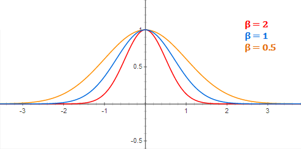
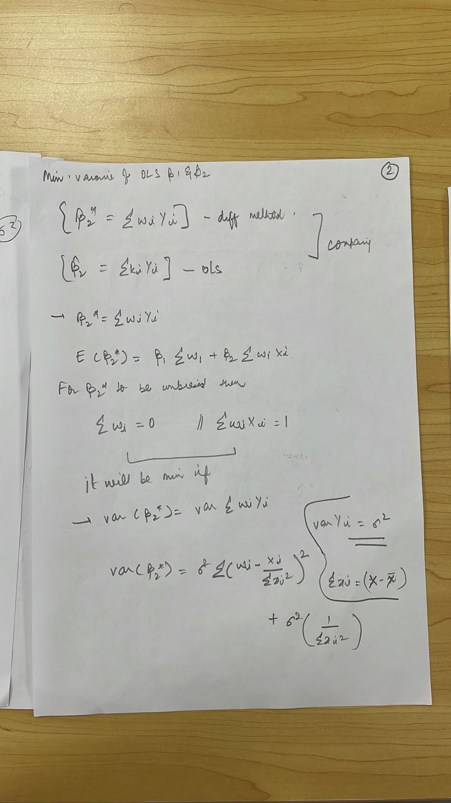
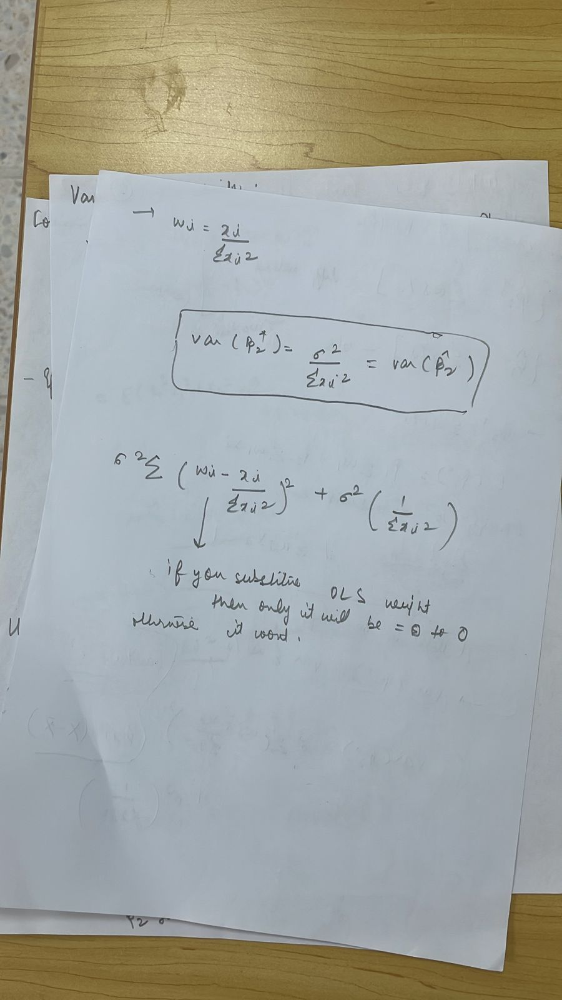

# Regression

Process of predicting continuous values.

$$
\hat y = \theta_0 + \theta_1 x_1
$$

- $\theta_0$ is the value of $y$ when $x_1=0$
- $\theta_1$ shows the change of $y$, when $x_1$ increases by 1 unit

### Variables

#### Uni-Variate

1 independent to 1 dependent variable

#### Multi-Variate

Multiple independent, but only dependent variable

### Degree of Regression

#### Linear Regression

Best-fit is a straight line

#### Non-Linear Regression

Best-fit is a curve

## IDK

Perpendicular distance between any point from regression line

$$
\frac{g(x)}{||w||}
$$

## Behind the Scenes of Regression

$$
\begin{aligned}
\hat y &= ax + b \\
a &= \frac{
n \Sigma xy - \Sigma x \Sigma y
}{
n \Sigma x^2 - (\Sigma x)^2
} \\
b &= \frac{1}{n} \Big( \Sigma y - a \Sigma x \Big)
\end{aligned}
$$

The pivot point of the best fit line are $(\bar x, \bar y)$; which are the averages of $x$ and $y$

## Multiple Linear Regression

$$
\begin{aligned}
\hat y &=
\theta_0 +
\theta_1 x_1 +
\dots +
\theta_n x_n \\
&=\theta^T X \\
\theta^T &= [\theta_0, \theta_1, \theta_2, \dots, \theta_n] \\
X &= \begin{bmatrix}
1 \\
x_1 \\
x_2 \\
\dots \\
x_n
\end{bmatrix}
\end{aligned}
$$

### 2 Variate Linear Regression

For this course, this is the max they can ask

$$
y = b_0 + b_1 x_1 + b_2 x_2
$$

## Something I missed

## Linear Basis Function

$$
\phi_i = \text{exp}
\left\{
\frac{-(x- \mu_i)^2}{2 \sigma^2}
\right\}
$$

- $\mu$ = pivot
- $\sigma^2$ = bandwidth
  - Higher, smoother
  - Lower, sharper

$$
w_i = \begin{cases}
1, & |x_i - x| \approx 0 \\
0, & |x_i - x| \to \infty
\end{cases}
$$

## Weighted Regression

$$
J'(\theta) = \sum w_i J(\theta)
$$

where $J(\theta)$ is usual error term

For time series data, you can use $w_i = \text{Radial basis function(t)}$

- $\mu = t_\text{max}$
- $\sigma^2 = (t_\text{max} - t_\text{min})/2$

---

## Statistics/Economics Perspective

OLS: Ordinary Least Squares is based on Principle of Least Squares

$$
\begin{aligned}
u_i
&= y_i - \hat y_i \\
&= y_i - (\hat \beta_0 + \hat \beta_1 x_i)
\end{aligned}
$$

We do **not** use just regular sum of residuals

- Equal and opposite errors will cancel each other, which may lead to non-optimal SRF having total error=0
- Multiple SRF may have the error=0, due to the above; then we may not know what is the best
- All errors(small/large) have the same weightage

Hence, we use sum of squared residuals

- Large errors should be penalized more
- Each error’s weightage is its own magnitude

#### Steps

1. Estimate all possible values of $(\hat \beta_1, \hat \beta_2)$
2. Consider all possible values of the estimators $(\hat \beta_1, \hat \beta_2)$

But this is too hard to do with trial-error method

Hence, we use calculus

$$
\frac{\partial \sum u_i}{}
$$

1. Set the partial derivative = 0

2. Rearrange the terms

3. Apply

$$
\begin{aligned}
\sum y_i &= n \hat \beta_1 + \hat \beta_2 \sum x_i \\
\sum y_i x_i &= n \hat \beta_1 + \hat \beta_2 \sum x_i
\end{aligned}
$$

## Assumptions of OLS & Classical Regression

1. Regression is performed with linear parameters

2. $x$ values are fixed in repeated sampling

3. Series of $u_i$ are random

   1. $E(u_i | x_i) = 0$

     2. Symmetric distribution for values of error terms **for a given value $x$**
     3. **Not** over time/different values of $x$
     4. This means that
        1. you have used up all the possible factors
        2. $u_i$ only contains the non-systematic component

   5. Homoscedascity of variance

     6. $\sigma^2 (u_i|x_i)$ should be same $\forall i$
     7. For the Variance of distribution of potential outcomes, the range of distribution stays same over time
     8. $\sigma^2 (x) = \sigma^2(x-\bar x)$

     else, the variable is **volatile**; hard to predict; **we cannot use OLS**

     - if variance decreases, value of $y$ is more reliable as training data
     - if variance increases, value of $y$ is less reliable as training data
     - We use voltaility modelling (calculating variance) to predict the pattern in variance

4. No [autocorrelation](#Autocorrelation) between $u_i$ and $u_j$

   - Residual series should be independent of other residual series

   - For any 2 values $x_i$ and $x_j$, the correlation between $u_i$ and $u_j$ is $0$

   $$
   \begin{aligned}
   \text{cov}(u_i, u_j | x_i, x_j)
   &= E
   \Big \{
   [u_i - E(u_i) | x_1],
   [u_i - E(u_i) | x_1]
   \Big \} \\
   &= E
   \Big \{
   [u_i | X_i], [u_j | X_j]
   \Big \} \\
   \Big(
   E(u_i) &= E(u_j) = 0
   \Big)
   \end{aligned}
   $$

   - If we plot the scatter plot between $u_i$ and $u_j$, there should be no sign of correlation

   - If there exists autocorrelation in time series, then we have to incorporate the lagged value of the dependent var as an explanatory var of itself

   - Rather than $y_t=f(x_t)$, we use $y_t = f(x_t, y_{t-1})$

5. No covariance/correlation between $u_i$ and $x_i$

   - No relationship between error term and independent variables

   - $$
     \text{Cov}(u_i, x_i) = 0
     $$

   - If there is correlation, then we cannot correctly obtain coefficients

6. DOF > 1

   - Degree of freedom $= n - k$, where
   - $n =$ number of observations
   - $k =$ no of independent variables
   - DOF = 0 leads to overfitting

7. Good variability

   - We need more variation in values of $x$
   - Indian stock market is very volatile. But not in UAE; so it's hard to use it an independent var. Similarly, we cant use exchange rate in UAE, as it is fixed to US dollars

8. No specification bias

   - We need to use the correct functional form, which is theoretically consistent

9. No multi-colinearity

   - Independent vars should not be correlated with each other
   - If |correlation| > 0.5 between 2 independent vars, then we drop one of the variables

## Properties of OLS

-  Easy computation, just from the data points
-  Point estimators (specific; not internal)
-  SRL (Sample Regression Line) passes through $(\bar x, \bar y)$
   We can get mean of y, when we substitute mean value of x
-  Mean value of estimated values = Mean value of actual values
-  Mean value of error/residual tems = 0
-  $\hat y - \bar y = \beta_1 (x - \bar x)$
-  Predicted value and residuals are not correlated with eachother

-  Error terms are not correlated with values of $x$
   -  $\sum \hat u_i x_i = 0$

-  OLS is BLUE
   (Best Linear Unbiased Estimator)

## BLUE Properties of OLS

Given the assumptions of CLRM(Classical Linear Regression Models), OLS estimators are BLUE, and have the following characteristics

- Gauss Markov Theorem
- Min variance
- Unbiased
- Linear

### Why?

- Assumptions 1-4 of OLS
- $\hat \beta$ is an estimator of $\beta$
- Linear $\hat \beta$ is a linear estimator
- Unbiased
  - $(E[ \hat \alpha], E[\hat \beta]) = (\alpha, \beta)$
  - Bias is the different between the estimated value and the true value
  - Unbiased means $(E[ \hat \alpha], E[\hat \beta]) - (\alpha, \beta) = 0$
- Best OLS estimator $\hat \beta$ has minimum variance
  - $\sigma^2(\hat \beta) = \sigma^2(\beta)$
- $\hat \alpha, \hat \beta$ are consistent
  - They will converge to the true value as the sample size increases $\to \infty$
  - ie, as sample size increases, sample estimators tend to true population parameter
- Efficiency
  - Min variance
  - Mean value = true population parameter
  - $\therefore ,$ estimators are efficient

### Derivation of BLUE Properties

#### Linearity of OLS Estimator

$$
\begin{aligned}
\hat \beta_2
&= \frac{\sum x_i y_i}{\sum x_i^2} \\
&= \sum k_i y_i \\
k_i &= \frac{x_i}{\sum x_i^2}
\end{aligned}
$$

$\therefore ,$

- $\beta_2$ is a linear function of $y$
- $\beta_2$ is weighted average of $y$

#### Properties of $k_i$

- $k_i = 0$
- $k_i$ is non-stochastic
- $\sum k_i^2 = \frac{1}{\sum x_i^2}$

#### Unbiasness of OLS Estimators

- $something = \beta_2 + \sum k_i u_i$
- $E(\hat \beta_2) = \beta_2 + \sum k_i E(u_i)$
  - Expectation of constant is constant
- $E(\hat \beta_2) = \beta_2$

$\beta_2$ is unbiased estimator

#### Variance of OLS Estimators

$$
\begin{aligned}
\sigma^2(\hat \beta_2)
&= E[\hat \beta_2 - E(\hat \beta_2)]^2 \\
&= E[\hat \beta_2 - \beta_2]^2 \\
&= E \left[ \left( \sum k_i u_i \right)^2 \right] \\
&= E[k_1^2 u_1^2 + k_2^2 u_2^2 + \dots +
2 k_1 k_2 \underbrace{u_1 u_2}_{= \ 0}
]
\quad (E[u_i, u_j] = 0) \\
&= \sigma^2 \sum k_i^2 \\
&= \frac{\sigma^2}{\sum x_i^2}
\end{aligned}
$$

This is the formula for variance of $\beta_2$. This is also equal to the expectation of residual series.

#### Covariance of $\beta_1$ and $\beta_2$

$$
\text{cov}(\hat \beta_1, \hat \beta_2) = \bar X \ \ \sigma^2(\beta_2)
$$

#### Minimum variance of $\beta_1$ and $\beta_2$

Some derivation (below)

{ loading=lazy }

{ loading=lazy }

## Precision Evaluation of OLS Estimators

Understand how accurate we are

Estimates change with change in sample. However, if there is large change in the estimates, the estimates are less-precise; if there is less change, then it is more precise.

| Evaluation Criteria                                          | Meaning                                                      |  Preferably  |
| ------------------------------------------------------------ | ------------------------------------------------------------ | :----------: |
| **SEE** Standard Error of Estimate                      | Standard deviation of sampling distribution of an estimate   | $\downarrow$ |
| **Goodness of Fit** (In practicality, it is actually badness of fit) | How much one sample estimate differs from another sample estimate | $\downarrow$ |
| **$R^2$** Coefficient of Determination                  | $0 \le R^2 \le 1$                                            |  $\uparrow$  |

### Standard Error of Estimate

$$
\begin{aligned}
\text{var} (\hat \beta_2)
&= \frac{\sigma^2}{\sum x_i^2} \\
\text{se}(\hat \beta_2)
&= 
\end{aligned}
$$

As we don’t have $\sigma$, we can use sample estimate

$$
\sigma^2 = \frac{\sum \hat u_i^2}{n-2}
$$

- $n - 2 =$ Degrees of freedom
  - We are subbing $2$ because there are 2 unknowns
  - $\beta_0$ and $\beta_1$

If standard error of $\beta_0$ or $\beta_1$ or $\beta_2$, then substitute them as 0

#### Determinants of SEE

$$
\begin{aligned}
\text{SEE}
&\propto \sigma \\
& \propto \frac{1}{\sum x_i^2} \\
& \propto \frac{1}{n}
\end{aligned}
$$

This is why we want large variability of independent variable $x$

### Goodness of Fit

$$
\hat \sigma^2 
= \sqrt{ \frac{\sum \hat u_i^2}{n-2} }
$$

### $R^2$

Helps us understand how well SRL fits the data

It is a **measure of explained variation**
It measures proportion of changes in dependent variable which is explained by the independent variable.

Let’s say $R^2=0.9$, then $90 \%$ of changes in $y$ is explained by $x$, **given that the coefficients $(\beta_0, \beta_1, \dots)$ are statistically-significant** (based on SEE of the coefficients)

Helps understand ___ of independent variables

- Relevance
- Power
- Importance

#### IDK

$$
\begin{aligned}
\text{TSS} &= \text{ESS + RSS} \\
\sum 
\end{aligned}
$$

TSS of $y$ = Total Sum of Squares of $y$

$$
\text{TSS} = \sum (y_i - \bar y)^2
$$

ESS = Explained sum of squares

$$
\hat {\beta_2}^2 \sum x_i^2
$$

$$
\begin{aligned}
R^2
&= \frac{\text{ESS}}{\text{TSS}} \\
\end{aligned}
$$

$$
\begin{aligned}
R^2
&= 1 - \frac{\text{RSS}}{\text{TSS}} \\
&= 1 - \frac{}{}
\end{aligned}
$$

$$
R^2 = {\hat \beta_2}^2 \left(
\frac{\sum x_i^2}{\sum y_i^2}
\right)
$$

#### Issues

- Simple $R^2$ has a tendancy to automatically increase with more number of independent variables
  - Not necessarily mean that the higher-dimensional model fits better, even though it has higher $R^2$
- Hence, we can only use for comparing fit of 2 models with the same number of independent variables
- Hence, we cannot use $R^2$ understand if adding another independent variable actually improves the model, or is it just because of the tendancy of $R^2$ value to increase as dimensions increases
- **Does not imply causality**

### Adjusted $R^2$

It is the same as $R^2$, but it is adjusted for number of independent varaibles

Helps understand

- if adding another independent variable is relevant
  - If adding another independent variable increases

- Predictive accuracy

Always look at adjusted $R^2$

$$
R^2_\text{Adjusted}
= 1 - \left[
\frac{(1-R^2)(n-1)}{(n-k-1)}
\right]
$$

- $k =$ no of independent variables
- $n =$ sample size

$$
R^2_\text{Adj} \in [0, 1]
$$

The reason why the formula is so complicated, rather than just dividing by $k$, is because we want the range of adjusted $R^2$ to also be $[0, 1]$

## Probability Distribution of $\beta_2$

$$
\beta_2 =
\frac{}{}
$$

As $k_i$ is non-stochastic, the value of $\beta_2$ depends on $y$, which is a random variable

$$
\hat \beta_2 = \sum k_i (\beta_1 + \beta_2 X_i + u_i)
$$

As $u_i$ is the only random component in the equation, $\beta_2 = f(u_i)$ meaning that we can assume $\beta_2$ follows the same distribution as $u_i$

As $u_i$ is normally distributed, $\beta_1$ and $beta_2$ are also normally-distributed

## Classical Linear Regression

Assumption of $u_i$

- Mean = 0
- Variance = $\sigma^2$
- Cov$(u_i, u_j) = 0$

$u_i \ N()$

$u_i$ and $u_j$ have [IID](#IID)

## Approximation for $t$ distribution

Student’s $t$ distribution

$$
\begin{aligned}
t
&= \frac{\hat \beta_2 - \beta_2}{SEE} \\
&= \frac{(\hat \beta_2 - \beta_2) \sqrt{\sum x_i^2} }{\hat \sigma} \\
\end{aligned}
$$

This $t$ variable will follow $t$ distribution with $(n-2)$ degrees of freedom

## IID

Identical and Independent Distribution

## Central Limit Theorem

> The central limit theorem states that if you have a population with mean $\mu$ and standard deviation $\sigma$ and take sufficiently large random samples from the population with replacement, then the distribution of the sample means will be approximately normally distributed.

## Correlation Coefficent

Measure of degree of association between 2 variables

Helps understand if both variables have some probability distribution

$$
r = \sqrt{R^2} \\
 R^2 = (r)^2
$$

==**Above equation $\refeq{randr2}$ is only for uni-variate models**==

### Correlation vs $R^2$

|                                                              |          Correlation          |                  $R^2$                   |
| ------------------------------------------------------------ | :---------------------------: | :--------------------------------------: |
| Range                                                        |           $[-1, 1]$           |                 $[0, 1]$                 |
| Symmetric?                                                   |               ✅               |                    ❌                     |
|                                                              |      $r(x, y) = r(y, x)$      |        $r^2(x, y) \ne r^2(y, x)$         |
| Independent on scale of variables?                           |               ✅               |                    ✅                     |
|                                                              |     $r(kx, y) = r(x, y)$      |         $r^2(kx, y) = r^2(x, y)$         |
| Independent on origin?                                       |               ❌               |                    ✅                     |
|                                                              |    $r(x-c, y) \ne r(x, y)$    |       $r^2(x-c, y) \ne r^2(x, y)$        |
| Relevance for non-linear relationship?                       |               ❌               |                    ✅                     |
|                                                              | $r(\frac{1}{x}, y) \approx 0$ | $r(\frac{1}{x}, y)$ not necessarily be 0 |
| Gives **direction** of causation/association (not exactly the value of causality) |               ❌               |                    ✅                     |

## Intervals

$$
\hat y \pm t_{\alpha/2} \times \text{SE}
$$

|                                                              | Confidence Interval                                          | Prediction Interval                                          |
| ------------------------------------------------------------ | ------------------------------------------------------------ | ------------------------------------------------------------ |
| The upper and lower bound for estimated __ at a given level of significance | mean                                                         | prediction                                                   |
| SE for Univariate Regression                                 | $s_x \sqrt{ \dfrac{1}{n} + \dfrac{(X^* - \bar X)^2}{\sum (X_i - \bar X)^2}}$ | $s_x \sqrt{ \textcolor{hotpink}{1 +} \dfrac{1}{n} + \dfrac{(X^* - \bar X)^2}{\sum (X - \bar X)^2}}$ |
| SE for Multivariate Regression                               | $s_x \sqrt{\dfrac{1}{n} +x'_{\text{pred}_\text{cent}} (X_\text{cent}'X_\text{cent})^{-1} x_{\text{pred}_\text{cent}}}$ | $s_x \sqrt{\textcolor{hotpink}{1+} \dfrac{1}{n} + x'_{\text{pred}_\text{cent}} (X_\text{cent}'X_\text{cent})^{-1} x_{\text{pred}_\text{cent}}}$ |

$$
x_{\text{pred}_\text{cent}} = x_\text{pred} - \mu_X \\
X_\text{cent} = X - \mu_X
$$

where $s =$ standard deviation of residuals

Degree of freedom = $n - k - 1$, where

- $n =$ sample size
- $k=$ no of input variables

Both the intervals are narrowest at $X^* = \bar X$, and gets wider further from this point.

