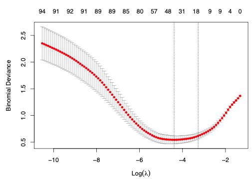

# Generalization

The ability of trained model to be able to perform well on unseen data. Better validation result $\implies$ Better generalization

The generalization gap (error difference b/w seen and unseen data) should be small

The more models you try, the worse your generalization wrt that data due to increase in $\vert H \vert$ as $H = \bigcup_i H_i$ where $H_i$ is the $H$ for each model. This is the essence behind importance of train-dev-val-test split

Note: Always try to overfit with a very small sample and then focus on generalization

Distribution mismatch: Train and Dev errors are low, but validation error is high

## Error Decomposition

|                       |                   Bias                    |                           Variance                           |    Distribution Mismatch     |   Bayes’ Error    |
| :-------------------: | :---------------------------------------: | :----------------------------------------------------------: | :--------------------------: | :---------------: |
|       Indicates       |                Inaccuracy                 |                         Imprecision                          |     Data Sampling Issue      | Unavoidable error |
|        Meaning        | Proximity of prediction is to true values | Amount by which $\hat y$ would change for different training data |                              |                   |
|      Implication      |               Underfitting                |                         Overfitting                          |                              |                   |
|      Denotation       |              $E[\hat y] - y$              | $\text{Var}(\hat y) = E \Bigg[ \ \Big(E[\hat y] - \hat y \ \Big)^2 \Bigg]$ |                              |                   |
|   Estimated through   |        Train Error - Desired Error        |                   Dev error - Train Error                    | Validation Error - Dev Error |   Desired Error   |
| Reason for estimation |           In-sample performance           |   Difference between in-sample and out-sample performance    |                              |                   |

$$
\text{MSE}_\text{out} = \text{Bias}^2 + \text{Variance} + \text{Dist Mis} + \text{Bayes Error}
$$

### Prediction Bias & Variance

We want **low value** of both

If a measurement is biased, the estimate will include a constant systematic error

## Scenarios

| Scenarios                                                    | Conclusion                 |
| ------------------------------------------------------------ | -------------------------- |
| Desired Error < Train Error                                  | Underfitting/ Optimal |
| Train Error $\approx$ Test Error $\approx$ Desired Error Train Error < Test Error < Desired Error | Optimal                    |
| Train Error << Test Error Train Error < Desired Error < Test Error | Overfitting                |

## Fitting & Capacity

We can control the fitting of a model, by changing hypothesis space, and hence changing its capacity

|                       | Under-fitting                                                | Appropriate-Fitting | Over-Fitting                                                 |
| --------------------- | ------------------------------------------------------------ | ------------------- | ------------------------------------------------------------ |
| Capacity              | Low                                                          | Appropriate         | Low                                                          |
| Bias                  | ⬆️                                                            | ⬇️                   | ⬇️                                                            |
| Variance              | ⬇️                                                            | ⬇️                   | ⬆️                                                            |
| Steps to address | Increase model complexity Increase training data Remove noise from data Inc no of features |                     | Cross-Validation More training data Feature Reduction Early Stopping Regularization |

The capacity of a model increases with increased [degree of polynomial](#degree-of-polynomial)

## Generalization Bound

Let

- $E_\text{in} =$ error on seen train data
- $E_\text{test} =$ error on unseen test data
- $E_\text{out} =$ theoretical error on the unseen population
- $\vert h \vert =$ complexity of hypothesis
- $\vert H \vert =$ complexity of hypothesis set

For binary predictor $f$

### Hoeffding’s Inequality

$$
\begin{aligned}
P( \vert E_\text{out} - E_\text{test} \vert > \epsilon)
& \le \sum_{i=1}^{\vert H \vert} P( \vert E_\text{out}(h_i) - E_\text{in}(h_i) \vert > \epsilon) \\
& \le {\vert H \vert} \cdot 2 e^{-2 n \epsilon^2}\\
& \le \delta \\
\implies
\vert E_\text{out} - E_\text{in} \vert &\le \epsilon \\
\text{ with probability } P( \vert E_\text{out} - E_\text{in} \vert &\le \epsilon) \in [1-\delta, 1] \\
\\
\text{where }
\delta &= 2 {\vert H \vert} e^{-2 n \epsilon^2} \\
\epsilon &= \sqrt{ \dfrac{1}{2n} \ln \left\vert \dfrac{2{\vert H \vert}}{\delta} \right\vert }
\end{aligned}
$$

### Vapnik-Chervonenkis Inequality

$$
\begin{aligned}
P( \vert E_\text{out} - E_\text{in} \vert > \epsilon) & \le \delta \\
\implies
\vert E_\text{out} - E_\text{in} \vert &\le \epsilon \\
\text{ with probability } P( \vert E_\text{out} - E_\text{in} \vert &\le \epsilon) \in [1-\delta, 1] \\
\\
\text{where } \delta &= 4 \cdot m_h(2n) \cdot e^{\frac{-1}{8} \epsilon^2 n} \\
\epsilon &= \sqrt{\dfrac{8}{n} \ln \left \vert \dfrac{4 \cdot m_h(2n)}{\delta} \right \vert
} \\
m_h(n) &\le \begin{cases}
n^{d_{vc}(H)}+1 \\
\left( \dfrac{ne}{d_{vc}(H)}\right) ^{d_{vc}(H)}, & n \ge d_{vc}(H)
\end{cases}
\end{aligned}
$$

For test data, $\vert H \vert = 1$, as it is not biased and we do **not** choose a hypothesis that looks good on it.
$$
\text{Generalization Gap} = O \left(
\sqrt{\dfrac{d_{vc}}{n} \ln n}
\right)
$$

### IDK

$$
\begin{aligned}
\vert H \vert &= \sum_i \vert h_i \vert \\
d_\text{vc} (H) &= \sum_i d_\text{vc} (h_i)
\end{aligned}
$$

The VC dimension of a hypothesis set is the sum of VC dimension of all the hypotheses in that set

### Sauer’s Lemma

$$
d_\text{vc} (H) < \infty
\implies m_H(n)
\le \sum_{i=0}^{d_\text{vc}(H)} \begin{pmatrix} N \\ i \end{pmatrix}
$$

## Dimensionality

When $k$ is very large, then the $\vert H \vert$ gets very large and hence, generalization becomes very poor

Curse of Dimensionality

## Training Size

Generalization improves with size of training set, until a saturation point, after which it stops improving.

|                | More data $\implies$                                        |
| -------------- | ----------------------------------------------------------- |
| Parametric     | asymptote to an error value exceeding Bayes error           |
| Non-Parametric | better generalization until best possible error is achieved |

## Bias-Variance Tradeoff

Usually U-Shaped

Each additional parameter adds the same amount of variance $\sigma^2/n$, regardless of whether its true coefficient is large or small (or zero).
$$
\begin{aligned}
\text{Variance}
&= \sigma^2 \left[
\dfrac{1+k}{n} + 1
\right] \\
& \approx
O(k)
\end{aligned}
$$
Hence, we can reduce variance by shrinking small coefficients to zero

### Tip

When using feature selection/LASSO regularization, stop one standard deviation > the optimal point, as even though bias has increased by a small amount, variance can be decreased a lot

## Generalization Bound vs Generalization Gap

|                 | Generalization Gap                | Generalization Bound                                    |
| --------------- | --------------------------------- | ------------------------------------------------------- |
| Associated with | Model - Bias - Variance | Testing method - Test Set Size - No of trials |

