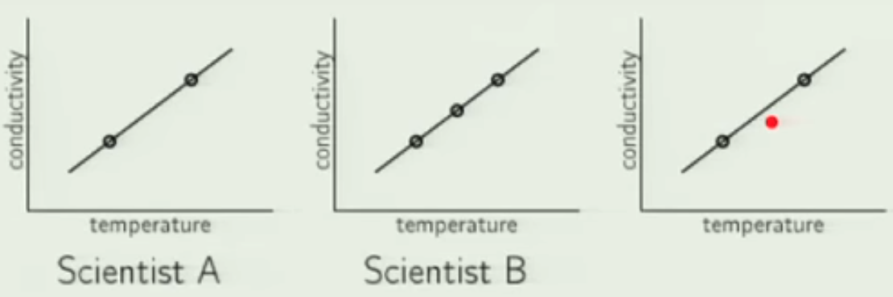

# Learning Theory

## Hypotheses

### Simple Hypotheses

An explanation of the data should be made as simple as possible, but no simpler

### Occam’s Razor

The simplest model that fits the data is also the most plausible

Simple

- Complexity of $h$: MDL (Minimum Description Length)
- Complexity of $H$: Entropy, VC Dimension

$l$ bits specify $h$ $\implies$ $h$ is one of the $2^l$ elements of a set $H$

Exception - Looks complex but is actually simple: SVM

### Why is simpler better?

Simpler means out-of-sample performance

Fewer simple hypotheses than complex ones: $m_H(N)$ $\implies$ less likely to fit a given dataset: $m_h(N)/2^N$ $\implies$ more significant when it happens

### Falsifiability

If your data has chance of falsifying your assertion, then it does not provide any evidence for that assertion

Fit that means nothing: linear regression fit with just 2 data points

## Sampling Bias

Non-Random Sampling

- non-representative sample that is not a random sample of the population we are interested in

  or

- study population is different from the target population

Problem for causal and statistical learning: learning will produce a similarly-biased outcome

### Types

| Censoring                                                    | Truncation                                                   |
| ------------------------------------------------------------ | ------------------------------------------------------------ |
| Given a random sample of individuals drawn from the population of interest, some variables – mainly the outcome – are observed only on individuals belonging to a subpopulation, while other variables are observed on all individuals in the sample | If all variables are observed only on individuals belonging to a subpopulation |
|                                                              | greater information loss than censoring                      |

### Solution: Matching distributions

Ensure that validation and test data matches the distribution of the true target population

The train and dev set need not match the same distribution, but it is recommended to sub-sampling them such that it matches the target population

Doesn’t work for

- Region with $p=0$ in-sample, but $p>0$ out-of-sample

How? Gaussian estimation/Adversarial validation

1. Balancing using only train data
   1. Obtain probability $p$ for each datapoint belonging to the train data
   2. Weight these with $1/p$ to be sampled again

2. Distribution matching using target population
   1. Obtain probability $p$ for each datapoint belonging to the train data
   2. Weight these with $1/p$ to be sampled again

## Data Snooping

Also called p-hacking, specification search, data dredging, fishing

Process of trying a series of models until we obtain a satisfactory result

This includes

- Parameters: Coefficients/Weights of the model
- Hyper-Parameters: Parameters that affect the learning of the model

It is possible to find a statistically significant result even if doesn’t exist, if you try hard enough

### Pitfalls

- Explicit: Intentionally trying many models on the same dataset, thereby increasing size of hypothesis set
- Implicit
  - Looking at the test data before choosing a model
  - Data leakage during feature engineering, such as normalization

- Adaptive analysis: When working with a public data set, we may already know what models work/don’t work, so the Hypothesis space > the model I formulate

### Takeaway

If a data set has affected any step in the learning process, its ability to assess the outcome of has been compromised. Hence it cannot be (fully) trusted in assessing the outcome.

### What to do?

- Formulate the research qn and fix the what model before seeing training data.
- If you intend on data snooping and choose a model based on the data, then you should decide on the set of models you are going to choose from before seeing the data, and account for the data snooping in your analysis by
  - Adjusting the significance level of your hypothesis tests by, for example, using the Bonferroni correction
  - Using a test data set to evaluate the performance of your final estimated model. The test set should be allocated at the beginning and only used at the end. **==Once a data set has been used, it should be treated as contaminated for evaluating test performance==**

### Reporting Guidelines

- Aim for honesty & transparency
- Clearly state research qn, research design, and reasoning behind model choice.
- Clearly state if analysis involves data snooping and how you have accounted for it.
- Report every hypothesis test you have performed relevant to the research question and highlight results that are robust across tests.
- Include a limitations section and point out any limitations and uncertainties in the analysis.

