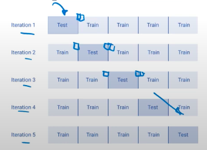

# Data Splitting

## Train-Test

The training set has an optimistic
bias, since it is used to choose a hypothesis that looks good on it. Hence, we require a unseen set as it is not biased

Once a data set has been used in the learning/validation process, it is “contaminated” – it obtains an optimistic bias, and the error calculated on the data set no longer has the tight generalization bound.

To simulate deployment, any data used for evaluation should be treated as if it does not exist at the time of modelling

## Train-Test Tradeoff

| Test Set Size | Model Bias | Generalization Bound |
| ------------- | ---------- | -------------------- |
| Small         | Low        | High                 |
| Large         | High       | Low                  |

## Data Split Sets

|                              | Train                                                                           | Development (Inner Validation)                     | Validation (Outer Validation)                       | Test (Holdout)|
|---                              | :-:                                                                             | :-:                                                       | :-:                                                       | :-:|
|Recommend split % | 40 | 20 | 20 | 20 |
| In-Sample (‘Seen’ by model) | ✅ | ❌ | ❌ | ❌ |
|EDA (‘Seen’ by analyst)                      | ✅                                                                               | ❌                                                         | ❌                                                         | ❌|
|Feature Engineering (Selection, Transformation, …) | ✅ | ❌ | ❌ | ❌ |
|Underfit Evaluation | ✅                                                                               | ❌                                                         | ❌                                                         | ❌|
|Model Tuning | ✅ | ❌ | ❌ | ❌ |
|Overfit Evaluation  | ❌                                                                               | ✅                                                         | ❌                                                         | ❌|
|Hyperparameter Tuning | ❌ | ✅ | ❌ | ❌ |
|Model Comparison/Selection                  | ❌                                                                               | ❌                                                         | ✅                                                         | ❌|
|Performance Reporting           | ❌                                                                               | ❌                                                         | ❌                                                         | ✅|
|Error Representation             | $E_\text{in}$                                                                   |                                                           |                                                           | $E_\text{test}$|
|Error Names                      | Training error/ In-Sample Error/ Empirical Error/ Empirical Risk | Development Error | Validation Error | Out-of-sample error Expected error Prediction error Risk|
|Comment |  |  |  | Should not be used for any model decision making |
|Color Scheme Below               | Green                         | Yellow | Orange | Red|

## Sampling Types

Repeatedly drawing samples from a training set and refitting a model of interest on each sample in order to obtain additional information about the fitted model.

Hence, these help address the issue of a simple validation: Results can be highly variable, depending on which observations are included in the training set and which are in the validation set

|                  | Sampling        | Comment                                            | Better for identifying uncertainty in model |
| ---------------- | --------------- | -------------------------------------------------- | ------------------------------------------- |
| Bootstrapping    | w/ Replacement  | Better as we can have a large repetitions of folds | parameters                                  |
| Cross Validation | w/o Replacement |                                                    | accuracy                                    |

### Cross Validation Types

|                                  |                                                              | Purpose                                                      | Comment                                   |
| -------------------------------- | ------------------------------------------------------------ | ------------------------------------------------------------ | ----------------------------------------- |
| Regular $k$ fold                 |                 | Obtain uncertainty of evaluation estimates                   | Higher $k$ recommended for small datasets |
| Leave-One-Out                    |                                                              | For very small datasets $n < 20$                        | $k=n$                                     |
| Shuffled                         |                 |                                                              |                                           |
| Random Permutation               |                 |                                                              |                                           |
| Stratified                       |                    | Ensures that Train, Validation & Test sets have same distribution |                                           |
| Stratified Shuffle               |                 |                                                              |                                           |
| Grouped                          |   |                                                              |                                           |
| Grouped - Leave One Group Out    |                 |                                                              |                                           |
| Grouped with Random Permutation  |                 |                                                              |                                           |
| Walk-Forward Expanding Window    |   |                                                              |                                           |
| Walk-Forward Rolling Window      |  |                                                              |                                           |
| Blocking                         |                 |                                                              |                                           |
| Purging                          |    | Remove train obs whose labels overlap in time with test labels |                                           |
| Purging & Embargo                |                 | Prevent data leakage due to serial correlation $x_{\text{train}_{-1}} \approx x_{\text{test}_{0}}$ $y_{\text{train}_{-1}} \approx y_{\text{test}_{0}}$ |                                           |
| CPCV (Combinatorial Purged) |  |                                                              |                                           |

### Bootstrapping Types

|                                  |                |                                                              |
| -------------------------------- | -------------- | ------------------------------------------------------------ |
| Random sampling with replacement | IID            |                                                              |
| ARIMA Bootstrap                  | Parametric     |                                                              |
| Moving Block Bootstrap           | Non-parametric |  |
| Circular Block Bootstrap         | Non-parametric |                                                              |
| Stationary Bootstrap             | Non-parametric |                                                              |

## Validation Methods

==Make sure to **shuffle** all splits for cross-sectional data==

| Type                     |                       Cross-Sectional                        |                         Time Series                          | Comment                                                      |
| ------------------------ | :----------------------------------------------------------: | :----------------------------------------------------------: | ------------------------------------------------------------ |
| Holdout                  |            |            |                                                              |
| $k$- Fold                |  |  | 1. Split dataset into $k$ subsets 2. Train model on $(k-1)$ subsets 3. Evaluate performance on $1$ subset 4. Summary stats of all iterations |
| Repeated $k$-Fold        |  |                              ❌                               | Repeat $k$ fold with different splits and random seed        |
| Nested $k$-Fold          |  |  |                                                              |
| Nested Repeated $k$-Fold |  |                              ❌                               |                                                              |

### Decision Parameter $k$

There is a tradeoff

|            | Small $k$ | Large $k$ |
| ---------- | --------- | --------- |
| Train Size | Small     | Large     |
| Test Size  | Large     | Small     |
| Bias       | High      | Low       |
| Variance   | Low       | High      |

Usually $k$ is taken as 4

When $k=n$, it is called as LOOCV (Leave-One-Out CV)

## Data Leakage

Cases where some information from the training set has “leaked” into the validation/test set. Estimation of the performances is likely to be optimistic

Due to data leakage, model trained for $y_t = f(x_j)$ is more likely to be ‘luckily’ accurate, even if $x_j$ is irrelevant

Causes

- Perform feature selection using the whole dataset
- Perform dimensionality reduction using the whole dataset
- Perform parameter selection using the whole dataset
- Perform model or architecture search using the whole dataset
- Report the performance obtained on the validation set that was used to decide when to stop training (in deep learning)
- For a given patient, put some of its visits in the training set and some in the validation set
- For a given 3D medical image, put some 2D slices in the train- ing set and some in the validation set

