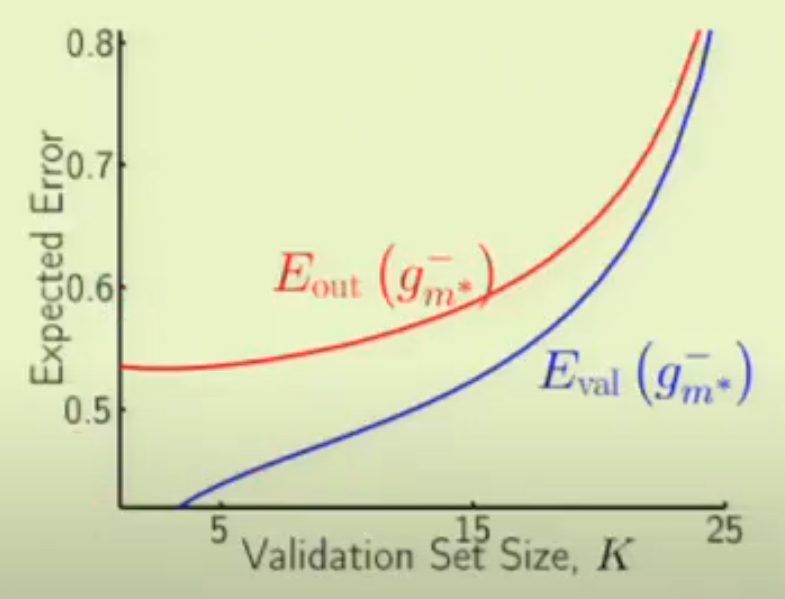
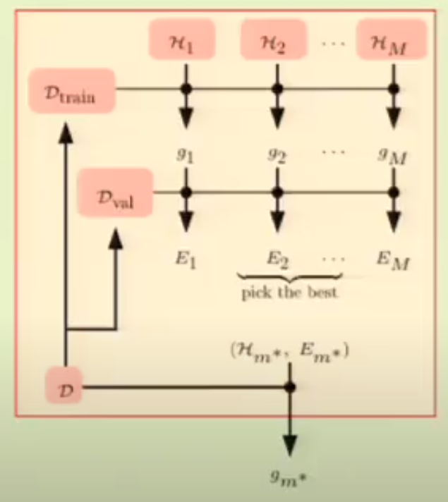
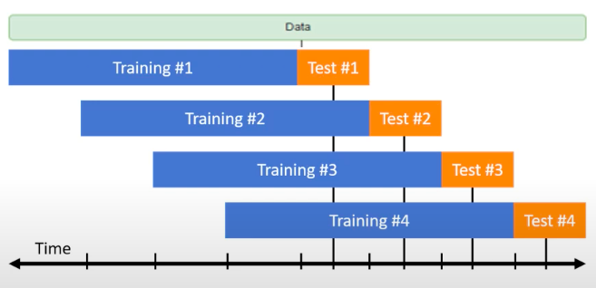
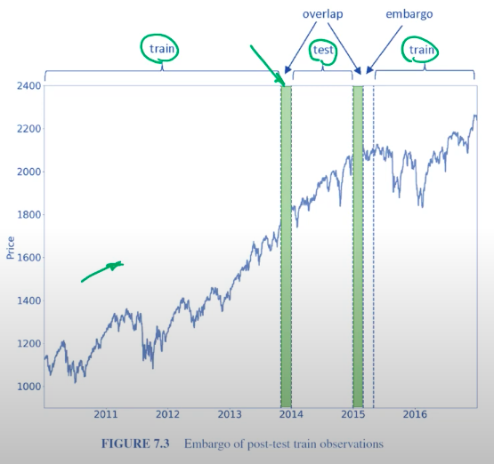
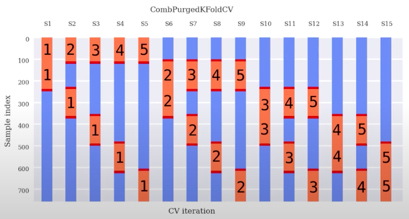
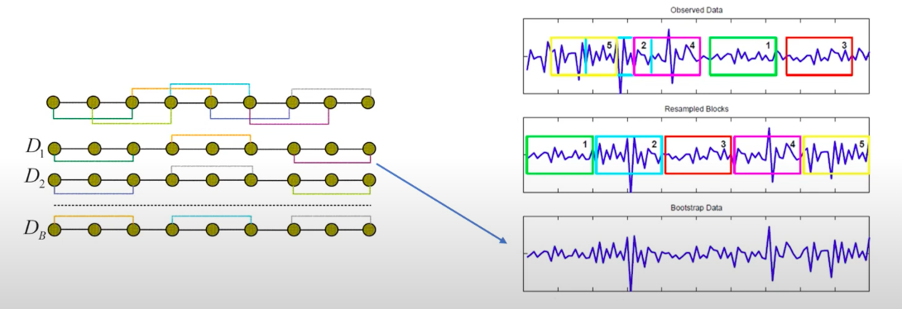
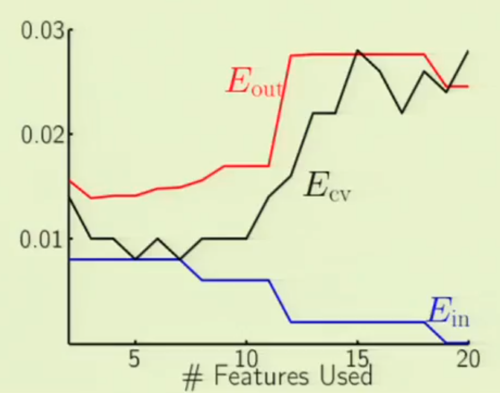

# Data Splitting

## Train-Test

The training set has an optimistic
bias, since it is used to choose a hypothesis that looks good on it. Hence, we require a unseen set as it is not biased

Once a data set has been used in the learning/validation process, it is “**contaminated**” – it obtains an optimistic (deceptive) bias, and the error calculated on the data set no longer has the tight generalization bound.

To simulate deployment, any data used for evaluation should be treated as if it does not exist at the time of modelling

## Data Split Sets

|                                                                    |                                      Train                                      |                 Development Eyeball                  |                Development Black Box                 |                    Validation Inner                    |                    Validation Outer                    |                           Test (Holdout)                           |
| ------------------------------------------------------------------ | :-----------------------------------------------------------------------------: | :-----------------------------------------------------: | :-----------------------------------------------------: | :-------------------------------------------------------: | :-------------------------------------------------------: | :---------------------------------------------------------------------: |
| Recommend split %                                                  |                                       20                                        |                            5                            |                            5                            |                            20                             |                            20                             |                                   20                                    |
| EDA ('Seen' by analyst)                                       |                                        ✅                                        |                            ❌                            |                            ❌                            |                             ❌                             |                             ❌                             |                                    ❌                                    |
| In-Sample ('Seen' by model)                                   |                                        ✅                                        |                            ❌                            |                            ❌                            |                             ❌                             |                             ❌                             |                                    ❌                                    |
| Pre-Processing 'learning' (Normalization, Standardization, …) |                                        ✅                                        |                            ❌                            |                            ❌                            |                             ❌                             |                             ❌                             |                                    ❌                                    |
| Feature Selection                                                  |                                        ✅                                        |                            ❌                            |                            ❌                            |                             ❌                             |                             ❌                             |                                    ❌                                    |
| Causal Discovery                                                   |                                        ✅                                        |                            ❌                            |                            ❌                            |                             ❌                             |                             ❌                             |                                    ❌                                    |
| Feature Engineering 'learning'                                     |                                        ✅                                        |                            ❌                            |                            ❌                            |                             ❌                             |                             ❌                             |                                    ❌                                    |
| Error Analysis (Inspection)                                     |                                        ✅                                        |                            ✅                            |                            ❌                            |                             ❌                             |                             ❌                             |                                    ❌                                    |
| Model Tuning                                                       |                                        ✅                                        |                            ✅                            |                            ❌                            |                             ❌                             |                             ❌                             |                                    ❌                                    |
| Underfit Evaluation                                                |                                        ✅                                        |                            ✅                            |                            ❌                            |                             ❌                             |                             ❌                             |                                    ❌                                    |
| Overfit Evaluation                                                 |                                        ❌                                        |                           🟡                            |                            ✅                            |                             ❌                             |                             ❌                             |                                    ❌                                    |
| Hyperparameter Tuning                                              |                                        ❌                                        |                            ❌                            |                            ❌                            |                             ✅                             |                             ❌                             |                                    ❌                                    |
| Model Selection                                                    |                                        ❌                                        |                            ❌                            |                            ❌                            |                             ❌                             |                             ✅                             |                                    ❌                                    |
| Model Evaluation (Performance Reporting)                        |                                        ❌                                        |                            ❌                            |                            ❌                            |                             ❌                             |                             ❌                             |                                    ✅                                    |
| $\hat f$                                                           |                              ${\hat f}_\text{in}$                               |                ${\hat f}_{\text{dev}_e}$                |                ${\hat f}_{\text{dev}_b}$                |                 ${\hat f}_{\text{val}_i}$                 |                 ${\hat f}_{\text{val}_o}$                 |                         ${\hat f}_\text{test}$                          |
| $\hat f$ trained on                                                |                                      Train                                      |                          Train                          |                       Until dev_e                       |                        Until dev_b                        |                        Until val_i                        |                               Until val_o                               |
| $E$                                                                |                                  $E_\text{in}$                                  |                   $E_{\text{dev}_e}$                    |                   $E_{\text{dev}_b}$                    |                    $E_{\text{val}_i}$                     |                    $E_{\text{val}_o}$                     |                             $E_\text{test}$                             |
| Error Names                                                        | Training error/ In-Sample Error/ Empirical Error/ Empirical Risk |                Eyeball Development Error                |               Black Box Development Error               |                     Validation Error                      |                                                           | $\hat E_\text{out}$ Expected error Prediction error Risk |
| No of $\hat f$                                                     |                                       Any                                       |                           Any                           |                           Any                           |                            Any                            |                  Low (Usually < 10?)                   |                                   $1$                                   |
| ${\vert H \vert}_\text{set}$                                       |                                    $\infty$                                     |                        $\infty$                         |                      $d_\text{vc}$                      |             ${\vert H \vert}_{\text{val}_i}$              |             ${\vert H \vert}_{\text{val}_o}$              |                                   $1$                                   |
| Comment                                                            |                                                                                 |                                                         |                                                         |                                                           |    Used for “training” on “finalist” set of hypotheses    |            Should not be used for any model decision making             |
| Color Scheme Below                                                 |             Green             | Green | Green | Yellow | Orange |           Red           |

"$\hat f$ trained on" implies that data should be split amongst to be used for
- 60: Model fitting
- 20: Model confidence interval generation (if required), else use this also for model fitting
- 20: Model calibration
	- Confidence interval calibration
	- Classification proportion calibration

$$
\begin{aligned}
\mathbb{E}[E_\text{test}]
&= E_\text{out} \\
\text{var}[E_\text{test}]
&= \dfrac{\sigma^2_{u}}{n_\text{test}} \\
\end{aligned}
$$

$$
E_\text{out} \le E_\text{set} + O \left( \sqrt{\dfrac{\ln {\vert H \vert}_\text{set}}{n_\text{set}}} \right)
$$

## Test-Size Tradeoff

$$
E_\text{out}(\hat f)
\underbrace{\approx}_\mathclap{n^*_\text{test} \downarrow}
E_\text{out}(\hat f_\text{test})
\underbrace{\approx}_\mathclap{n^*_\text{test} \uparrow}
E_\text{test}(\hat f_\text{test})
$$

|                                                              |                    Small                    |                  Large                   |
| ------------------------------------------------------------ | :-----------------------------------------: | :--------------------------------------: |
| Low Model Bias                                               |                      ✅                      |                    ❌                     |
| Small Generalization Bound                                   |                      ❌                      |                    ✅                     |
| Reliable $\hat E_\text{out}$ $E_\text{out}(\hat f_\text{test})-E_\text{test}(\hat f_\text{test})$ |                      ❌                      |                    ✅                     |
| Tested model and final model are same Small $E_\text{out}(\hat f) - E_\text{out}(\hat f_\text{test})$ |                      ✅                      |                    ❌                     |
| Extreme case Model performance reporting                | “with no certainty, the model is excellent” | “with high certainty, the model is crap” |

## Usage

1. Split data
2. Competition
	1. Create a self-hosted competition ('Kaggle' equivalent)
3. Overfit to single train sample
4. Overfit to entire dataset
	- Beat baseline model(s)
5. Tune to generalize to dev set
	- Beat baseline model(s)
6. Tune hyperparameters on inner validation set
7. Compare all models on $E_\text{val}$ on outer validation set
	- Must beat baseline model(s)
8. Select best model $\hat f_{\text{val}_o}^*$
9. Get accuracy estimate of $\hat f_\text{val}^*$ on test data: $E_\text{test}$

Single metric

- Use RMS (Root Mean Squared) of train and dev error estimate to compare models
  - Harmonic mean not applicable as it gives more weight to smaller value

## Sampling Types

Repeatedly drawing samples from a training set and refitting a model of interest on each sample in order to obtain additional information about the fitted model.

Hence, these help address the issue of a simple validation: Results can be highly variable, depending on which observations are included in the training set and which are in the validation set

|                                                                     | Bootstrapping                                                                               | Cross Validation |
| ------------------------------------------------------------------- | ------------------------------------------------------------------------------------------- | ---------------- |
| Sampling                                                            | w/ Replacement                                                                              | w/o Replacement  |
| Estimate uncertainty in model parameters                            | ✅                                                                                           | ❌                |
| Estimate expected model evaluation metric                           | ✅                                                                                           | ❌                |
| Estimate model stability: standard error in model evaluation metric | ✅                                                                                           | ❌                |
| Model Tuning                                                        | ✅ (check if change caused statistically-significant improvement)                            | ✅                |
| Hyperparameter Tuning                                               | ✅ (check if change caused statistically-significant improvement)                            | ✅                |
| Model Selection                                                     | ❌                                                                                           | ✅                |
| Advantage                                                           | Large repetitions of folds: No assumptions for standard error estimation                    |                  |
| Comment                                                             | The resulting distribution will give the **sampling distribution** of the evaluation metric |                  |

### Cross Validation Types

|                                  |                                                              | Purpose                                                      | Comment                                   |
| -------------------------------- | ------------------------------------------------------------ | ------------------------------------------------------------ | ----------------------------------------- |
| Regular $k$ fold                 |                 | Obtain uncertainty of evaluation estimates                   | Higher $k$ recommended for small datasets |
| Leave-One-Out                    |                                                              | For very small datasets $n < 20$                        | $k=n$                                     |
| Shuffled                         |                 |                                                              |                                           |
| Random Permutation               |                 |                                                              |                                           |
| Stratified                       |                    | Ensures that Train, Validation & Test sets have same distribution |                                           |
| Stratified Shuffle               |                 |                                                              |                                           |
| Grouped                          |   |                                                              |                                           |
| Grouped - Leave One Group Out    |                 |                                                              |                                           |
| Grouped with Random Permutation  |                 |                                                              |                                           |
| Walk-Forward Expanding Window    |   |                                                              |                                           |
| Walk-Forward Rolling Window      |  |                                                              |                                           |
| Blocking                         |                 |                                                              |                                           |
| Purging                          |    | Remove train obs whose labels overlap in time with test labels |                                           |
| Purging & Embargo                |                 | Prevent data leakage due to serial correlation $x_{\text{train}_{-1}} \approx x_{\text{test}_{0}}$ $y_{\text{train}_{-1}} \approx y_{\text{test}_{0}}$ |                                           |
| CPCV (Combinatorial Purged) |  |                                                              |                                           |

### Bootstrapping Types

|                                  |                |                                                                                                                                                   | Advantage                             | Disadvantage                                             |
| -------------------------------- | -------------- | ------------------------------------------------------------------------------------------------------------------------------------------------- | ------------------------------------- | -------------------------------------------------------- |
| Random sampling with replacement | IID            |                                                                                                                                                   |                                       |                                                          |
| ARIMA Bootstrap                  | Parametric     |                                                                                                                                                   |                                       |                                                          |
| Moving Block Bootstrap           | Non-parametric |                                                                                   |                                       |                                                          |
| Circular Block Bootstrap         | Non-parametric |                                                                                                                                                   |                                       |                                                          |
| Stationary Bootstrap             | Non-parametric |                                                                                                                                                   |                                       |                                                          |
| Test-Set Bootstrap               |                | Only bootstrap the out-of-sample set (dev, val, test)                                                                                          | No refitting: Great for Deep Learning | Large out-of-sample size required for good bootstrapping |
| 0.632 Bootstrap                  |                | Metric = $\dfrac{1}{k} \text{Metric}_i$  $\text{Metric}_i = 0.632 \cdot \text{Metric}_\text{test} + 0.368 \cdot \text{Metric}_\text{train}$ |                                       |                                                          |
| 0.632+ Bootstrap                 |                |                                                                                                                                                   |                                       |                                                          |

## Validation Methods

| Type                     |                                             Cross-Sectional                                             |                                    Time Series                                    | Comment                                                                                                                                                   |
| ------------------------ | :-----------------------------------------------------------------------------------------------------: | :-------------------------------------------------------------------------------: | --------------------------------------------------------------------------------------------------------------------------------------------------------- |
| Holdout                  |                                                       |                                 |                                                                                                                                                           |
| $k$- Fold                |                    |  | 1. Split dataset into $k$ subsets 2. Train model on $(k-1)$ subsets 3. Evaluate performance on $1$ subset 4. Summary stats of all iterations |
| Repeated $k$-Fold        |  |                                         ❌                                         | Repeat $k$ fold with different splits and random seed                                                                                                     |
| Nested $k$-Fold          |                       |     |                                                                                                                                                           |
| Nested Repeated $k$-Fold |     |                                         ❌                                         |                                                                                                                                                           |

For
- cross-sectional data
	- make sure to **shuffle** all splits
- time-series data, always add
	- purging
	- embargo
	- step size/gap between splits
		- estimates of error/loss for nearby splits will be correlated, so no point in estimating them
		- larger step size $\implies$ fewer splits $\implies$ saves time
		- always take step size $>1$, as it is pointless to have step size $= 1$

### Decision Parameter $k$

There is a tradeoff

|            | Small $k$ | Large $k$ |
| ---------- | --------- | --------- |
| Train Size | Small     | Large     |
| Test Size  | Large     | Small     |
| Bias       | High      | Low       |
| Variance   | Low       | High      |

Usually $k$ is taken

- Large dataset: 4
- Small dataset: 10
- Tiny dataset: $k=n$ , ie LOOCV (Leave-One-Out CV)

## Data Leakage

Cases where some information from the training set has “leaked” into the validation/test set. Estimation of the performances is likely to be optimistic

Due to data leakage, model trained for $y_t = f(x_j)$ is more likely to be ‘luckily’ accurate, even if $x_j$ is irrelevant

Causes

- Perform feature selection using the whole dataset
- Perform dimensionality reduction using the whole dataset
- Perform parameter selection using the whole dataset
- Perform model or architecture search using the whole dataset
- Report the performance obtained on the validation set that was used to decide when to stop training (in deep learning)
- For a given patient, put some of its visits in the training set and some in the validation set
- For a given 3D medical image, put some 2D slices in the train- ing set and some in the validation set

