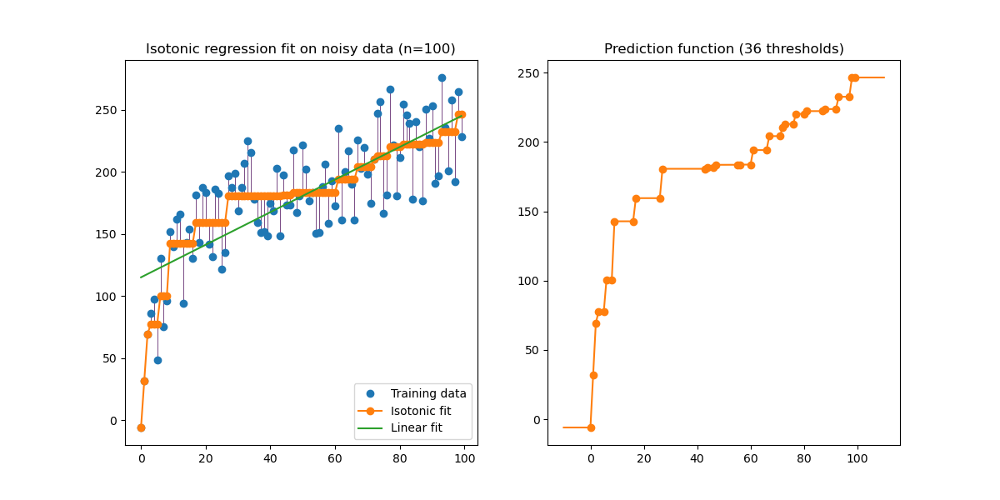

# OLS Regression

OLS: Ordinary Least Squares

$$
\hat y = \theta_0 + \theta_1 X_1
$$

- $\theta_0$ is the value of $y$ when $x_1=0$
- $\theta_1$ shows the change in $y$, when $X_1$ increases by 1 unit
- 

### Properties

-  Regression is performed with linear parameters
-  Easy computation, just from the data points
-  Point estimators (specific; not internal)
-  Regression Line passes through $(\bar x, \bar y)$
-  Mean value of estimated values = Mean value of actual values $E(\hat y) = E(y)$
-  Mean value of error/residual terms = 0: $\sum u_i = 0$
-  Predicted value and residuals are not correlated with each other: $\sum \hat u_i \hat y_i = 0$
-  Error terms are uncorrelated $x$: $\sum \hat u_i x_i = 0$
   
-  OLS is BLUE (Best Linear Unbiased Estimator)
   
   - Gauss Markov Theorem
   - Linearity of OLS Estimators
   - Unbiasness of OLS Estimators
   - Minimum variance of OLS Estimators
   - OLS estimators are consistent
     
     They will converge to the true value as the sample size increases $\to \infty$

## Correlation vs $R^2$

|                                                              |          Correlation          |                  $R^2$                  |
| ------------------------------------------------------------ | :---------------------------: | :-------------------------------------: |
| Range                                                        |           $[-1, 1]$           |                $[0, 1]$                 |
| Symmetric?                                                   |               ✅               |                    ❌                    |
|                                                              |      $r(x, y) = r(y, x)$      |        $R^2(x, y) \ne R^2(y, x)$        |
| Independent on scale of variables?                           |               ✅               |                    ✅                    |
|                                                              |     $r(kx, y) = r(x, y)$      |        $R^2(kx, y) = R^2(x, y)$         |
| Independent on origin?                                       |               ❌               |                    ✅                    |
|                                                              |    $r(x-c, y) \ne r(x, y)$    |       $R^2(x-c, y) \ne R^2(x, y)$       |
| Relevance for non-linear relationship?                       |               ❌               |                    ✅                    |
|                                                              | $r(\frac{1}{x}, y) \approx 0$ | $R^2(\frac{1}{x}, y)$ not necessarily 0 |
| Gives **direction** of causation/association (not exactly the value of causality) |               ❌               |                    ✅                    |

## Isotonic Regression

Minimizes error ensuring increasing/decreasing trend only

