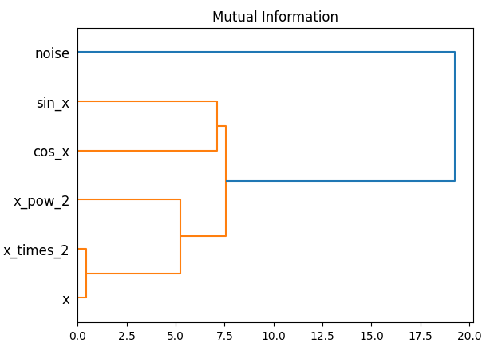

# Feature Selection

| Model  |                                             |
| ------ | ------------------------------------------- |
| Null   | $\beta_0 + u$                               |
| Subset | $\beta_0 + \sum_j^k' \beta_j x_j + u; k'<k$ |
| Full   | $\beta_0 + \sum_j^k \beta_j x_j + u$        |

Also called as Subset/Variable Selection

For $p$ potential predictors, $\exists \ 2^p$ possible models. Comparing all subsets is computationally-infeasible

| Action                   |                                               | Can handle multi-collinearity | Can handle interactions | Robust to overfitting | Selection Type | Constraint Type |                                                                                                                                                                                                                                                                                                          | Advantage                                                    | Disadvantage                                                        |
| ------------------------ | --------------------------------------------- | ----------------------------- | ----------------------- | --------------------- | -------------- | --------------- | -------------------------------------------------------------------------------------------------------------------------------------------------------------------------------------------------------------------------------------------------------------------------------------------------------- | ------------------------------------------------------------ | ------------------------------------------------------------------- |
| Drop useless features    | Too many missing values                       |                               |                         |                       |                |                 |                                                                                                                                                                                                                                                                                                          |                                                              |                                                                     |
|                          | Variance threshold                            |                               |                         |                       |                |                 |                                                                                                                                                                                                                                                                                                          |                                                              |                                                                     |
|                          | Correlation with target                       | ❌                             | ❌                       | ✅                     |                |                 |                                                                                                                                                                                                                                                                                                          |                                                              | 2 vars uncorrelated with the target can become informative together |
|                          | Dropping redundant features (multi-collinear) |                               | ❌                       |                       |                |                 |                                                                                                                                                                                                                                                                                                          |                                                              |                                                                     |
| Feature Information      | Mutual Information                            | ❌                             | ❌                       | ✅                     |                |                 |                                                                                                                                                                                                                                                                                                          |                                                              |                                                                     |
| Feature Importance       | Random Forest Feature Importance              | ❌                             | ✅                       | ❌                     |                |                 | Trained model has to be very accurate, an assumption rarely met - Whenever a model is overfitted, chances are that the features with the highest feature importance scores are to blame, and as such should be removed. However, these are precisely the features that a feature importance will keep |                                                              |                                                                     |
| Feature Predictive Power | Mean Decrease Accuracy                        | ❌                             | ✅                       | ✅                     |                |                 | Out of sample                                                                                                                                                                                                                                                                                            |                                                              |                                                                     |
| Specification Search     | Full Search                                   | ❌                             | ✅                       | ❌                     | Discrete       | Hard            | Brute-Force                                                                                                                                                                                                                                                                                              | Global optima                                                | Computationally-expensive                                           |
|                          | Forward stepwise selection                    | ❌                             | ❌                       | ❌                     | Discrete       | Hard            | Starts with the null model, and then adds predictors one-at-a-time                                                                                                                                                                                                                                       | Computationally efficient Lower sample size requirement |                                                                     |
|                          | Backward Stepwise Selection                   | ❌                             | ❌                       | ❌                     | Discrete       | Hard            | Start with the full model and remove predictors one-at-a-time                                                                                                                                                                                                                                            |                                                              | Expensive Large sample size requirement                        |
|                          | LASSO                                         | ✅                             | ❌                       | ✅                     | Continuous     | Soft            | Refer to regularization                                                                                                                                                                                                                                                                                  |                                                              |                                                                     |

For handling multi-collinearity
- Perform clustering of similar features
	- Similar: Pairwise Correlation/Mutual information
	- Clustering: Hierarchical is preferred over centroid-based
	- Include random noise feature to understand what is significant relationship
	- 
- Modify feature selection to handle clusters, by choosing one of the below
	- Choose one feature per cluster
	- Cluster MDI: sum of MDIs of features in each cluster
	- Cluster MDA: Shuffling all features in each cluster simultaneously

## Forward

1. Let M0 denote the null model.
2. Fit all univariate models. Choose the one with the best in-sample fit (smallest RSS, highest R2) and add that variable – say x(1)– to M0. Call the resulting model M1.
3. Fit all bivariate models that include x(1): y ∼ β0 + β(1)x(1) + βj xj , and add xj from the one with the best in-sample fit to M1. Call the resulting model M2.
4. Continue until your model selection rule (cross-validation error, AIC, BIC) is lower for the current model than for any of the models that add one variable.

## IDK

- $\alpha_\text{add}$ usually $0.05$ or $0.10$
- $\alpha_\text{remove} > \alpha_\text{add}$

### Forward Stepwise Regression

1. Write down full possible model with all predictors, functions, interactions, etc
2. Regress $y$ against each model term individually
3. Pick $\alpha_\text{add}$ and $\alpha_\text{remove}$ such that $\alpha_\text{add}<\alpha_\text{remove}$
4. Pick best regressor
      1. Calculate $t=\beta_j/\text{SE}(\beta_j)$
      2. Calculate $p$ value for each term
      3. Pick smallest $p$-value $p^*_j$
      4. $p^*_j<\alpha_\text{add} \implies$ add parameter $j$
5. Check if previous term should be removed
   1. For all previously-added regressors, find the one with the lowest $t$ score and hence highest $p$ value $p^*_{j'}$
   2. If $p^*_{j'} > \alpha_\text{remove}$, remove $j'$
6. Repeat step 4-5 until no improvement

## Omitted Variable Bias

If a correct regressor $x_j$ is missing from the model, then the remaining model parameters will be biased if $x_j$ is related to the other vars

The bias will be proportional to the correlation between the missing $x_j$ and the regressors used in the model

## Uncounted DOF

Every time you test a regressor term for the model, it is an addition to the degree of freedom, whether or not you include it in the model

Causes data snooping

DOF = $n-p +$ no of trials