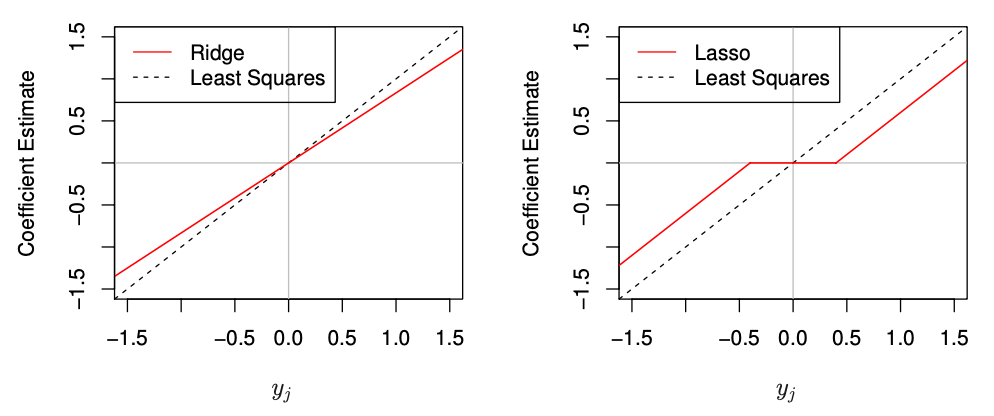
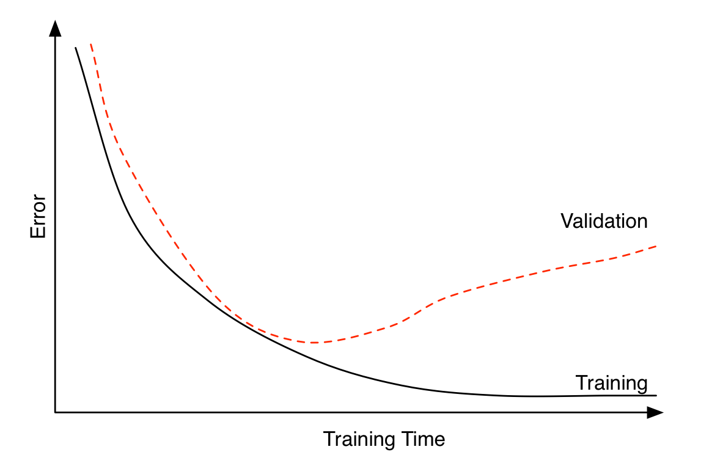

# Model Tuning & Regularization

Methods that constrain the complexity of a model in order to reduce overfitting and improve out-of-sample error, by reducing variance and compromising on an increased bias

## Reducing capacity

Reduce the number of

- parameters (weights)
- layers (neural net)
- units per layers (neural net)
- Bottle neck layers (neural net)

### Bottleneck Layer(s) for neural nets

Let

- Let layer $i$ and layer $j$ be adjacent layers
- $w_i$ be weights of layer $i$
- $\vert w_i \vert$ be the number of units in a layer $i$
- $w_b$ be the bottleneck layer
  - effective only if $\vert w_b \vert < \arg \min(\vert w_i \vert, \vert w_j \vert)$

$$
\begin{aligned}
\text{Before: } & \vert w_i \vert \cdot \vert w_j \vert \\
\text{After: } & \vert w_i \vert \cdot \vert w_b \vert + \vert w_b \vert \cdot \vert w_j \vert
\end{aligned}
$$

Example

```mermaid
flowchart LR
a[10<br/>units] -->|100<br/>connections| b[10<br/>units]
c[10<br/>units] -->|10<br/>connections| d[1<br/>unit] -->|10<br/>connections| e[10<br/>units]
```

## Increase DOF

- Reduce $k$

  - Feature Selection

  - Dimensionality Reduction

- Increase $n$
  - Data augmentation

## Subsampling at each iteration

- columns
- rows

## Weight Decay

Also called as Shrinkage Term/Regularization Penalty

Reduce errors by fitting the function appropriately on the given training set, to help reduce variance, and hence avoid overfitting, while minimally affecting bias.

This is done by adding a penalty term in the cost function.

Note:

- All input features must be ==**standardized**==
- Intercept should not be penalized

$$
J'(\theta) = J(\theta) + \dfrac{\textcolor{hotpink}{\text{Regularization Penalty}}}{\text{Sample Size}}
$$

This is similar to 
$$
E_\text{out} = E_\text{in} + O(D_{VC})
$$

| Regularizer | Penalty| Effect                                      | Robust to outliers | Unique solution? | Comments | $\hat \beta$ | Limitations | Bayesian Interpretation |
|---                      | ---| ---                                         | ---                                   |---                      |---                      |---                      |---                      |---                      |
| $L_0$ | $\lambda \sum \limits_j^k (\beta_{j=0} \ne 0)$ Number of non-zero coefficients | Enforces sparsity (Feature selection) |  |  | Computationally-expensive Not Convex No closed-form soln (requires grad descent) |  |  |  |
|$L_1$ (Lasso: Least Absolute Shrinkage & Selection Operator)       | $\lambda \sum \limits_{j=0}^k \dfrac{\vert\beta_j - \mu_{\beta^*_j} \vert}{\sigma^2_{\beta^*_j}}$ | Encourages sparsity (Feature selection) Eliminates low effect features completely | ✅                   | ❌ | Convex No closed-form soln (requires grad descent) | $\begin{cases} \text{sign}({\hat \beta}_\text{OLS}) \times \left( \vert {\hat \beta}_\text{OLS} \vert - \lambda/2 \right) , & \vert {\hat \beta}_\text{OLS} \vert > \lambda/2, \\ 0, & \text{otherwise} \end{cases}$ | when $\exists$ highly-correlated features - Results can be random/arbitrary and unstable  - Multiple solutions | Double-exponential Laplace prior with Mean $\mu_{\beta^*_j}$ |
|$L_2$ (Rigde)       | $\lambda \sum \limits_{j=0}^k \dfrac{(\beta_j - \mu_{\beta^*_j})^2}{\sigma^2_{\beta_j^*}}$ | Scale down parameters Reduces multi-collinearity | ❌ | ✅ | Convex Closed-form soln exists | $\dfrac{{\hat \beta}_\text{OLS}}{1 + \lambda}$ |  | Normal prior with mean $\mu_{\beta^*_j}$ |
|$L_q$ | $\lambda \sum \limits_{j=0}^k \dfrac{{\vert\beta_j - \mu_{\beta^*_j} \vert}^q}{\sigma^2_{\beta^*_j}}$ | |  |  | | |  |  |
|Weighted | $\lambda \sum \limits_{j=0}^k w_j \cdot L_q$ | Penalize some parameters more than others | | | Useful to penalize higher order terms | |  |  |
|$L_3$ (Elastic Net) | $\alpha L_1 + (1-\alpha) L_2$|                                             | Not very | ✅ | |  |  |  |
|Entropy                  | $\lambda \sum \limits_{j=0}^k - P(\beta_j) \ln P(\beta_j)$ | Encourage parameters to be different Encourages sparsity Cause high variation in between parameters |  |  | |  |  |  |
|SR3 (Sparse Relaxed) |  |  |  |  | |  |  |  |

where

- $\mu_{\beta^*_j}$ is the prior-known most probable value of $\beta_j$
- $\sigma^2_{\beta^*_j}$ is the prior-known standard deviation of $\beta_j$

These 2 incorporate desirable Bayesian aspects in our model.

### Bayesian Interpretation

Regularization amounts to the use of informative priors, where we introduce our knowledge or belief about the target function in the form of priors, and use them to “regulate” the behavior of the hypothesis we choose

Incorporating $\hat \beta$ into the regularization incorporates maximum likelihood estimate of the coefficients.

Didn’t understand: The standard deviation of the prior distribution corresponds to regularization strength $\lambda$

Example

|    $y$    | $\hat \beta$ |
| :-------: | :----------: |
| $\beta x$ |      0       |
| $x^\beta$ |      1       |

### IDK

### Contours of Regularizers

### Why is standardization required?

- magnitudes of parameters need to be comparable
- Penalized estimates are **not** scale equivariant: multiplying $x_j$ by a constant $c$ can cause a significant change in $\hat \beta$ when using regularization

### Feature Selection Paths

### Penalty Coefficient

### Frequentist Interpretation

Select coefficient one/two iterations **after** the optimal point, to reduce variance further

$\lambda$ regulates the smoothness of the spline that solves
$$
\min_h \left \{
J(\theta, x_i, y_i) + \lambda \int [h''(t)]^2 \cdot dt
\right \}
$$
Penalizing the squared $k$th derivative leads to a natural spline of
degree $2k − 1$

| $\lambda$ | Reduces  | Comment                           |
| --------- | -------- | --------------------------------- |
| 0         | Bias     | Interpolates every $(x_i, y_i)$   |
| $\infty$  | Variance | Becomes linear least squares line |

## Multi-Stage Regularization

| Stage | Goal               |            |
| ----- | ------------------ | ---------- |
| 1     | variable selection | LASSO      |
| 2     | estimation         | Any method |

Intuition: Since vars in 2nd stage have less "competition" from noise variables, estimating using selected variables could give better results

## System Equation Penalty

Useful if you know the underlying systematic differential equation

$$
J'(\theta) = J(\theta) + \text{DE} \\
\text{RHS(DE)} = 0
$$
Refer to PINNs for more information

## IDK

## Early-Stopping

Stop one/two iterations before the optimal point, to reduce variance further

## Dropout

Dropout is applied on the output of hidden fully-connected layers

### Training

Stochastically drop out units with probability $p_\text{drop}$ and keep with $p_\text{keep}=1-p_\text{drop}$

Annealed dropout

### Evaluation/Production

At inference time, dropout is inactive, as we should not predict stochastically

| Approach                           | Time  |                                     | Advantages                                                   | Disadvantage                                                 |
| ---------------------------------- | ----- | ----------------------------------- | ------------------------------------------------------------ | ------------------------------------------------------------ |
| Naive approach                     | Test  | Simply not use dropout              |                                                              | All units receive $(1/p_\text{drop})$ times as many incoming signals compared to training, so responses will be different |
| Test-Time Rescaling                | Test  | Multiply weights by $p_\text{keep}$ |                                                              | Comparing  similar architectures w/ and w/o dropout requires implementing 2 different networks at test time |
| Dropout Inversion (preferred) | Train | Divide weights by $p_\text{keep}$   | Overcome limitations of Test-Time Rescaling Allows for annealed dropout |                                                              |

## Ensembling

## Noise Injection

- Add noise to inputs
- Add noise to outputs

Behaves similar to L2 regularization

## Label Smoothing

$$
y' =
\begin{cases}
y - \epsilon/m, & y = y_\text{true} \\
y + \epsilon/m, & y = y_\text{false}
\end{cases}
$$

where

- $y_\text{true}$ is the true label
- $m=$ total number of labels

## Active Teaching

```mermaid
flowchart LR
c(( ))
m[ML]

d[(Dataset)] --> m & EDA

EDA -->
rb[Rule-Based System]

subgraph Active Teaching
  rb & m <-->|Compare & Update| c
end
```

