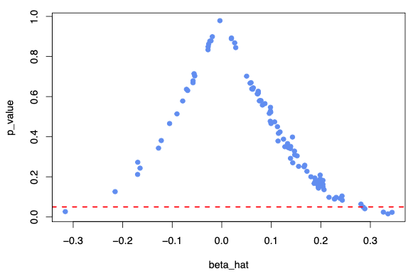
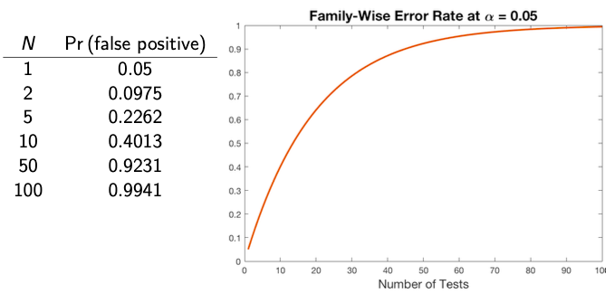
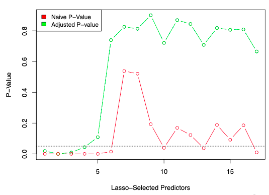

## Statistical Inference

Deals with the problem of uncertainty in estimates due to sample variability

Does not deal with

- Whether model specification is correct
- Whether $x$ has causal effect on $y$
- Whether model is good for describing causal effect of $x$ on $y$

## Hypothesis Testing

$$
\begin{aligned}
& H_0: \beta_j = 0 \\
& {\tiny \text{ that includes other all predictors and nothing else}} \\ \\
& H_1: \text{o.w}
\end{aligned}
$$

- Rejection of $H_0 \centernot \implies \beta$  significantly different from 0. Therefore, to assess magnitude of $\beta$, confidence intervals are more useful than $p$-values
- Rejection of $H_0$ does not mean that $x$ has a significant causal effect on $y$. Statistical significance $\centernot \implies$ scientific, real-world significance. The most important variables are not those with the smallest p-values.
- The t−test can be thought of as checking whether adding $x_j$ really improves predictions in a model that contains other specified predictors
- 95% CI = $\text{LL}, \text{UL} \centernot \implies \text{Pr}(\beta \in [\text{LL, UL}]) = 0.95$
  - Correct interpretation: a 95% CI for $\beta$ means that if
    we estimate our model on many independent random samples drawn
    from the same population and construct $\text{CI}_m = [\text{LL}_m, \text{UL}_m]$ on each sample, then 95% of these $\{ CI_m \}$ will contain $\beta$

$$
L(H1, \hat H_1) = \begin{cases}
0, & H_1 = \hat H_1 \\
95, & H_1 = 0, \hat H_1 = 1 \\
5, & H_1 = 1, \hat H_1 = 0
\end{cases}
$$

## P-Value

P-value is not the conditional probability of $H_0$. It is actually the probability of $H_0$ being true based only on the observed data set (without incorporating prior knowledge)
$$
\begin{aligned}
p \text{-value}
&\ne P(H_0 = \text{True} \vert D) \\
p \text{-value}
&= P(D \vert H_0 = \text{True} )\\
&= \text{Pr}(\vert t \vert \ge \vert t(\hat \beta) \ \vert H_0)
\end{aligned}
$$

$$
\begin{aligned}
\text{What actually} & \text { needed} \\
P(H_0
= \text{True} \vert D)
&= \dfrac{P(D \vert H_0) \cdot P(H_0)}{P(D)} \\
&= \dfrac{p \cdot P(H_0)}{P(D)} \\
&= \dfrac{p \cdot P(H_0)}{p \cdot P(H_0) + (1-p) \cdot P(H_1)}
\end{aligned}
$$

where $D$ is the data

When $P(H_1) < 0.1$, we may need the p−value to be much smaller than the conventional threshold of $\alpha = 0.05$ in order to “confidently” reject $H_0$

- For example, to concluding that a coin is biased would require a significant number of one-sided results 

Hypothesis tests are only valid for large sample size, as they are based on the asymptotic properties of test statistics.  Hence, Bootstrapping can be used to obtain more accurate p−value estimates

## Information Content of Statistical (Non)Significance

Statistical result is informative only when it has the potential to substantially change our beliefs. The discrepancy between a prior and a posterior distribution thus provides a basic measure of the informativeness of a statistical result.

Using this measure, non-significant results are often more informative than significant results in scenarios common in empirical economics.

Hence, null need not always be $H_0: \beta = 0$. It can be what is prior known. This can be implemented in ridge regression by using a prior known value

- Beliefs on the causal effect of a policy intervention are usually better described by a continuous distribution rather than a distribution with significant probability mass at point zero.

When $P(H_0)$ is low, statistical significance often carries little information; non-significance is highly informative, because in this case, non-significance is more “surprising” and induces a larger change in the posterior belief
$$
\underbrace{1 - \dfrac{p(\beta \vert R=0)}{p(\beta)}}_\text{INS} \\
= \dfrac{P(R=1)}{P(R=0)} \times \underbrace{1 - \dfrac{p(\beta \vert R=1)}{p(\beta)}}_\text{IS}
$$
where

- $R=H_0 \text{ rejected}$ at given significance level
- $P(R = 1)$ is the prior probability of rejection of the null
  - $P(R = 1) = \int P(R = 1 \vert \beta)  \cdot p(\beta) \cdot d\theta$
- $\text{INS}$ = Informativeness of non-significance
- $\text{IS}$ = Informativeness of significance

#### Takeaways

- Non-significance is more informative than significance as long as
  $P(R = 1) > 0.5$
- As $n$ inc and $p(\beta=0)$ dec, $p(R=1)$ increases
  - Thus, as datasets get larger, and because there are rarely reasons to put significant priors on $\theta=0$, non-significant results will be more informative in empirical studies in economics
  - When $n$ is very large, without prior probability mass at the point null, significance carries no information

## Statistical Significance Filter

Publication Bias

Only the extreme significant cases of the study make it through to the publication, and hence are not a representative sample of all empirical findings.

$E[\hat \beta \vert \text{significant} >> \beta]$

The power of test is low; The null hypothesis is false, but fails to be rejected $(1-\alpha \% )$ of the time

Lower power leads to high exaggeration ratios, ie if the estimate is statistically significant, it must be at least $a$ times higher than the true effect size

Type $S$ error probability: if the error is statistically-significant, but has the wrong sign

## Multiple Testing

Multiple comparisons

Assuming each test is independent, under $H_0$ of all tests

If you perform multiple hypothesis tests, the probability of at least one producing a statistically-significant result at the significance level $\alpha$ due to chance, is necessarily greater than $\alpha$

### FWER

Joint Type 1 Error/FWER (Family-wise Error Rate) is the probability of making at least 1 type 1 error when simultaneously performing $m$ hypothesis tests
$$
P(\ge 1 \text{ false positive}) = 1 - (1-\alpha)^m
$$
where $m$ is the number of tests conducted (ie model specifications tried)

### Bonferroni Correction

Bounds the FWER at below $\alpha$ by setting the significance threshold for each individual test as $\alpha/m$
$$
1 - \left(1 - \dfrac{\alpha}{m} \right)^m \le \alpha
$$
It is conservative, as it is assumes independent tests.

For large $m$, it leads to a significant loss of power, ie higher probability of false negative

## Selective Inference

Assessing strength of evidence after obtaining the ‘best model’ through searching from a large number of models

If not taken into account, the effects of selection can greatly exaggerate the apparent strengths of relationships.

Also called as Post-Selection Inference

### Context

To conduct statistical inference for procedures that involve model selection, such as forward stepwise regression or the lasso, it is tempting to look only at the final selected model. However, such inference is generally invalid

The problem is essentially the same as those of specification search and data-snooping: an observed correlation of 0.9 between x and y may be noteworthy. However, if x is found by searching over 100 variables looking for the one with the highest observed correlation with y, then the finding is no longer as impressive and could well be due to chance

### Solution: Conditional Coverage

Make the inference conditional on the model selected

Construct CI for $\beta_{j, M}$ conditional on model $M$ being selected:
$$
P(\beta_{j, M} \in C_{j,m} \vert M \text{ selected}) \ge 1 - \alpha
$$