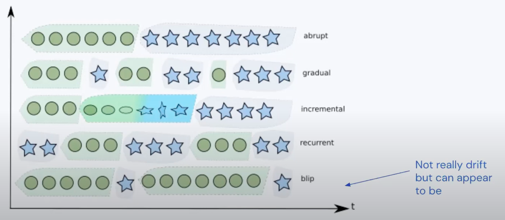
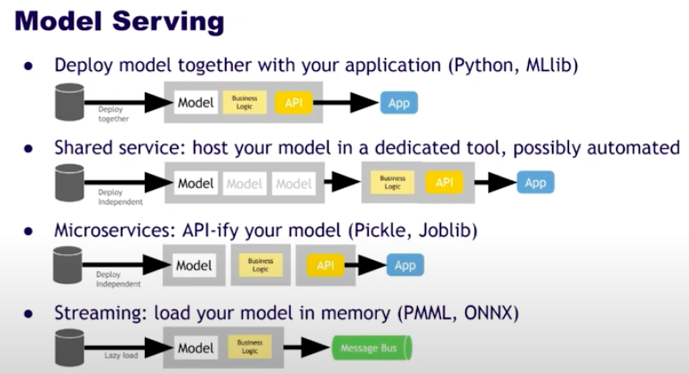

# Production

Stage after deploying the model to work with live data
- Model conversion
- Optimization
	- Performance
		- Latency
		- Throughput
	- Energy-consumption
- Security & Privacy
- Online learning

## Drift

Train & live data distributions change over time

Causes
- Structural break
- Data integrity issues

### Types

| Type          | Data Change | Relationship Change | Subtype                    | Change in      | Solution                                                                                                                                                                              | Example                            | Example cause                          |
| ------------- | ----------- | ------------------- | -------------------------- | -------------- | ------------------------------------------------------------------------------------------------------------------------------------------------------------------------------------- | ---------------------------------- | -------------------------------------- |
| Data Drift    | ✅           | ❌                   | Feature/ Covariate      | $p(x)$         |                                                                                                                                                                                       | Applicants from new market         | Product launch in new market           |
|               |             |                     | Prior/ Output/ Label | $p(y)$         |                                                                                                                                                                                       | Price of goods increase            | Inflation                              |
| Concept Drift | ❌           | ✅                   |                            | $p(y \vert x)$ | - Give higher sample weight to recent datapoints - Use batch-streaming hybrid   - Works when we have the label associated with every data point, such as in Recommender Systems | Price-elasticity of demand changes | New competitor in your existing market |

Check with
- Adversarial Validation
- Anomaly Detection

- If label and drift happen together and cancel each other out, there is no concept drift.
- Else, concept drift will be caused by one/both since they are linked by Bayes'  equation

### Speed

## Deployment Checklist

### Update Frequency
Realtime or batch training
### Model Location

|                                    | Cloud  | Edge/Browser |
| ---------------------------------- | ------ | ------------ |
| Cheaper                            | ❌      | ✅            |
| Small models (Load + Inference) | Slower | Faster       |
| Large models (Load + Inference) | Faster | Slower       |
| Offline support                    | ❌      | ✅            |
| User Privacy                       | ❌      | ✅            |
| Model Privacy                      | ✅      | ❌            |

### Compute requirements
CPU/GPU/Memory

### Latency, throughput (QPS)

### Logging

### Security & Privacy

## Scenarios of Deployment

- New product/capability
- Automate/assist with manual task
- Replace previous ML system

## Types of Deployment

| Type       |                                                                                                     |
| ---------- | --------------------------------------------------------------------------------------------------- |
| Canary     | Roll out to small fraction of traffic initially Monitor system and ramp up traffic gradually   |
| Blue-Green | Fully deploy new version (green) Keep old model dormant, and rollback to it if required (blue) |

## Degrees of Automation

|                    |     |
| ------------------ | --- |
| Human-Only         |     |
| Shadow Mode        |     |
| AI Assistance      |     |
| Partial Automation |     |
| Full automation    |     |

## Monitoring

- Brainstorm potential problems
- Brainstorm appropriate metrics to identify the problems
  - Software Metrics
    - Memory
    - Compute
    - Latency
    - Throughput
    - Server load
  - Data
	  - Data Distributions
	  - Input Metrics
	    - Average Input length
	    - Fraction of rows with missing values
	    - Average image brightness
	  - Output metrics
	    - Missing outputs
	    - No of times user redoes search
	    - CTR (ClickThrough Rate): No of clicks that your ad receives divided by the number of times your ad

## Model Serving

## Adversarial Attacks

Fool model by adding noise

This is not a problem with Deep Learning and/or ConvNets. Same issue comes up with Neural Networks in any other modalities. Primary cause of neural networks' vulnerability adversarial perturbation is their linear nature (and very high-dimensional, sparsely-populated input spaces).

The exact adversarial noise can easily be learnt
- known model weights: directly
- unknown model weights: through backpropagation

eg: Confidently predicting the class even though it is extrapolating

Solution
- Data augmentation; not sufficient
- Train for adversarial robustness; not sufficient
	1. Create adversarial examples
	2. Add them to train data, tagged as "adversarial class"
- Not clear what is the guaranteed workaround