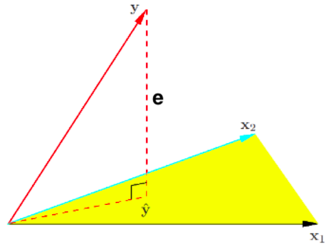

# OLS Regression

OLS: Ordinary Least Squares

$$
\hat y = \hat \beta_0 + \sum_{j=1}^k \hat \beta_j X_j
$$

- $\hat \beta_0$ is the value of $y$ when $x_j=0, \forall j \in [1, k]$
- $\hat \beta_j$ shows the change in $y$ **associated** (not necessarily caused) with an increase of $X_j$ by 1 unit

$$
\begin{aligned}
\hat \beta &= \dfrac{\text{Cov}(X, y)}{V(X)} \\
\hat \beta_0 &= E[y] - E[X]' \hat \beta \\
\text{Simple model} \implies
\hat \beta_1 &= \dfrac{\sigma_{xy}}{\sigma_x} \\
\hat \beta_0 &= \bar y - \beta_1 \bar x \\
\end{aligned}
$$

$$
\text{Frisch-Waugh-Lovell} \\
\implies \hat \beta_j 
= \dfrac{\sigma_{u_j, y}}{\sigma_{u_j}}
$$

where $u_j$ is the residual from a regression of $x_j$ with all other features

In vector form,
$$
\begin{aligned}
\hat \beta &= (X'X)^{-1} X' Y \\
\hat \beta_j &=\dfrac{{\hat u_j}' Y}{{\hat u_j}' \hat u_j}
\end{aligned}
$$

### Properties

-  Regression is performed with linear parameters

-  Easy computation, just from the data points

-  Point estimators (specific; not internal)

-  Regression Line passes through $(\bar x, \bar y)$

-  Mean value of estimated values = Mean value of actual values $E(\hat y) = E(y)$

-  Mean value of error/residual terms = 0: $\sum u_i = 0$

-  Predicted value and residuals are not correlated with each other: $\sum \hat u_i \hat y_i = 0$

-  Error terms are uncorrelated $x$: $\sum \hat u_i x_i = 0$
   
-  Each $\hat \beta_j$ is the slope coefficient on a scatter plot with $y$ on the $y$-axis and $u_j^*$ on the x-axis
   
   -  $u_j^*$ isolates the value of $x_j$ from other $x_i, i \ne j$
   
-  OLS is BLUE (Best Linear Unbiased Estimator)

   - Gauss Markov Theorem
   - Linearity of OLS Estimators
   - Unbiasness of OLS Estimators
   - Minimum variance of OLS Estimators
   - OLS estimators are consistent
     
     They will converge to the true value as the sample size increases $\to \infty$
   
-  Gives the MLE with $u \sim N(0, \text{MSE})$

## Geometric Interpretation

OLS fit $\hat y$ is the projection of $y$ onto the linear space spanned by $\{ 1, x_1, \dots , x_k \}$

Projection/Hat Matrix
$$
\begin{aligned}
\hat Y &= HY \\
H &= X (X' X)^{-1} X' \\
H^2 &= H \\
(I-H)^2 &= (I-H) \\
\text{trace}(H) &= 1+p
\end{aligned}
$$

## Asymptotic Variance of Estimator

Using central limit theorem,
$$
\sqrt{n}(\hat \beta - \beta) \sim N(0, \sigma_{\hat \beta}) \\
\implies 
\dfrac{(\hat \beta - \beta)}{\sigma_{\hat \beta}} \sim N(0, 1)
$$

$$
\begin{aligned}
\sigma_{\hat \beta} &= (X' X)^{-1} (X' \ohm X) (X'X)^{-1} \\
\ohm &= \text{diag}(\hat e_1^2, \dots, \hat e^2_n)
\end{aligned}
$$

Assuming homoskedascity of errors
$$
\begin{aligned}
\sigma_{\hat \beta}
&= \dfrac{\text{MSE}}{\hat u_j \hat u_j} \\
&= (X' X)^{-1} \cdot \text{MSE}
\end{aligned}
$$

## Correlation vs $R^2$

|                                                              |          Correlation          |                  $R^2$                  |
| ------------------------------------------------------------ | :---------------------------: | :-------------------------------------: |
| Range                                                        |           $[-1, 1]$           |                $[0, 1]$                 |
| Symmetric?                                                   |               ✅               |                    ❌                    |
|                                                              |      $r(x, y) = r(y, x)$      |        $R^2(x, y) \ne R^2(y, x)$        |
| Independent on scale of variables?                           |               ✅               |                    ✅                    |
|                                                              |     $r(kx, y) = r(x, y)$      |        $R^2(kx, y) = R^2(x, y)$         |
| Independent on origin?                                       |               ❌               |                    ✅                    |
|                                                              |    $r(x-c, y) \ne r(x, y)$    |       $R^2(x-c, y) \ne R^2(x, y)$       |
| Relevance for non-linear relationship?                       |               ❌               |                    ✅                    |
|                                                              | $r(\frac{1}{x}, y) \approx 0$ | $R^2(\frac{1}{x}, y)$ not necessarily 0 |
| Gives **direction** of causation/association (not exactly the value of causality) |               ❌               |                    ✅                    |

## Isotonic Regression

Minimizes error ensuring increasing/decreasing trend only

