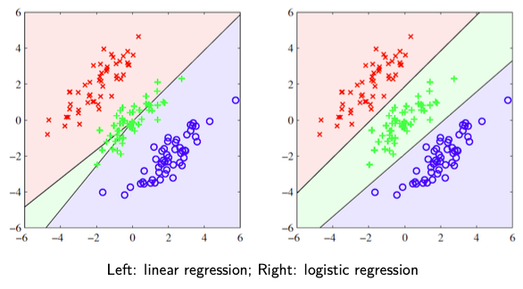
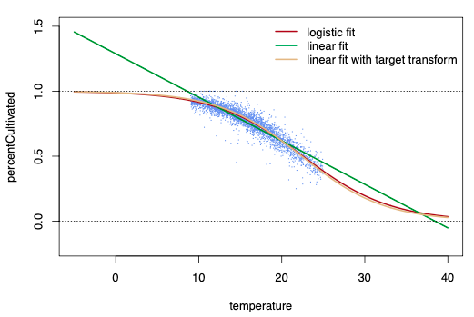
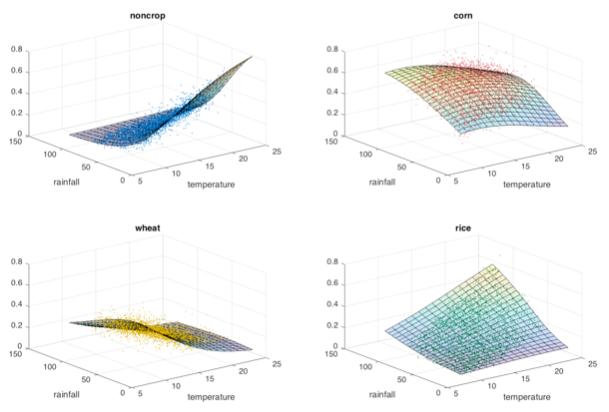
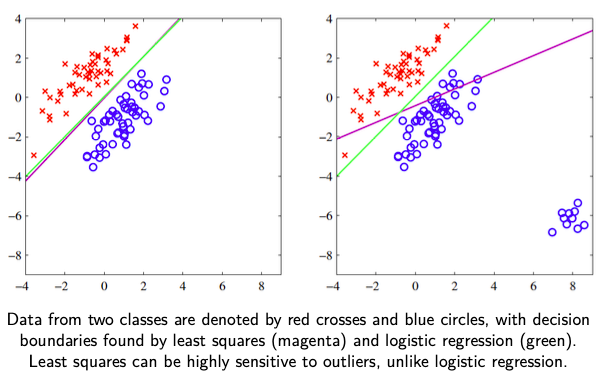
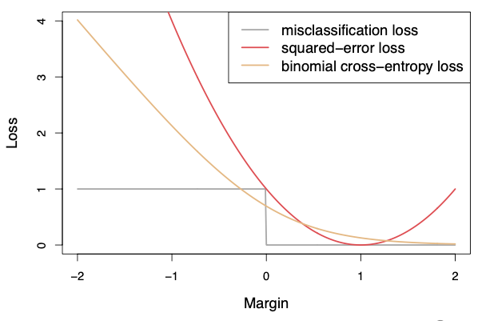
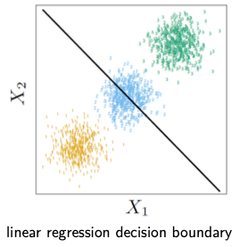

# Logistic Regression

Logistic regression minimizes the cross-entropy error

Uses Sigmoid Function and binary cross-entropy loss

Decision of such a discriminant function is always singly-connected and convex.
$$
\begin{aligned}
p(y=k)
&= \dfrac{
	\exp(\beta_k x)
}{
	\sum_k^K \exp(\beta_k x)
} \\
\beta_0 &= 0, \beta_1 = 1 \\
\implies
p(y=1)
&= \dfrac{
	e^{x}
}{
	1 + e^{\beta x}
} \\
p(y=0) &= \dfrac{
	1
}{
	1 + e^{\beta x}
} \\
\implies \ln \dfrac{P(y=j)}{P(y=k)} &= (\beta_j-\beta_k)' X
\end{aligned}
$$

$$
\begin{aligned}
p
&= P(y=1|x) \\
&= \sigma(\beta^T x) \\
&= \frac{1}{1 + \exp(-\beta^T x)} \\
\implies \beta^T x
&= \text{logit}(p) \\
&= \ln \left \vert \dfrac{p}{1-p} \right \vert
\end{aligned}
$$

$$
\begin{aligned}
\hat \beta &= \arg \max_\beta L(\beta) \\

&= \arg \min_\beta -\log L(\beta)
&= \sum_{i=1}^n \ln P(y_i \vert x_i; \beta) \\
-\log L(\beta) &= \sum_{i=1}^n y_i \log \sigma (x_i' \beta) + (1-y_i) \log(1- \sigma(x_i' \beta))
\end{aligned}
$$

Logistic regression assumes that the log odds is a linear function

We need to choose class $0$ to be the reference level, and normalize $\beta_0=0$

Meaning: $\exp( \beta x')$ is the probability of $y=1$ relative to $y=0$

## Classification

### Binary 

$$
\begin{aligned}
\hat y &= \begin{cases}
1, & p \ge p_1 \\
0, & p \le p_0 \\
\text{Unsure} & \text{o.w}
\end{cases} \\
p_1 &= \dfrac{1}{1 + c}
\end{aligned}
$$

where

- $c =$ relative cost of FN wrt FP (misclassifying $y=1$ wrt $y=0$)
  - $c =$ usually 1
- $p_0, p_1 =$ thresholds
  - $p_0, p_1$ are commonly taken as 0.5

### Multi-Class

Soft-max function = generalized logistic function for multi-class

Linear decision boundary
$$
\begin{aligned}
p(y=j)
&= \dfrac{\exp(\beta_j x)}{\sum_k^K \exp(\beta_k x) } \\
\\
\ln \dfrac{P(y=j)}{P(y=k)} &= (\beta_j-\beta_k)' X \\
\implies \ln \dfrac{P(y=j)}{P(y=k)} &= (\beta_j)' X & (\beta_k = 0)
\end{aligned}
$$
where $K$ = number of classes

We need to choose one class $k$ to be the reference level, and normalize $\beta_k=0$

Meaning: $\exp( \beta_j x')$ is the probability of $y=j$ relative to $y=k$

### Decision Boundary

Decision boundary is obtained by solving for $P(y=k_i) = P(y=k_j)$

The decision boundary between 2 classes does not depend on another class

### Class Share

Consider alternative $j$
$$
\begin{aligned}
P(y_i=j)
&= \int P(y_i=j \vert x_i) f(x_i) \cdot d x_i \\
& \approx \dfrac{1}{n} \sum_{i=1}^n P(y_i=j \vert x_i)
\end{aligned}
$$

We can average individual conditional choice probabilities to get an estimate of the class share of each alternative in the population.

### Counterfactual Analysis

Logistic regression assumes [IIA](#IIA), hence does not take into account similarity of classes for evaluating class share when there is a class is added/dropped

This assumption is fine for in-sample prediction, but inappropriate for counterfactual analysis

## Probabilistic Regression

### Binary

### Multi

## OLS vs Logistic

OLS is not appropriate for classification

- OLS is not probabilistic, as it’s range can be outside $[0, 1]$
- OLS tries to find $\hat y_i$ close to $y_i$, even though we just need $y_i = (\hat y > 0.5)$
- OLS is sensitive to outliers, due to large deviation and high cost function
- OLS penalizes cases where $y_i=1$ and $\hat y>1$, ie it penalizes predictions that are “too correct”
  - OLS penalizes observations with large positive margins and hence is not a suitable loss function for classification

- Classes can be **masked** by others, especially when no of classes is large and no of predictors is small
  - OLS estimates normal linear model, but classification has a distribution very different from Gaussian
  - 
    - Decision boundaries produced by linear regression between 1 and 2 and between 2 and 3 are the same, so we would never predict class 2

