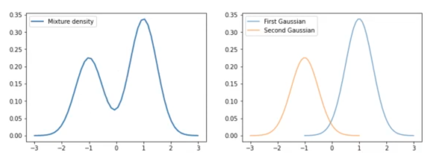

# Gaussian Classifier

$$
\begin{aligned}
P(y=c|x)
& = \dfrac{P(x, y=c)}{P(x)}
\\
& = \dfrac{P(x|y=c) \times P(y=c)}{P(x)}
\\
& \propto P(x|y=c) \times P(y=c)
\end{aligned}
$$

We assume Normally-distributed

## Gaussian Mixture

A mixture of $K$ Gaussians is a distribution $p(x)$ of the form
$$
p(x) = \sum_{k=1}^K p_k N(x; \mu_k, \Sigma_k)
$$
where

- $N$ is a multi-variate Gaussian distribution
- $\Sigma_k =$ covariance
- $p_k =$ probability of $x$

## Gaussian Discriminant Analysis

Also called Quadratic Discriminant Analysis, as the shape of the decision boundary is quadratic

Hence, if we have $C$ classes
$$
\begin{alignedat}{1}
p(x, y)
&= \sum_{c=1}^c \hat p(y=c)
&&\cdot \hat p(x \vert y=c) \\
&= \sum_{c=1}^C p_c
&&\cdot N(x; \mu_c, \Sigma_c)
\end{alignedat}
$$
Guessing parameters

For $C$ Classes, there are $3C$ parameters
$$
\begin{aligned}
\hat \theta
& = \{
\\
& \mu_1, \Sigma_1, p_1 \\
& \dots \\
& \mu_C, \Sigma_C, p_C
\\
\}
\end{aligned}
$$

$$
\begin{aligned}
\mu_c &= E[x \vert y = c] \\
\Sigma_c &= \Sigma[x \vert y = c] \\
p_c &= \dfrac{n_c}{n}
\end{aligned}
$$

### Special Cases

- LDA: $\Sigma_k = \text{same}$
- Gaussian Naive Bayes: $\Sigma_k = \text{diagonal}$

## Bernoulli Naive Bayes

- $P(y):$ categorical distribution
- $P(x_j \vert y):$ Bernoulli distribution

### Assumption

Assume that every input var is independent of each other
$$
\begin{aligned}
&p(x_j \vert y)  \perp p(x_{\centernot j} \vert y)
\\
\implies
&p(x \vert y)
= \prod_{j=1}^k p(x_j \vert y)
\end{aligned}
$$
$p(x_j \vert y)$ is assumed as Bernoulli distribution, hence there is only one parameter for each input var

$p(x \vert y)$ has only $k$ parameters in total

#### Why?

To handle discrete input data of high dimensionality

Solution: assume that $x$ is sampled from a categorical distribution that assigns a probability to each possible state of $x$

However, if the dimensionality of $x$ is too high, $x$ can take a large domain of values. Hence, we would need to specify $(C_j)^k-1$ parameters for the categorical distribution, where

- $C_j=$ no of classes in discrete variable $x_j$
- $k=$ no of dimensions

#### Limitations

- This is not a perfect assumption, as inputs may be correlated with each other for eg in NLP
  - “Doctor” will be accompanied with “Patient” in the same ‘bag of words’

### IDK

$$
\begin{aligned}
\ln \mathcal{L}(x \vert C)
&= \ln \mathcal{L}(x \vert \mu_c, \sigma_c^2) \\
&= \ln P(x \vert \mu_c, \sigma_c^2) \\
\end{aligned}
$$

$$
\ln
\underbrace{\mathcal{L} (C|x)}_{\mathclap {\text{Posterior}}} =
\ln \underbrace{\mathcal{L}(x|C)}_{\mathclap {\text{Likelihood}}} +
\ln \underbrace{\mathcal{L} (C)}_{\mathclap{\text{Posterior}}}
$$

### 2 Classes

$$
\begin{aligned}
\ln \frac{P(C_1 | x)}{P(C_2 | x)}
&= \ln P(C_1 | x) - \ln P(C_2 | x) \\
&= \frac{-1}{2} ()
\end{aligned}
$$

- If log ratio $\ge 0$, assign to $C_1$
- If log ratio $<0$, assign to $C_2$

We need to ensure that we have equal sample of both classes, so that the prior probabilities of both the classes in the formula is the same.

