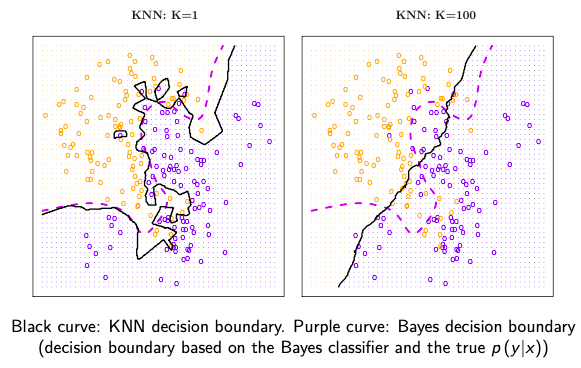

# $k$ Nearest Neighbor

represents each record as a datapoint with $m$ dimensional space, where $m$ is the number of attributes

Similarity-based, non-parametric

Assumes that underlying relationship b/w $x$ and $y$ is continuous

## Requirements

- Set of labelled records
- **Normalized** Proximity/Distance metric
  - Min-Max normalization
  - $Z$-normalization
- Odd value of $k$

## Choosing $k$

Similar to bias-variance tradeoff
$$
\begin{aligned}
\text{Flexibility} &\propto \dfrac{1}{k} \\

\implies \text{Bias} &\propto k \\
\text{Variance} &\propto \dfrac{1}{k}
\end{aligned}
$$

- For K = 1, the training error rate is 0. Bias is low and
  variance is high
- As K inc, model becomes less flexible and produces a linear-like decision boundary, with lower variance and higher bias

## Classification

Class label is the majority label of $k$ nearest neighbors

### Steps

- Compute distance between test record and all train records
- Identify $k$ neighbors of test records
  (Low distance=high similarity)
- Use majority voiting to find the class label of test sample

### Choosing Value of $k$

| $k$       | Problems                                        |
| --------- | ----------------------------------------------- |
| too small | Overfitting Susceptible to noise           |
| too large | Underfitting Susceptible to far-off points |

1. Use a test set
2. Let $k = 3$
3. Record error rate of classifier/accuracy
4. $k = k+2$
5. Repeat steps 3 and 4, until value of $k$ for which
   1. error is min
   2. accuracy is maximum

## Regression

KNN can be used for regression as well

Predicted value will be the average of the continuous labels of $k$-nearest neighbors

## Distance-Weighted KNN Classifier

Closer points are given larger weights for the majority voting scheme

## KNN CLassifier

$k$-nearest neighbor

- Pick a value of $k$
- Calculate distance between unknown item from all other items
- Seect $k$ observations in the training data are nearest to the unknown data point
- Predict the response of the unknown data point using the most popular response value from $k$ nearest neighbors

Lazy Learning: It does not build models explicitly
KNN builds a model for each test element

### Value of $k$

|      | $k$ too Small      | $k$ too Large                                   |
| ---- | ------------------ | ----------------------------------------------- |
|      | Sensitive to noise | Neighborhood includes points from other classes |

### Distances

- Manhattan distance
- Euclidian distance
- Makowski distance

Refer to data mining distances

### Advantages

- No training period
- Easy to implement
- NEw data can be added any time
- Multi-class, not just binary classification

### Disadvantages

- We have to calculate the distance for all testing dataset, wrt all records of the training dataset
  - Does not work well with large dataset
  - Does not work well with high dimensional dataset
- Sensitive to noisy and mssing data
- Attributes need to scaled to prevent distance measures from being dominated by one of the attributes

